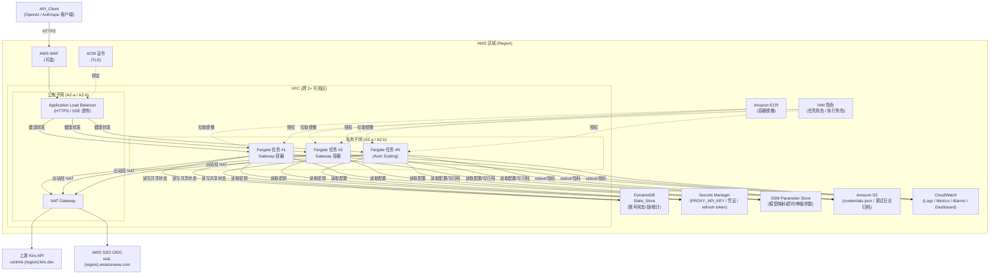
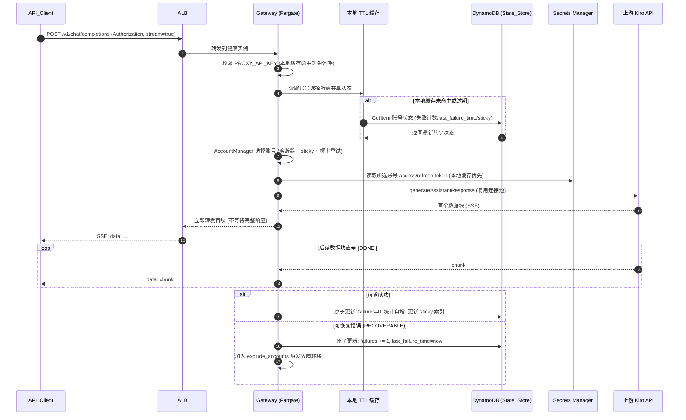
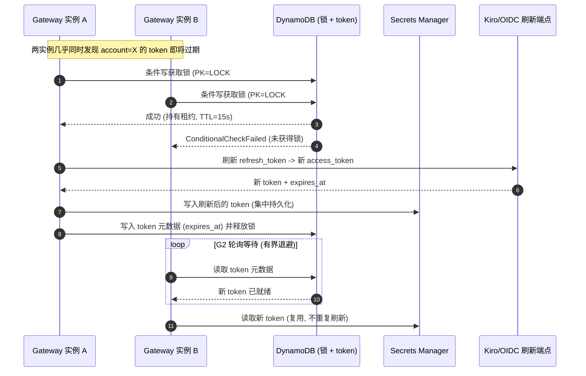

# 设计文档

## 概述（Overview）

本设计文档描述如何将 **kiro-gateway**（基于 Python 3.10+ / FastAPI / uvicorn / httpx / loguru 的单机代理网关，兼容 OpenAI 与 Anthropic API，反向代理 Kiro API / Amazon Q Developer）改造为 **AWS 云原生、池化、可水平伸缩** 的部署形态。整体架构与组织方式对齐 AWS 官方方案《Guidance for Multi-Provider Generative AI Gateway on AWS》（[GitHub 仓库](https://github.com/aws-solutions-library-samples/guidance-for-multi-provider-generative-ai-gateway-on-aws)），采用 **ECS Fargate + ALB + Service Auto Scaling + CDK/CloudFormation IaC + CloudWatch + Secrets Manager + S3** 的最佳实践组合。

> 内容已根据 AWS 官方 guidance 仓库的公开结构进行改写与归纳，以符合内容许可与署名要求（Content was rephrased for compliance with licensing restrictions）。

### 设计目标

1. **池化与水平伸缩**：从单进程升级为多实例计算池（ECS Fargate Service），跨 ≥2 个可用区部署，由 ALB 统一入口分发，依据 CPU 与请求并发自动伸缩。
2. **状态外置**：将原本写本地磁盘的运行时共享状态（`state.json`：账号失败计数、熔断器状态、模型映射、sticky 索引、统计）迁移到 **DynamoDB**，使多实例对故障转移做出一致决策，并使用原子更新避免并发覆盖。
3. **配置与密钥外置**：将 `.env`（配置）、`credentials.json`（多账号）、本地凭证文件（`~/.aws/sso/cache/*.json`、kiro-cli `data.sqlite3`）迁移到 **SSM Parameter Store / S3（非敏感）** 与 **Secrets Manager（敏感）**，通过 IAM 角色访问。
4. **令牌刷新协调**：将 `KiroAuthManager` 的“刷新后写回本地文件”改造为 **分布式单飞（single-flight）刷新 + 集中持久化**，确保同一账号在池内不会被多个实例重复刷新。
5. **可观测性**：结构化日志输出到 stdout 由 CloudWatch Logs 采集，自定义指标、告警、仪表板与请求 ID 关联，调试日志归档到 S3/CloudWatch 并带保留期。
6. **向后兼容**：完全保留 `/v1/models`、`/v1/chat/completions`、`/v1/messages`、`/`、`/health` 端点及 SSE 流式行为与 `PROXY_API_KEY` 鉴权契约，使现有客户端零改动接入。
7. **双运行形态**：通过 **存储后端抽象层（Storage Backend Abstraction）**，使同一份应用代码既能以本地文件后端运行（`docker-compose` 开发态），也能以 AWS 后端运行（云原生生产态）。

### 关键设计原则

- **网关而非守门员（Gateway, not gatekeeper）**：沿用现有实现哲学，不在网关侧做过度模型校验，由上游 Kiro API 决策。
- **行为等价（Behavioral Parity）**：状态外置后，熔断器指数退避、sticky 故障转移、TTL 模型缓存等语义必须与单机实现保持可验证的一致。
- **最小侵入（Minimal Intrusion）**：路由层、转换层（converters）、流式层（streaming）、解析层保持不变，仅替换“存储/状态/凭证/配置/日志”这几处 I/O 边界。

---

## 架构（Architecture）

### 整体 AWS 架构

改造后的系统部署在单一 VPC 内，跨 ≥2 个可用区，公有子网放置 ALB 与 NAT Gateway，私有子网放置 ECS Fargate 任务。Fargate 任务通过 NAT Gateway 出站访问 `runtime.{region}.kiro.dev` 与 `oidc.{region}.amazonaws.com`，并通过 VPC Endpoint（可选）访问 AWS 托管服务。



### 组件层次与术语映射

| 需求术语 | AWS 实现 | 说明 |
|---|---|---|
| Gateway_Service | ECS Fargate Service | 多实例池化计算 |
| Gateway | Fargate Task（容器实例） | 无状态运行，共享状态外置 |
| Load_Balancer | Application Load Balancer (ALB) | 单一入口、SSE 透传、健康检查 |
| Auto_Scaler | Application Auto Scaling（ECS 目标跟踪） | CPU / 请求并发伸缩 |
| State_Store | DynamoDB（按需计费、多 AZ 冗余） | 账号状态、锁、统计、模型映射 |
| Secret_Store | AWS Secrets Manager | PROXY_API_KEY、凭证、refresh token |
| Config_Store | SSM Parameter Store + S3 | 非敏感配置与 credentials.json |
| Object_Store | Amazon S3 | 配置文件、调试日志归档 |
| Observability_Service | Amazon CloudWatch | 日志、指标、告警、仪表板 |
| Deployment_Template | AWS CDK（TypeScript，推荐） | 一键部署 IaC |

### 运行时请求流（聊天补全）

下图展示一次 `/v1/chat/completions`（`stream=true`）请求从客户端到上游再到 SSE 回流的完整路径，重点体现“从 DynamoDB 选择账号”与“首个数据块即转发”。



### 令牌刷新（带分布式锁）流

`KiroAuthManager` 在云原生形态下不再写回本地文件，而是采用 **DynamoDB 条件写租约锁（single-flight）**：仅一个实例真正向上游刷新，其余实例等待并复用刷新结果。



---

## 组件与接口（Components and Interfaces）

改造的核心是引入 **存储后端抽象层**：定义一组与具体存储无关的接口（Protocol/ABC），提供 **LocalFileBackend**（开发态，行为等价于现状）与 **AwsBackend**（云原生态）两套实现。应用启动时依据 `STORAGE_BACKEND`（`local` | `aws`）环境变量选择实现，注入到 `AccountManager`、`KiroAuthManager`、`config` 加载器与调试日志器。

### 接口 1：ConfigProvider（配置提供者）

负责加载非敏感配置（端口、超时、模型映射、伸缩参数等），并实现配置优先级与缺失校验。

```python
class ConfigProvider(Protocol):
    def get(self, key: str, default: Optional[str] = None) -> Optional[str]: ...
    def get_required(self, key: str) -> str:  # 缺失则抛 MissingConfigError
        ...
    def get_namespace(self, prefix: str) -> dict[str, str]: ...  # 批量读取 (如模型映射)
    def reload(self) -> None: ...  # 重启/重新部署后生效
```

- **LocalConfigProvider**：读取 `.env`（沿用现有 `kiro/config.py` 的 `python-dotenv` 逻辑与 Windows 路径处理）。
- **SsmConfigProvider**：读取 SSM Parameter Store（路径前缀 `/<stack>/<env>/config/*`），批量 `GetParametersByPath`，结果进入 TTL 缓存；`credentials.json` 经由 `S3ConfigProvider` 从 S3 读取。
- **配置优先级**：`SSM 显式值 > 环境变量 > 代码默认值`（对应需求 5.3）。

### 接口 2：SecretProvider（密钥提供者）

负责读取敏感值，并对外提供脱敏视图。

```python
class SecretProvider(Protocol):
    async def get_secret(self, name: str) -> str: ...
    async def get_json_secret(self, name: str) -> dict: ...
    async def put_secret(self, name: str, value: str) -> None: ...  # 写回刷新后的 token
    def redact(self, text: str) -> str: ...  # 日志脱敏
```

- **LocalSecretProvider**：从 `.env` / 本地凭证文件读取（开发态）。
- **SecretsManagerProvider**：从 Secrets Manager 读取 `PROXY_API_KEY`、`credentials.json` 内容、各账号 refresh/access token；带 TTL 缓存（减少计费调用）。

### 接口 3：StateStore（共享状态存储）

抽象账号运行时共享状态的读写与原子更新。

```python
class StateStore(Protocol):
    async def get_account_state(self, account_id: str) -> AccountState: ...
    async def increment_failure(self, account_id: str, failure_time: float) -> AccountState: ...  # 原子计数
    async def reset_failure(self, account_id: str) -> None: ...
    async def incr_stats(self, account_id: str, *, total: int, ok: int, failed: int) -> None: ...  # 原子加
    async def get_sticky_index(self) -> int: ...
    async def set_sticky_index(self, index: int) -> None: ...
    async def get_model_mapping(self, model: str) -> list[str]: ...
    async def add_model_account(self, model: str, account_id: str) -> None: ...
```

- **LocalStateStore**：基于现有 `state.json`（tmp+rename 原子写、每 ~10s 落盘），保持现状行为。
- **DynamoStateStore**：使用 DynamoDB `UpdateItem` + `ADD`（原子计数器）/ 条件表达式实现无锁原子更新；读侧叠加本地 TTL 缓存以满足 P95 ≤ 50ms 的额外延迟约束（需求 11.3）。

### 接口 4：TokenRefreshCoordinator（令牌刷新协调器）

封装分布式单飞刷新逻辑，供 `KiroAuthManager` 调用。

```python
class TokenRefreshCoordinator(Protocol):
    async def acquire_lock(self, account_id: str, ttl_seconds: int) -> bool: ...  # 条件写
    async def release_lock(self, account_id: str) -> None: ...
    async def store_refreshed_token(self, account_id: str, token: TokenBundle) -> None: ...
    async def wait_for_token(self, account_id: str, timeout: float) -> Optional[TokenBundle]: ...
```

- **NoopCoordinator**（本地态）：直接调用现有 `asyncio.Lock` 路径（单实例即单飞）。
- **DynamoRefreshCoordinator**（云原生态）：以 `PK=LOCK#<account_id>` 行的条件写实现短租约锁，刷新后 token 写入 Secrets Manager 与 DynamoDB 元数据，落锁失败者轮询等待复用。

### 接口 5：DebugLogSink（调试日志汇）

```python
class DebugLogSink(Protocol):
    async def write(self, request_id: str, payload: dict) -> None: ...
```

- **LocalDebugLogSink**：写本地 `debug_logs/`（现状）。
- **S3DebugLogSink**：以 `s3://<bucket>/debug/<yyyy>/<mm>/<dd>/<request_id>.json` 归档，桶启用生命周期规则按保留期清除（需求 12.4）。应用主日志统一走 loguru → stdout → CloudWatch Logs。

### 接口与现有模块的接入点

| 现有模块 | 改造方式 | 保持不变的部分 |
|---|---|---|
| `kiro/config.py` | 包装为 `ConfigProvider`；`os.getenv` 改为 `provider.get` | 所有常量名、默认值、模型别名/隐藏模型逻辑 |
| `kiro/auth.py` `KiroAuthManager` | 注入 `SecretProvider` + `TokenRefreshCoordinator`；`_save_credentials_to_file/_sqlite` 改为 `put_secret` | token 过期判断、Desktop/SSO OIDC 刷新协议、region 推导 |
| `kiro/account_manager.py` | 注入 `StateStore`；`load_state/_save_state` 改为状态存储读写；`failures`/`stats` 改原子操作 | 熔断器退避公式、sticky 选择、概率重试、TTL 刷新、单账号旁路 |
| `kiro/cache.py` `ModelInfoCache` | 保持每实例内存 TTL 缓存（允许，需求 11.5） | 全部 |
| `kiro/debug_logger.py` | 注入 `DebugLogSink` | 日志内容结构 |
| 路由/转换/流式层 | **不改动** | `/v1/models`、`/v1/chat/completions`、`/v1/messages`、SSE |

---

## 数据模型（Data Models）

### State_Store（DynamoDB）表设计

采用 **单表设计（single-table design）**，按需计费（PAY_PER_REQUEST，满足需求 12.3），SSE/TTL 控制租约与归档项过期。表名：`<stack>-gateway-state`。

| 属性 | 类型 | 说明 |
|---|---|---|
| `PK`（分区键） | String | 实体分区键，见下表前缀 |
| `SK`（排序键） | String | 实体排序键 |
| `failures` | Number | 连续失败计数（原子 `ADD`） |
| `last_failure_time` | Number | 最近失败时间戳（epoch 秒） |
| `models_cached_at` | Number | 模型缓存时间戳 |
| `total_requests` / `successful_requests` / `failed_requests` | Number | 统计（原子 `ADD`） |
| `accounts` | List<String> | 模型→账号映射列表 |
| `sticky_index` | Number | 全局 sticky 索引 |
| `lock_owner` | String | 锁持有者实例 ID |
| `lock_expires_at` | Number | 锁租约过期时间（用于条件写抢占） |
| `expires_at` | Number | DynamoDB TTL 属性（自动清理归档/过期项） |
| `version` | Number | 乐观锁版本号（可选，用于复合更新） |

#### 主键与实体布局

| 实体 | PK | SK | 关键属性 |
|---|---|---|---|
| 账号状态 | `ACCT#<account_id>` | `STATE` | failures, last_failure_time, models_cached_at, stats |
| 全局 sticky 索引 | `GLOBAL` | `STICKY` | sticky_index |
| 模型→账号映射 | `MODEL#<model>` | `ACCOUNTS` | accounts |
| 令牌刷新锁 | `LOCK#<account_id>` | `LEASE` | lock_owner, lock_expires_at |
| 令牌元数据 | `TOKEN#<account_id>` | `META` | expires_at（access token 真值存于 Secrets Manager） |

#### 原子更新策略（避免丢失更新）

- **失败计数**：`UpdateItem` 配合 `SET last_failure_time = :t ADD failures :one`，`ADD` 为服务端原子加，多实例并发不会互相覆盖（对应需求 7.6）。
- **统计自增**：同样使用 `ADD total_requests :1` 等。
- **重置失败**：`SET failures = :zero`（成功路径）。
- **sticky 索引**：`SET sticky_index = :idx`（成功路径的 last-writer-wins 可接受，sticky 仅为软偏好）。
- **模型映射追加**：`ADD accounts :account_id_set`（使用 String Set 保证幂等去重）。
- **租约锁**：`UpdateItem` 条件 `attribute_not_exists(lock_owner) OR lock_expires_at < :now`，成功者写入 `lock_owner` 与 `lock_expires_at = now + ttl`。

#### 本地 TTL 缓存层（读延迟优化）

每个 Gateway 实例维护进程内 `StateCache`（TTL 默认 1–2s，可配），覆盖账号状态与 sticky 索引的读路径：

- 读：缓存命中直接返回；未命中或过期则单次 `GetItem` 回填。
- 写：写穿（write-through）更新缓存，保证本实例后续读自洽。
- 目的：将“读取共享状态/配置/密钥”引入的非流式额外延迟控制在 P95 ≤ 50ms（需求 11.3、11.5），同时减少按调用计费成本（需求 12.2）。
- 一致性权衡：跨实例最终一致（秒级），熔断/故障转移决策对短暂滞后不敏感（概率重试与半开状态本身具有容错性）。

### Secret_Store（Secrets Manager）密钥布局

| 密钥名 | 内容 | 静态加密 |
|---|---|---|
| `<stack>/proxy-api-key` | PROXY_API_KEY 字符串 | KMS |
| `<stack>/credentials-json` | `credentials.json` 完整内容（多账号配置） | KMS |
| `<stack>/account/<account_id>/token` | 该账号的 access/refresh token、expires_at、profile_arn | KMS |

### Config_Store（SSM Parameter Store）参数布局

| 参数路径 | 类型 | 示例 |
|---|---|---|
| `/<stack>/config/STREAMING_READ_TIMEOUT` | String | `300` |
| `/<stack>/config/FIRST_TOKEN_TIMEOUT` | String | `15` |
| `/<stack>/config/ACCOUNT_RECOVERY_TIMEOUT` | String | `60` |
| `/<stack>/config/ACCOUNT_MAX_BACKOFF_MULTIPLIER` | String | `1440` |
| `/<stack>/config/ACCOUNT_PROBABILISTIC_RETRY_CHANCE` | String | `0.1` |
| `/<stack>/config/model-aliases/<alias>` | String | 模型别名映射 |
| `/<stack>/config/scaling/min` `/max` `/cpu-target` | String | 伸缩参数 |

> `credentials.json` 因体积较大且属配置而非单值密钥，结构化存放：非敏感骨架放 S3（`s3://<bucket>/config/credentials.json`），其中的 refresh token 等敏感字段放 Secrets Manager 并在加载时合并。

### 应用内状态数据类（保持兼容）

沿用现有 `Account` / `AccountStats` / `ModelAccountList` 数据类，仅将其持久化来源由本地文件改为 `StateStore`：

```text
AccountState {
  account_id: str
  failures: int            # 熔断器连续失败计数
  last_failure_time: float # epoch 秒
  models_cached_at: float
  stats: { total_requests, successful_requests, failed_requests }
}
```


---

## 正确性属性（Correctness Properties）

> 属性（Property）是指在系统所有有效执行中都应成立的特征或行为——本质上是关于“系统应当做什么”的形式化陈述。属性充当人类可读规格与机器可验证正确性保证之间的桥梁。

本节将可测试的验收标准转化为带全称量词（“对任意 / 对所有”）的正确性属性，供后续属性化测试（property-based testing）实现。基础设施类（IaC、CloudWatch 告警、KMS 加密配置、S3 生命周期）不适用 PBT，改用 CDK 快照与合规检查（见测试策略），故不在此列。每个属性最少运行 100 次随机迭代。

### 属性 1：配置来源优先级

*对任意* 配置键，以及该键在 SSM Parameter Store、环境变量、代码默认值三层中存在性与取值的任意组合，`ConfigProvider.get` 返回的值应等于存在的最高优先级层的取值（优先级：SSM > 环境变量 > 默认值）。

**Validates: Requirements 5.3**

### 属性 2：必需配置缺失触发明确错误

*对任意* 必需配置键集合与其任意缺失子集，对缺失键调用 `get_required` 应抛出明确的 `MissingConfigError`（包含键名），而对存在键应正常返回其值。

**Validates: Requirements 5.4**

### 属性 3：日志密钥脱敏

*对任意* 文本以及任意嵌入其中的密钥值（PROXY_API_KEY、refresh/access token），脱敏函数 `redact` 的输出都不应包含任何密钥明文，同时保留非密钥内容。

**Validates: Requirements 6.5**

### 属性 4：客户端鉴权匹配

*对任意* 客户端在 `Authorization` / `x-api-key` 头中提交的密钥字符串，当且仅当其等于 Secret_Store 中的 PROXY_API_KEY 时鉴权通过；否则网关拒绝请求并返回鉴权失败状态码。

**Validates: Requirements 6.6, 10.4**

### 属性 5：刷新令牌持久化往返

*对任意* 账号与刷新后产生的新 token 包，将其经 `SecretProvider.put_secret` 写入后再读回，应得到等价的 token 包，且整个过程不写入任何本地凭证文件。

**Validates: Requirements 6.7**

### 属性 6：令牌刷新单飞（无重复刷新）

*对任意* 账号与任意数量并发请求同一账号 token 刷新的实例集合，在一次刷新窗口内对上游刷新端点的实际刷新调用次数应恰为 1，其余实例复用该刷新结果。

**Validates: Requirements 6.7, 7.7**

### 属性 7：共享状态跨实例可见

*对任意* 账号与任意失败/成功事件序列，当一个实例将其写入 State_Store 后，另一个共享同一 State_Store 的实例在缓存过期后读取，应观察到一致的账号状态。

**Validates: Requirements 7.3, 7.5**

### 属性 8：熔断器冷却判定确定性

*对任意* 账号共享状态 `(failures, last_failure_time)` 与当前时间 `now`，冷却判定为纯函数：`is_in_cooldown = (now - last_failure_time) < ACCOUNT_RECOVERY_TIMEOUT * min(2^(failures-1), ACCOUNT_MAX_BACKOFF_MULTIPLIER)`；任意实例对相同输入应得到相同判定结果。

**Validates: Requirements 7.4**

### 属性 9：失败计数原子性（无丢失更新）

*对任意* 初始失败计数与任意 N 次并发 `increment_failure` 调用，State_Store 中该账号的最终 `failures` 值应等于初始值加 N（原子计数器在并发下不丢失任何更新）。

**Validates: Requirements 7.6**

### 属性 10：熔断器与故障转移状态机行为等价

*对任意* 由成功 / 可恢复失败 / 致命失败 / INVALID_MODEL_ID 组成的事件序列，以单机内存 `AccountManager` 为参考模型驱动外置（DynamoDB）实现后，二者在每一步的可见状态（失败计数、是否跳过、sticky 索引、故障转移顺序）应保持等价。

**Validates: Requirements 7.7**

### 属性 11：模型解析一致性

*对任意* 模型名称或别名输入（含隐藏模型与 `auto-kiro` 等别名），改造后 `ModelResolver` 的解析结果应与改造前单机实现的解析结果一致。

**Validates: Requirements 10.5**

### 属性 12：SSE 流式透传不变量

*对任意* 上游返回的数据块序列，网关向客户端转发的 SSE 帧序列应与上游分块在内容与顺序上一致，且在收到上游首个数据块后即转发（不等待完整响应），并以与改造前一致的结束标记（如 `[DONE]`）收尾。

**Validates: Requirements 10.2, 11.2**

---

## 错误处理（Error Handling）

错误处理在保持现有“网关而非守门员”哲学的同时，针对外置存储新增了降级与容错路径。

### 启动期错误

| 场景 | 处理策略 |
|---|---|
| 必需配置缺失（SSM/S3 均无） | 记录明确错误（含键名），以非零状态退出（需求 5.4），ECS 任务进入失败重启，告警触发 |
| Secrets Manager 不可达 | 指数退避重试 N 次；耗尽后启动失败，避免以空凭证对外提供服务 |
| DynamoDB 表不可达 | 启动失败并退出；由 IaC 保证表先于服务创建 |
| `credentials.json` 解析失败 | 沿用现有逐条校验：跳过非法条目并告警，至少一个有效账号方可启动 |

### 运行期错误

- **State_Store 读失败**：优先返回本地 TTL 缓存的陈旧值（fail-open），记录 WARNING 并上报指标；缓存亦无则按“账号无失败状态”保守处理，确保请求可继续（与现有“故障转移”精神一致）。
- **State_Store 写失败**：失败计数/统计写入失败时记录并重试（有界），不阻塞主请求路径；最终一致性可容忍短暂滞后。
- **令牌刷新锁争用**：未获锁的实例在有界超时内轮询等待新 token；超时后允许其自行刷新（降级，避免永久阻塞），刷新仍写回集中存储。
- **上游 Kiro API 错误**：完全沿用现有 `account_errors` 分类（FATAL / RECOVERABLE / INVALID_MODEL_ID）：RECOVERABLE 触发熔断计数与故障转移；INVALID_MODEL_ID 不惩罚账号；FATAL 直接上抛。
- **SSE 流中断**：沿用现有 `FIRST_TOKEN_TIMEOUT` 重试与 `STREAMING_READ_TIMEOUT` 逻辑；ALB 空闲超时配置为 ≥ `STREAMING_READ_TIMEOUT`（需求 2.6）避免负载均衡器提前断流。
- **优雅停机**：收到 SIGTERM 后停止接收新请求，等待在途请求（含 SSE）完成或至 ECS 停止超时；配合 ALB 目标组 deregistration delay（draining）实现安全缩容（需求 4.5）。

### 鉴权与脱敏

- 鉴权失败统一返回与改造前一致的状态码与错误体（需求 6.6、10.4）。
- 所有日志经 `SecretProvider.redact` 脱敏后再输出 stdout（需求 6.5）。
- 每条日志包含 `request_id`，由入站中间件生成并贯穿调用链与调试归档（需求 8.7）。

---

## 测试策略（Testing Strategy）

采用 **单元测试 + 属性化测试 + 集成测试** 三层互补策略。属性化测试覆盖普遍正确性，单元测试覆盖具体示例与边界，集成测试覆盖基础设施与端到端行为。

### 属性化测试（Property-Based Testing）

- **库选择**：Python 使用 [Hypothesis](https://hypothesis.readthedocs.io/)，**不自行实现** 属性测试框架。
- **迭代次数**：每个属性测试最少 100 次随机迭代（Hypothesis `max_examples>=100`）。
- **标注格式**：每个属性测试以注释标注其对应的设计属性，格式为：
  `# Feature: aws-cloud-native-gateway, Property {number}: {property_text}`
- **单一映射**：每个正确性属性以单一属性化测试实现。
- **AWS 依赖隔离**：涉及 DynamoDB / Secrets Manager 的属性（属性 5、6、7、9、10）使用 [moto](https://github.com/getmoto/moto) 或 LocalStack 模拟，以便低成本运行 100+ 次迭代。
- **属性与测试对应**：

| 属性 | 测试要点 | AWS 模拟 |
|---|---|---|
| 1 配置优先级 | 三层取值组合 → 最高优先级值 | 否（纯逻辑） |
| 2 必需配置缺失 | 缺失键抛 MissingConfigError | 否 |
| 3 日志脱敏 | 脱敏后不含密钥明文 | 否 |
| 4 客户端鉴权 | 当且仅当匹配才通过 | 否 |
| 5 刷新令牌往返 | 写入后读回等价、不碰本地文件 | moto Secrets Manager |
| 6 单飞刷新 | 并发下上游刷新调用恰 1 次 | moto DynamoDB 锁 |
| 7 跨实例可见 | A 写 B 读一致 | moto/LocalStack DynamoDB |
| 8 冷却判定确定性 | 纯函数与单机等价 | 否 |
| 9 原子计数 | 并发 N 次 → failures += N | moto/LocalStack DynamoDB |
| 10 状态机等价 | 与内存参考模型逐步等价 | moto DynamoDB |
| 11 模型解析一致 | 改造前后解析等价 | 否 |
| 12 SSE 透传 | 帧内容/顺序一致、首块即转发 | 否（注入式模拟上游流） |

### 单元测试（Unit Tests）

- 复用现有 `tests/unit/` 套件，确保路由、转换器、流式、解析、模型解析等行为不回归（向后兼容核心保障）。
- 新增针对各 Backend 实现的示例测试：`SsmConfigProvider`、`SecretsManagerProvider`、`DynamoStateStore`、`DynamoRefreshCoordinator`、`S3DebugLogSink`。
- 端点存在性示例测试：断言 `/v1/models`、`/v1/chat/completions`、`/v1/messages`、`/health` 已注册（需求 10.1）。
- 边界与错误条件：空 `credentials.json`、单账号旁路、INVALID_MODEL_ID 不惩罚、token 即将过期判定等。

### 集成测试（Integration Tests）

- **LocalStack/moto 端到端**：以 AWS 后端启动应用，验证“配置加载→账号选择→（模拟）上游→SSE 回流→状态写回”全链路（需求 1.4、5.5、7.3）。
- **双后端等价**：同一批请求分别在 `local` 与 `aws` 后端运行，比较响应等价，验证向后兼容（需求 5.5、10.x）。
- **优雅停机**：发送 SIGTERM 验证在途请求完成后才退出（需求 4.5）。
- **性能基准**：在带 TTL 缓存下测量非流式请求读取共享状态/配置/密钥的 P95 额外延迟 ≤ 50ms（需求 11.3）。

### 基础设施测试（IaC，非 PBT）

- **CDK 快照测试**：`cdk synth` 输出快照断言，覆盖网络、计算、数据、可观测性各 Stack。
- **合规/策略检查**：断言 DynamoDB/S3/Secrets 启用 KMS 静态加密（需求 6.3）、ALB 启用 ACM TLS、IAM 任务角色为最小权限（需求 9.6）、ALB 空闲超时 ≥ 流式读取超时（需求 2.6）。
- **告警与生命周期**：断言 5xx>5%/无健康目标告警阈值（需求 8.4、8.5）、S3/CloudWatch 调试日志保留期（需求 12.4）、DynamoDB 按需计费模式（需求 12.3）已正确声明。

---

## IaC 与交付物（补充说明）

### CDK 项目结构（对齐 AWS guidance）

推荐使用 **AWS CDK（TypeScript）**，按关注点拆分 Stack/Construct：

```text
infra/
  bin/app.ts                 # CDK 应用入口, 读取参数 (region/min/max/instance size)
  lib/
    network-stack.ts         # VPC, 公/私子网(2+ AZ), NAT Gateway, VPC Endpoints
    data-stack.ts            # DynamoDB(单表,按需), Secrets Manager, SSM 参数, S3 桶(KMS+生命周期)
    compute-stack.ts         # ECR, ECS Cluster, Fargate Service/TaskDef, ALB, 目标组, ACM, (可选)WAF
    autoscaling-construct.ts # 目标跟踪策略(CPU 70%/缩 30%, 可选请求并发)
    observability-stack.ts   # CloudWatch 日志组/指标/告警/仪表板
    iam.ts                   # 最小权限任务角色 + 执行角色
  cdk.json / package.json
```

- **参数化**：实例 CPU/内存规格、最小/最大实例数、AWS 区域（需求 9.3）。
- **部署/销毁**：`cdk deploy --all --parameters ...`（创建全部资源并输出 ALB 入口，需求 9.2、9.4）；`cdk destroy --all`（移除本次资源，需求 9.5）。
- **镜像构建与推送**：复用现有 `Dockerfile`，CI 构建镜像并推送 ECR；CDK 引用该镜像。
- **CI/CD**：GitHub Actions 工作流（在现有 `.github/workflows/docker.yml` 基础上扩展）：构建镜像 → 推送 ECR → 触发 `cdk deploy`。

### 安全

- **静态加密**：DynamoDB、S3、Secrets Manager 均启用 KMS（需求 6.3）。
- **传输加密**：ALB 绑定 ACM 证书启用 HTTPS/TLS（需求 10、安全）。
- **最小权限 IAM**：任务角色仅授予所需的 DynamoDB 表、特定 Secrets、特定 SSM 路径、特定 S3 前缀、CloudWatch PutMetric/Logs 权限（需求 6.4、9.6）。
- **可选 WAF**：ALB 前置 AWS WAF 提供基础防护。
- **日志脱敏**：见错误处理与属性 3。

### 向后兼容与迁移

- **契约不变**：路由、SSE 流式、`Authorization` 鉴权、模型名/别名解析全部保留（需求 10.1–10.5）。
- **迁移步骤**：
  1. `.env` 非敏感项 → SSM Parameter Store（`/<stack>/config/*`）。
  2. `PROXY_API_KEY` 与各账号 refresh token → Secrets Manager。
  3. `credentials.json` 骨架 → S3，敏感字段 → Secrets Manager（加载时合并）。
  4. 本地凭证文件（`~/.aws/sso/cache/*.json`、kiro-cli `data.sqlite3`）中的 token → 导入 Secrets Manager。
  5. `state.json` 运行时状态 → 首次启动由 DynamoDB 空状态重建（失败计数等可从零开始，语义无损）。
  6. `debug_logs/` → S3 归档桶（带保留期）。

### 中文文档交付物（对齐 AWS guidance 项目格式）

| 交付物 | 内容 | 对应需求 |
|---|---|---|
| `docs/zh/CLOUD_NATIVE_README.md` | 方案概述、前置条件、部署步骤、配置说明、卸载步骤 | 13.1、13.3、13.4 |
| `docs/zh/ARCHITECTURE_AWS.md` | 含 Mermaid 架构图（各组件关系） | 13.2 |
| `docs/zh/DEPLOYMENT_GUIDE.md` | 一键部署命令与参数说明、销毁命令 | 13.4 |
| `docs/zh/MIGRATION_GUIDE.md` | 本地文件 → SSM/Secrets/S3/DynamoDB 迁移步骤 | 13.5 |
| `docs/zh/COST_ESTIMATION.md` | 预估成本与主要成本因素（Fargate/NAT/ALB/DynamoDB 等） | 13.6 |

> 以上文档为 tasks 阶段的产出目标，结构与章节组织对齐《Guidance for Multi-Provider Generative AI Gateway on AWS》项目；本设计文档不直接生成这些文档，仅定义其格式与范围。

---

## 设计决策与权衡（Design Decisions & Rationale）

1. **DynamoDB 而非 Redis/ElastiCache 作为 State_Store**：DynamoDB 按需计费、原生原子计数器（`ADD`）、多 AZ 冗余、无需管理节点，契合“无服务器、低运维、成本可控、跨 AZ 冗余”的需求（1、3.5、12.3），且原子更新天然满足 7.6。
2. **存储后端抽象层**：在不破坏现有模块边界的前提下实现 local/aws 双形态，最大化复用现有路由/转换/流式代码，降低回归风险，保障向后兼容（需求 5.5、10.x）。
3. **本地 TTL 缓存 + 最终一致**：以秒级最终一致换取 P95 ≤ 50ms 的低额外延迟与更低计费成本（需求 11.3、11.5、12.2）；熔断/故障转移对短暂滞后不敏感。
4. **DynamoDB 条件写租约锁实现单飞刷新**：避免引入额外协调服务，复用已有 State_Store；租约带 TTL 防止死锁，未获锁者有界等待后可降级自刷新。
5. **token 真值存 Secrets Manager、元数据存 DynamoDB**：敏感值集中加密管理，热路径的过期判断走低延迟的 DynamoDB/缓存（需求 6.1–6.4、6.7）。
