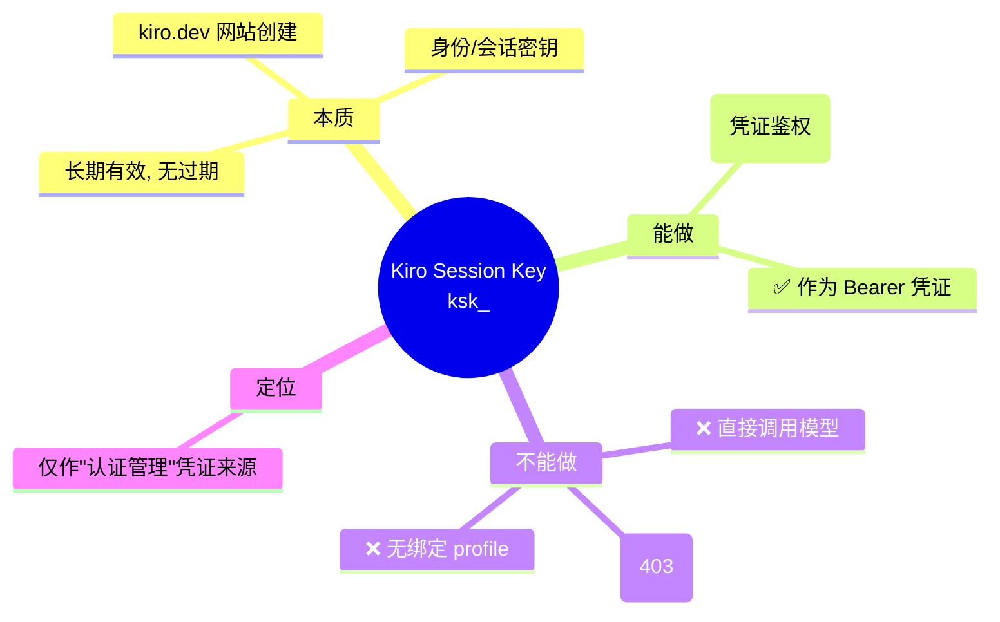
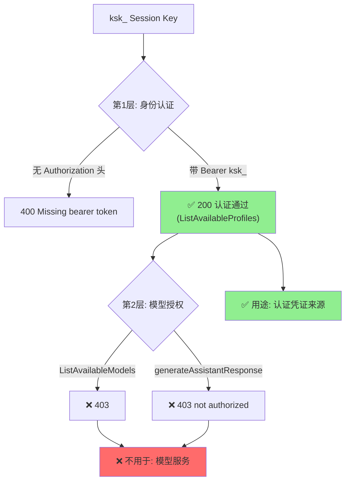
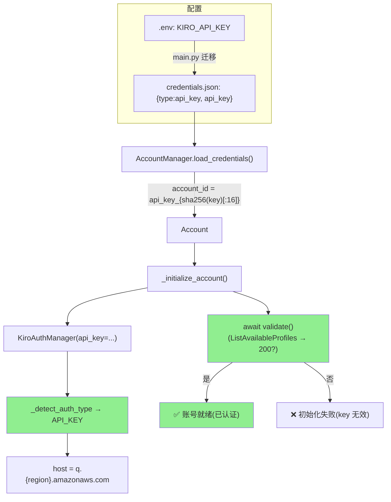
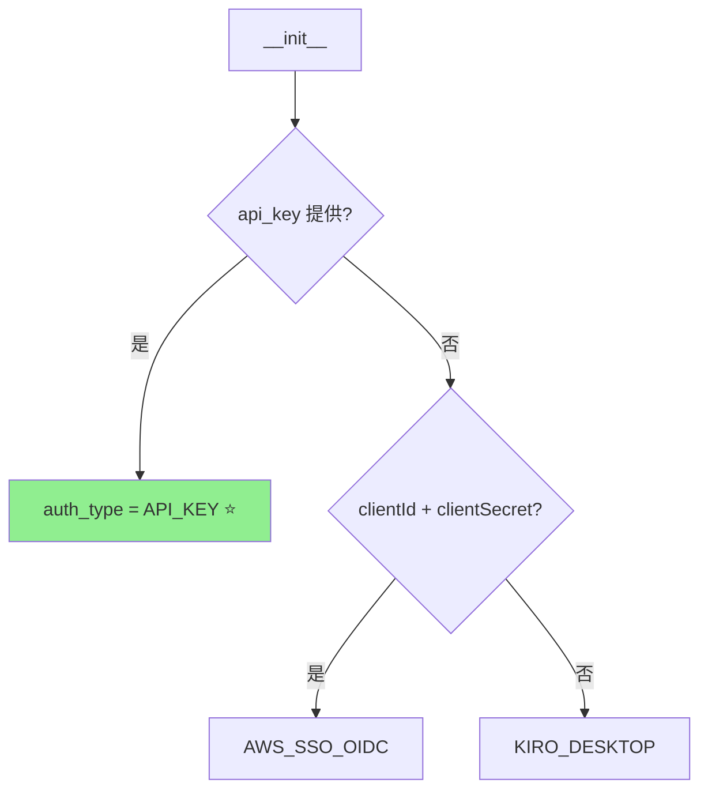
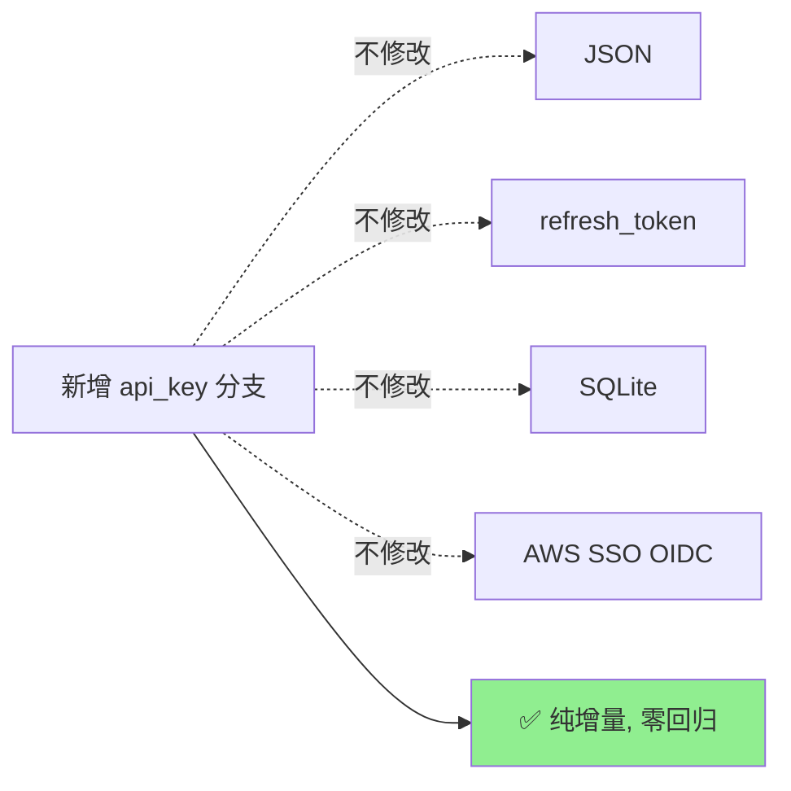

# 新增凭证来源调研：Authenticate with an API key（Kiro Session Key）

> 版本：v2.4.dev.13 | 最后更新：2026-06-01
> 状态：✅ 已实现并测试（全量 1722 通过；两个真实 key 端到端认证通过）

为 Kiro Gateway 的**认证管理**模块新增第 5 种凭证来源 **Kiro Session Key（`ksk_`）**，
**仅作为认证凭证使用**，与现有 4 种方式（JSON / refresh_token / SQLite / AWS SSO OIDC）共存，
并融入多账号系统（每个 Session Key = 一个账号）。

---

## 1. 核心前提（已验证）

**结论**：`ksk_` Session Key 只能完成**身份认证**，无法用于模型调用
（Kiro 平台不支持以 Session Key 直接调用模型）。因此本方案**只把它作为
认证凭证来源**接入，不尝试用它做模型服务。

---

## 2. 调研：协议与权限层级

通过**官方 Kiro CLI 二进制分析** + **真实端点探测**确定（外部信息已按授权许可改写）。

| 维度 | 结论 |
|------|------|
| 传输方式 | `ksk_` 直接作为 `Authorization: Bearer` |
| 端点 | `q.{region}.amazonaws.com`（CodeWhisperer/Q 身份端点） |
| 协议 | AWS Coral RPC：`Content-Type: application/x-amz-json-1.0` + `x-amz-target` |
| 认证校验 | `ListAvailableProfiles` → **HTTP 200 = 凭证有效** |
| 模型能力 | `ListAvailableModels` → **403**；无绑定 profile → 无法服务模型 |

### 权限分层（为什么只能做认证）

**实测**：两个独立 `ksk_` key 行为一致 —— `ListAvailableProfiles` 200（认证通过），
`ListAvailableModels` 403（无模型权限）。证明 Session Key 是**纯认证凭证**。

---

## 3. 方案设计：作为"认证管理"凭证来源

### 3.1 集成位置

### 3.2 认证类型检测（API_KEY 最高优先级）

### 3.3 KiroAuthManager 行为（API_KEY）

| 方法 | 行为 |
|------|------|
| `get_access_token()` | 直接返回 `ksk_`（即 Bearer 凭证），**无网络调用** |
| `validate()` | 调 `ListAvailableProfiles`，HTTP 200 → True（已认证），否则 False |
| `is_token_expiring_soon()` | 恒为 `False`（Session Key 不过期） |
| `force_refresh()` | 返回 `ksk_`（无可刷新内容） |
| host 覆盖 | `api_host`/`q_host` = `q.{region}.amazonaws.com` |

### 3.4 多账号融合

- 每个 Session Key = 一个账号，`account_id` 用哈希（不存原始 key）
- 与 JSON/SQLite/refresh_token 账号混合编排
- 账号初始化的判定标准是**认证成功**（`validate()` 为 True），而非是否能服务模型

---

## 4. 兼容性与边界

| 项 | 说明 |
|----|------|
| 现有 4 种认证 | ❌ 不受影响（新增 `elif` 分支） |
| 模型列表 | API_KEY 跳过 `ListAvailableModels`（403），用静态 fallback 模型 |
| 安全 | Key 仅脱敏入日志；`account_id` 为哈希；不记录 Authorization 头 |
| **能力边界** | Session Key **仅用于认证**；模型服务请使用携带模型权限的凭证（Kiro IDE JSON / refresh token / kiro-cli SQLite） |

---

## 5. 结论

| 问题 | 答案 |
|------|------|
| 能否新增 Session Key 作为凭证来源? | ✅ 能，作为**认证凭证**已实现并测试 |
| 用途? | ✅ 仅**认证管理**（凭证鉴权） |
| 协议? | ✅ 直传 Bearer → `q.{region}.amazonaws.com`，`ListAvailableProfiles` 200 校验 |
| 与多账号融合度? | ✅ 每个 Key = 一个账号，复用全部编排能力 |
| 是否兼容现有功能? | ✅ 纯增量，1722 测试零回归 |
| 能否用它调模型? | ❌ 不能（平台限制）；本方案不做此尝试 |

> 实施步骤与测试结果见 [`API_KEY_AUTH_POC_RESULT.md`](API_KEY_AUTH_POC_RESULT.md)。
