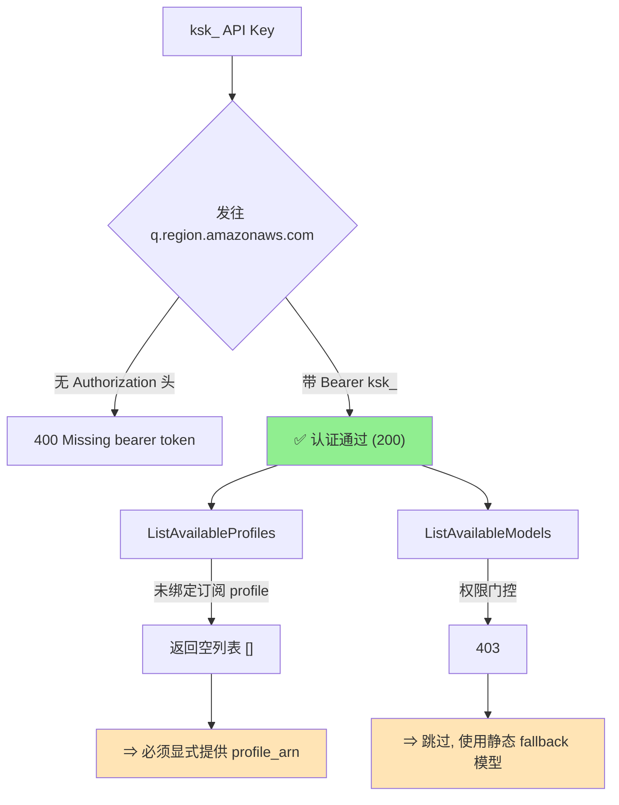
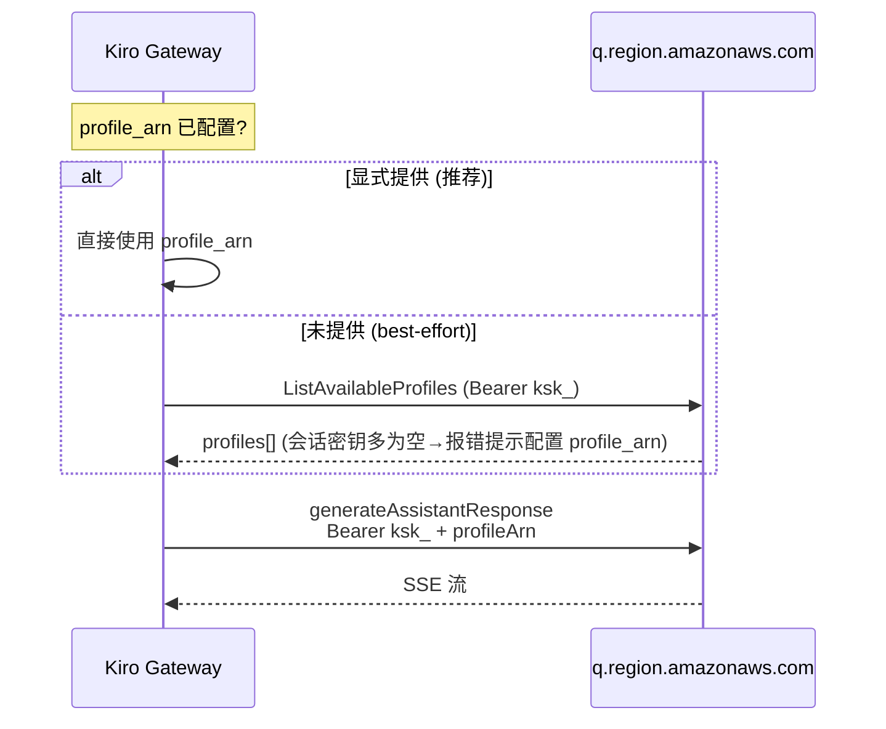
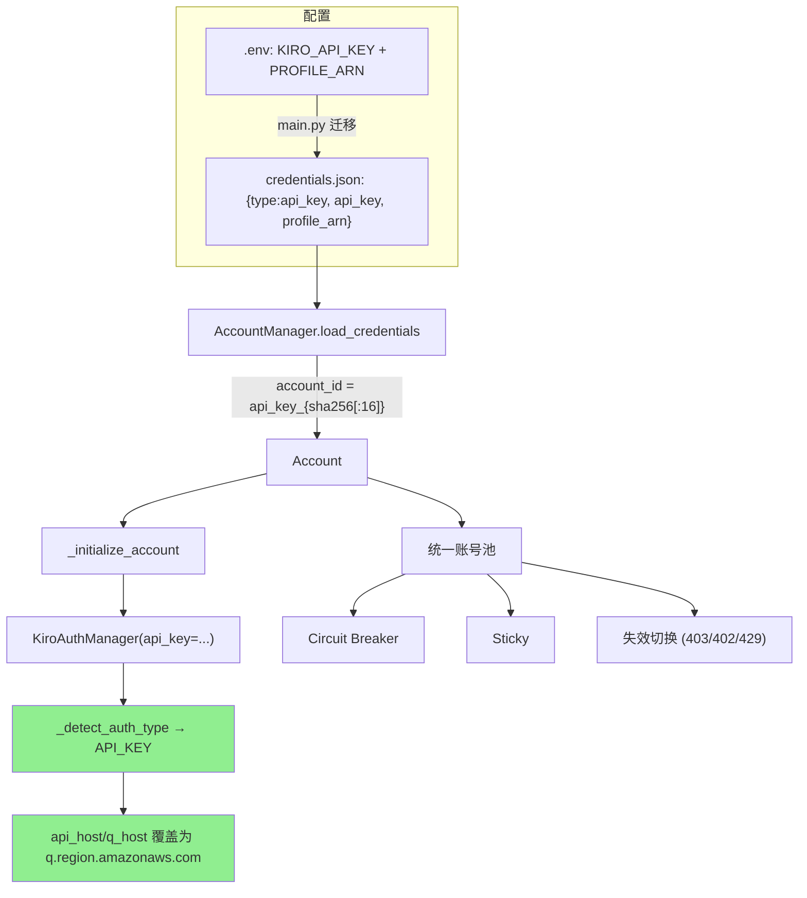
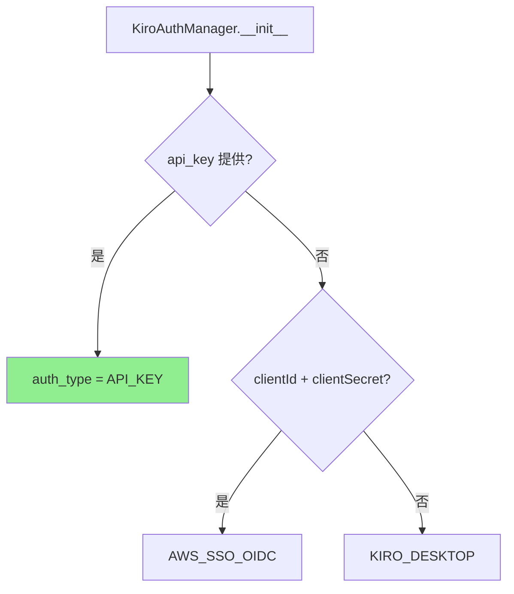
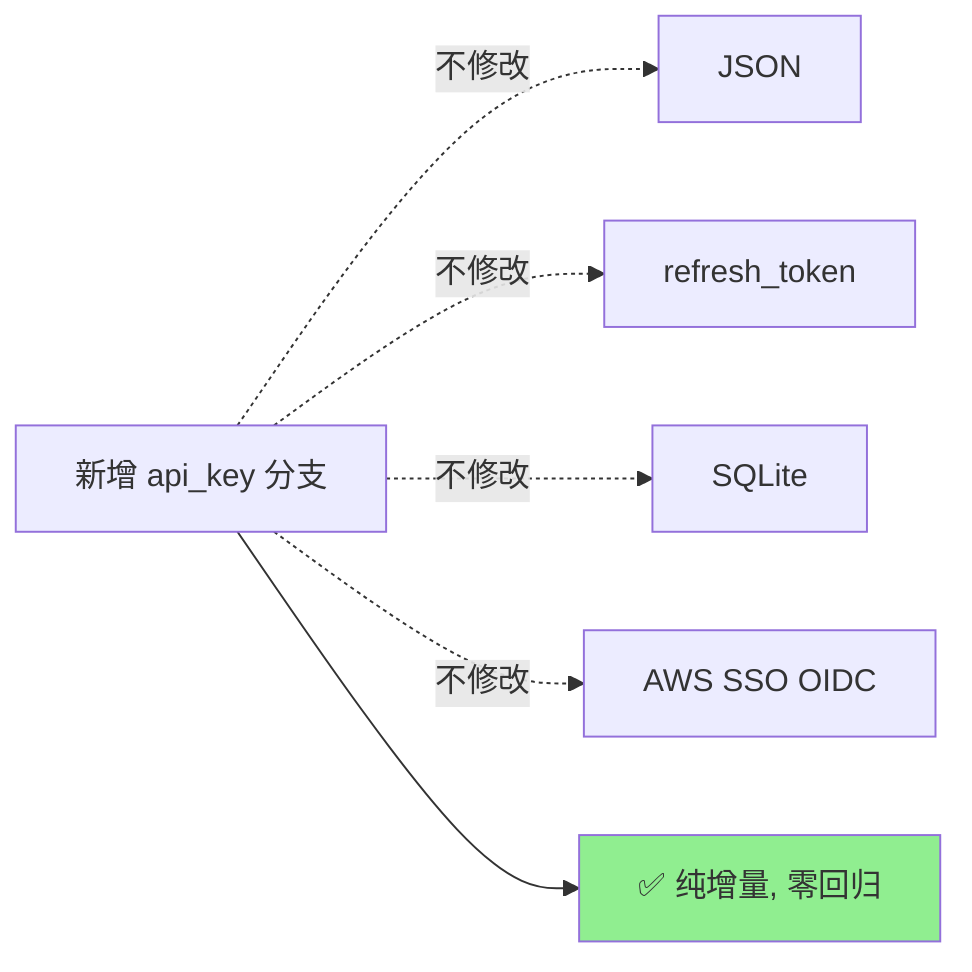

# 新增凭证来源方案：Authenticate with an API key

> 版本：v2.4.dev.13 | 最后更新：2026-06-01
> 状态：✅ 已实现并测试（全量 1719 测试通过，零回归）

为 Kiro Gateway 的认证管理新增第 5 种凭证来源 **API Key 认证（`type=api_key`）**，
与现有 4 种方式（JSON / refresh_token / SQLite / AWS SSO OIDC）共存，并融入多账号系统
（每个 API Key = 一个账号）。

---

## 1. 需求

| 项 | 说明 |
|----|------|
| 目标 | 支持 Kiro 门户签发的 API Key（前缀 `ksk_`，用于 Kiro CLI headless 模式） |
| 兼容 | 不影响现有 4 种认证方式（纯增量变更） |
| 融合 | 每个 API Key 作为一个独立账号，复用故障切换 / Circuit Breaker / Sticky |

---

## 2. API Key 认证协议（已验证）

> 通过**官方 Kiro CLI 二进制分析** + **真实端点探测**确定。外部信息已按授权许可改写。

### 2.1 协议要点

| 维度 | 结论 |
|------|------|
| 传输方式 | API Key 直接作为 `Authorization: Bearer {ksk_key}`（**无需 token 交换**） |
| 目标端点 | **`q.{region}.amazonaws.com`**（AWS CodeWhisperer/Q 服务），**非** `runtime.kiro.dev` |
| 协议格式 | AWS Coral RPC：`Content-Type: application/x-amz-json-1.0` + `x-amz-target` |
| profileArn | **需显式提供**；`ListAvailableProfiles` 对 `ksk_` 会话密钥返回空列表 |
| 模型列表 | API Key 在 `ListAvailableModels` 上返回 403 → 跳过，使用静态 fallback 模型 |
| 过期 | API Key 长期有效，无需刷新 |


### 2.2 关键特性：`ksk_` 是"身份/会话密钥"

`ksk_` API Key 能通过认证（"我是谁"），但其模型访问权限由**分配的 profile** 门控：



**设计取舍**：因 `ListAvailableProfiles` 对会话密钥返回空，**显式 `profile_arn` 是主路径**；
自动发现仅作 best-effort（账号若已开通 profile 则自动生效）。

### 2.3 请求时序




---

## 3. 架构集成

### 3.1 集成位置



### 3.2 认证类型检测（API_KEY 最高优先级）



### 3.3 多账号融合（每个 Key = 一个账号）

- `account_id` 用 `api_key_{sha256(key)[:16]}` 生成（哈希，不存原始 key）
- API Key 账号与 JSON/SQLite/refresh_token 账号**混合编排**
- 自动继承故障切换：某 Key 被限流/失效 → 切换下一个账号


---

## 4. 实现设计（与代码一一对应）

### 4.1 `kiro/config.py`

```python
KIRO_API_KEY: str = os.getenv("KIRO_API_KEY", "")

# API Key 直传 Bearer 的服务端点（q.{region}.amazonaws.com）
KIRO_API_KEY_SERVICE_HOST_TEMPLATE: str = os.getenv(
    "KIRO_API_KEY_SERVICE_URL", "https://q.{region}.amazonaws.com"
)
def get_kiro_api_key_service_host(region: str) -> str:
    return KIRO_API_KEY_SERVICE_HOST_TEMPLATE.format(region=region)
```

### 4.2 `kiro/auth.py`

```python
class AuthType(Enum):
    KIRO_DESKTOP = "kiro_desktop"
    AWS_SSO_OIDC = "aws_sso_oidc"
    API_KEY = "api_key"                      # 新增

# __init__: 当 auth_type == API_KEY 时, 覆盖 host 为 q.{region}.amazonaws.com
if self._auth_type == AuthType.API_KEY:
    api_key_host = get_kiro_api_key_service_host(final_api_region)
    self._api_host = api_key_host
    self._q_host = api_key_host

async def get_access_token(self) -> str:
    if self._auth_type == AuthType.API_KEY:
        if not self._profile_arn:            # best-effort 发现
            async with self._lock:
                if not self._profile_arn:
                    await self._discover_profile_arn()  # ListAvailableProfiles
        return self._api_key                  # Key 即 Bearer token

def is_token_expiring_soon(self) -> bool:
    if self._auth_type == AuthType.API_KEY:
        return False                          # 永不过期
```

- `_discover_profile_arn()`：`POST {q_host}` + `x-amz-target: AmazonCodeWhispererService.ListAvailableProfiles`，取 `profiles[0].arn`；空列表时抛出指引设置 `profile_arn` 的清晰错误。
- `force_refresh()`：API_KEY 直接返回 key（无交换）。
- `_redact_secret()`：日志仅显示前 8 位 + 长度。

### 4.3 `kiro/account_manager.py`

```python
def _should_use_static_models(auth_manager) -> bool:
    # API Key 在 ListAvailableModels 上 403 → 跳过, 用静态 fallback 模型
    if auth_manager.auth_type == AuthType.API_KEY:
        return True
    return _is_runtime_endpoint(auth_manager)
```

- `load_credentials()`：新增 `type=api_key` 校验 + `account_id = api_key_{hash}`。
- `_initialize_account()`：新增 api_key 构造分支；无 `profile_arn` 时记录警告。

### 4.4 `main.py`

`.env` 中的 `KIRO_API_KEY` 以最高优先级迁移到 `credentials.json`；`validate_configuration()` 接受 API Key 作为合法凭证。


---

## 5. 兼容性



| 现有能力 | 影响 |
|----------|------|
| 4 种现有认证 | ❌ 不受影响（新增 `elif` 分支） |
| 多账号故障切换 | ✅ 增强（API Key 纳入账号池） |
| 错误分类 / 调试日志 | ✅ 复用（403/402/429 通用；headers 不入日志） |

**安全**：API Key 仅脱敏入日志；`account_id` 为哈希；`state.json` 不存原始 key。

---

## 6. 测试策略

| 层 | 覆盖 |
|----|------|
| 单元 | AuthType 检测优先级、host 路由到 q.amazonaws.com、永不过期、直传返回 key、profile 发现成功/空报错/已配置则跳过、force_refresh、脱敏、`_should_use_static_models`、config helper |
| 单元 | account_manager：api_key 加载 / 确定性 ID / 缺字段跳过 / 多 key 独立 / 混合类型 / 显式 profile_arn 初始化 |
| 集成 | 双 API Key 故障切换、单 API Key 加载 |

全量：**1719 passed, 0 failed**。

---

## 7. 结论

| 问题 | 答案 |
|------|------|
| 能否新增 API Key 凭证来源? | ✅ 能，已实现并测试 |
| 传输协议? | ✅ 直传 Bearer 到 `q.{region}.amazonaws.com`（无交换） |
| profileArn 如何获得? | ✅ 显式 `profile_arn`（主路径）；`ListAvailableProfiles` best-effort 自动发现 |
| 与多账号融合度? | ✅ 每个 Key = 一个账号，复用全部编排能力 |
| 是否兼容现有功能? | ✅ 纯增量，1719 测试零回归 |
| `ksk_` 限制? | ⚠️ 会话密钥需显式 profile_arn；模型访问受 profile 门控 |

> 详细实施结果见 [`API_KEY_AUTH_POC_RESULT.md`](API_KEY_AUTH_POC_RESULT.md)。
