# 新增凭证来源调研：Authenticate with an API key

> **任务性质**：功能可行性调研 + 集成方案设计（不含代码改动，仅设计）
> **目标版本**：v2.4.dev.13
> **最后更新**：2026-05-28

---

## 1. 需求背景与目标

### 1.1 需求

为 Kiro Gateway 的**认证管理**模块新增第 5 种凭证来源：
**API Key 认证（`KIRO_API_KEY`）**，并满足：

1. 与现有 4 种认证方式（JSON / refresh_token / SQLite / AWS SSO OIDC）**完全兼容**
2. 与**多账号管理系统**无缝融合 —— 每个 API Key 视为一个独立账号
3. **不影响**任何现有功能（零破坏性变更）

### 1.2 核心设计理念

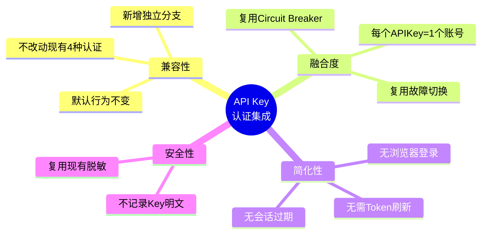


---

## 2. Kiro API Key 认证机制调研

> 基于 Kiro 官方文档与公开资料整理。内容已按授权许可要求改写。

### 2.1 关键事实

| 维度 | 说明 | 来源 |
|------|------|------|
| 触发方式 | 设置 `KIRO_API_KEY` 环境变量，CLI 跳过浏览器登录 | [headless mode 博客](https://kiro.dev/blog/introducing-headless-mode/) |
| 可用范围 | Kiro Pro / Pro+ / Power 订阅；企业版需管理员启用 | [headless 文档](https://kiro.dev/docs/cli/headless/) |
| 签发来源 | Kiro 门户 / 控制台（Settings → 启用 API Key 生成） | [API keys 治理文档](https://kiro.dev/docs/enterprise/governance/api-keys/) |
| 生命周期 | 长期有效，无会话过期，无需刷新 | [classmethod 实测](https://dev.classmethod.jp/en/articles/kiro-cli-2-0-headless-mode-api-key-auth/) |
| 使用场景 | Headless / 非交互式 / CI/CD 自动化 | [CLI 2.0 changelog](https://kiro.dev/changelog/cli/2-0/) |

### 2.2 与现有认证方式的本质区别

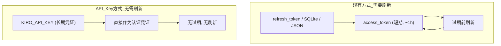

**核心差异**：现有方式都是"用 refresh_token 换取短期 access_token 并定期刷新"，
而 API Key 是**长期静态凭证**，认证模型大幅简化。

### 2.3 待验证的技术细节（实现前需确认）

> ⚠️ 官方文档未公开 API Key 的具体传输协议，以下需在实现阶段通过抓包/测试确认：

| 待验证项 | 可能性A | 可能性B |
|----------|---------|---------|
| Key 传输方式 | 直接作为 `Authorization: Bearer {key}` | 先用 Key 换取临时 access_token |
| profileArn | 仍需提供 | API Key 已绑定，无需提供 |
| 端点是否相同 | 复用 `runtime.{region}.kiro.dev` | 可能有专用端点 |
| 区域处理 | 沿用现有 region 逻辑 | Key 内含区域信息 |

**设计原则**：方案需对上述两种可能性都保持**适配弹性**（见 §5.3）。


---

## 3. 现有认证架构分析

### 3.1 认证体系的两层结构

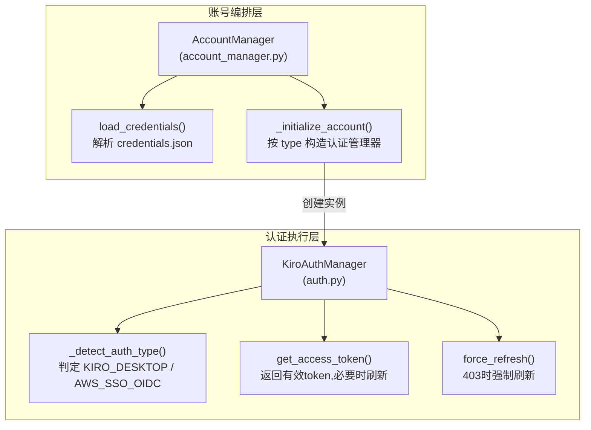

### 3.2 现有凭证类型 → 认证管理器映射

`_initialize_account()` 中的分发逻辑（auth.py 现状）：

| credentials.json `type` | 构造参数 | AuthType |
|------------------------|----------|----------|
| `json` | `creds_file=path` | 自动检测 |
| `sqlite` | `sqlite_db=path` | 通常 AWS_SSO_OIDC |
| `refresh_token` | `refresh_token=...` | KIRO_DESKTOP |

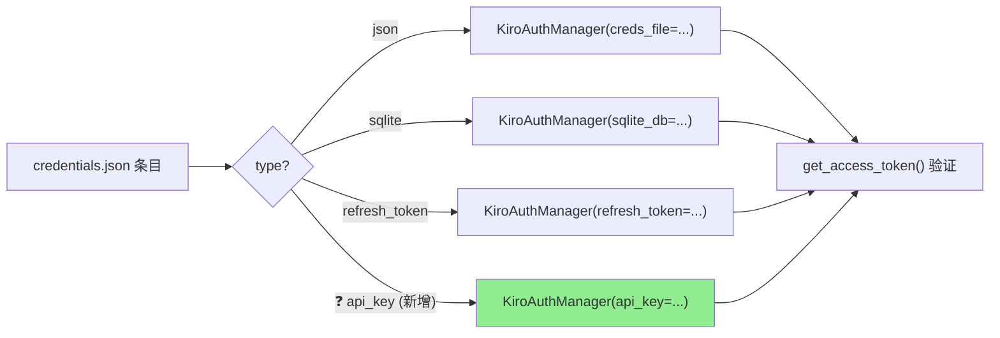

### 3.3 关键调用链路（请求时）

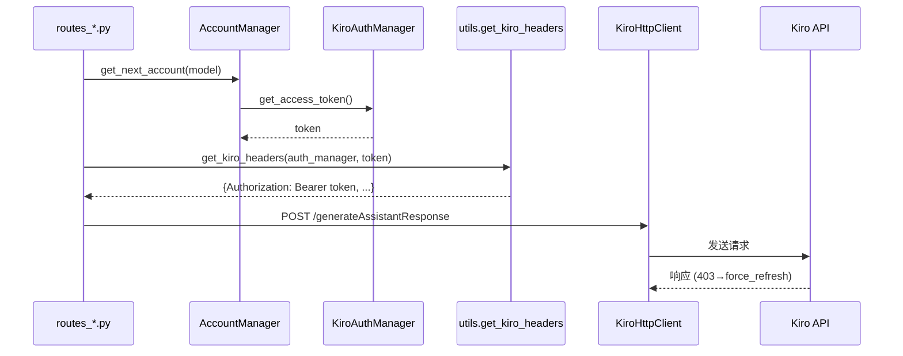

**关键观察**：整个上层（路由、HTTP客户端、headers构造）只依赖
`KiroAuthManager` 的**统一接口**（`get_access_token()` / `force_refresh()` / 属性）。
这意味着只要新认证方式**实现相同接口**，上层代码**完全无需改动**。


---

## 4. 可行性分析

### 4.1 结论：✅ 高度可行

API Key 认证天然契合现有架构，原因如下：

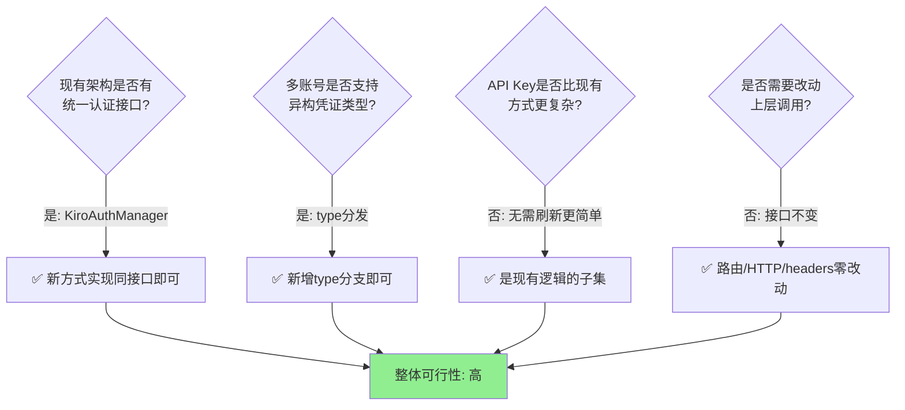

### 4.2 复杂度评估

| 评估维度 | 评级 | 说明 |
|----------|------|------|
| 实现复杂度 | 🟢 低 | API Key 无刷新逻辑，是现有逻辑的简化子集 |
| 改动范围 | 🟢 小 | 集中在 `auth.py` + `account_manager.py` |
| 破坏性风险 | 🟢 极低 | 纯新增分支，不修改现有路径 |
| 测试成本 | 🟠 中 | 需覆盖单账号/多账号/混合场景 |
| 不确定性 | 🟠 中 | API Key 传输协议需实测确认（§2.3） |

### 4.3 与多账号系统的融合度分析

**每个 API Key = 一个账号** 的映射非常自然：

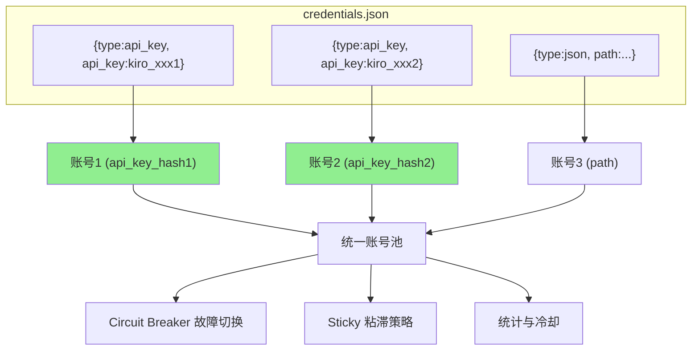

**融合优势**：
- API Key 账号与其他类型账号**混合编排**，可同时使用
- 自动继承故障切换：某个 Key 被限流(429)/配额耗尽(402) → 切换下一个
- account_id 用 `api_key_{sha256[:16]}` 生成，与 `refresh_token` 类型一致


---

## 5. 集成方案设计

### 5.1 总体改动地图

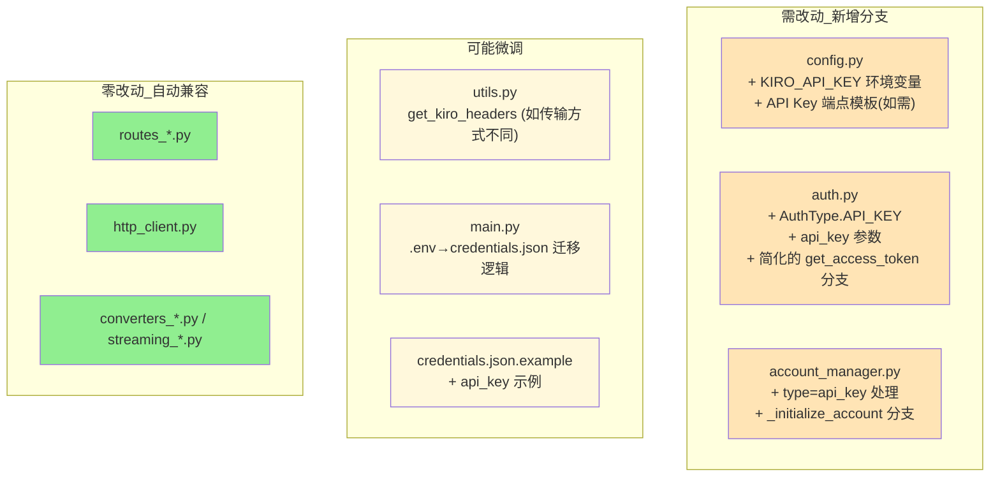

### 5.2 认证类型扩展设计

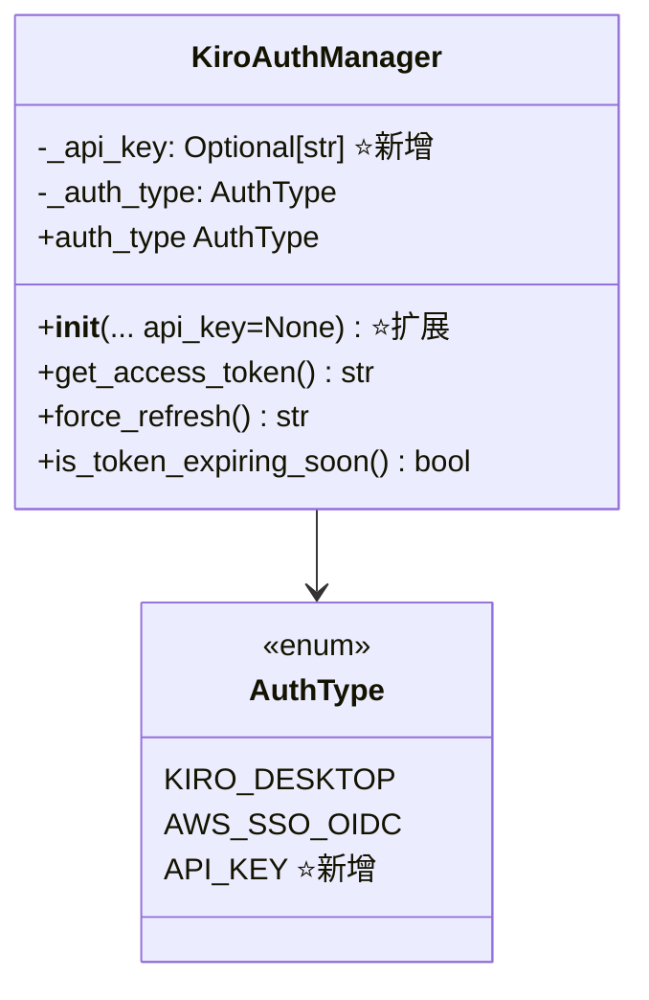

### 5.3 认证类型检测逻辑扩展

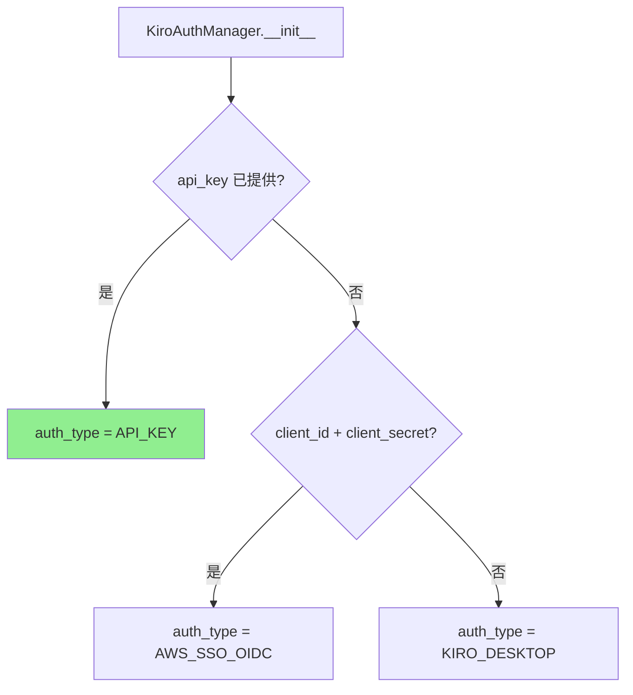

> **优先级**：`api_key` 检测应放在**最前面**，确保显式提供 Key 时优先采用。

### 5.4 get_access_token() 的 API Key 分支

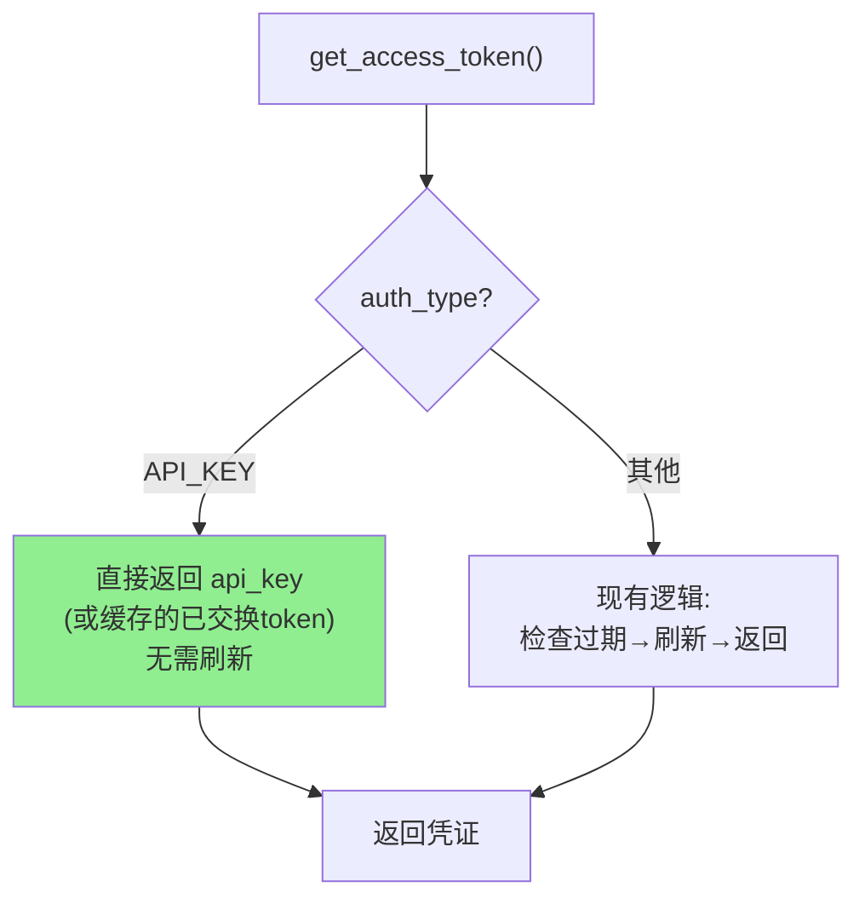

**两种实现弹性**（对应 §2.3 待验证项）：
- **可能性A（直传）**：`get_access_token()` 直接返回 `self._api_key`
- **可能性B（交换）**：首次用 Key 换取 access_token 并缓存，过期后重新换取

### 5.5 is_token_expiring_soon() 行为

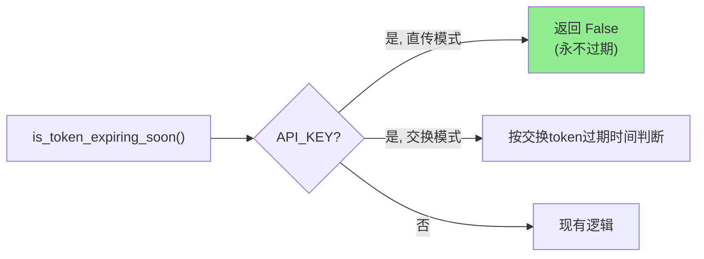


---

## 6. 详细实现设计（按模块）

> 以下为**设计示意**（伪代码/片段），用于说明改动点，非最终代码。

### 6.1 `config.py`

```python
# 新增：API Key 环境变量（用于 .env 单账号场景）
KIRO_API_KEY: str = os.getenv("KIRO_API_KEY", "")

# 如实测确认 API Key 走专用端点，则新增模板（否则复用现有 runtime 端点）
# KIRO_API_KEY_ENDPOINT_TEMPLATE: str = "https://..."
```

### 6.2 `auth.py`

```python
class AuthType(Enum):
    KIRO_DESKTOP = "kiro_desktop"
    AWS_SSO_OIDC = "aws_sso_oidc"
    API_KEY = "api_key"          # 新增

class KiroAuthManager:
    def __init__(self, ..., api_key: Optional[str] = None):
        self._api_key = api_key
        # ... 现有初始化 ...

    def _detect_auth_type(self) -> None:
        if self._api_key:                          # 新增分支(最高优先级)
            self._auth_type = AuthType.API_KEY
        elif self._client_id and self._client_secret:
            self._auth_type = AuthType.AWS_SSO_OIDC
        else:
            self._auth_type = AuthType.KIRO_DESKTOP

    async def get_access_token(self) -> str:
        if self._auth_type == AuthType.API_KEY:    # 新增分支
            # 可能性A: 直传
            return self._api_key
            # 可能性B: 交换并缓存(伪代码)
            # if not self._access_token or self.is_token_expiring_soon():
            #     await self._exchange_api_key_for_token()
            # return self._access_token
        # ... 现有刷新逻辑保持不变 ...

    def is_token_expiring_soon(self) -> bool:
        if self._auth_type == AuthType.API_KEY and not self._exchange_mode:
            return False                            # 永不过期
        # ... 现有逻辑 ...
```

### 6.3 `account_manager.py`

**load_credentials() 新增校验分支：**

```python
# API Key 类型校验（类比 refresh_token）
if cred_type == "api_key" and not entry.get("api_key"):
    logger.warning(f"Invalid entry (type=api_key requires api_key field): {entry}")
    continue

if cred_type == "api_key":
    key = entry.get("api_key", "")
    key_hash = hashlib.sha256(key.encode()).hexdigest()[:16]
    account_id = f"api_key_{key_hash}"          # 与 refresh_token 命名风格一致
    self._accounts[account_id] = Account(id=account_id)
    continue
```

**_initialize_account() 新增构造分支：**

```python
elif cred_type == "api_key":
    auth_manager = KiroAuthManager(
        api_key=creds_config.get("api_key"),
        profile_arn=creds_config.get("profile_arn"),
        region=creds_config.get("region", "us-east-1"),
        api_region=creds_config.get("api_region")
    )
```

### 6.4 `main.py`（.env → credentials.json 迁移）

在 lifespan 的迁移逻辑中，新增 API Key 来源（优先级可设为最高或可配置）：

```python
has_api_key = bool(KIRO_API_KEY)
# ...
if has_api_key:
    entry = {"type": "api_key", "api_key": KIRO_API_KEY}
    _add_env_overrides(entry)
    credentials.append(entry)
```

### 6.5 `credentials.json.example`（新增示例）

```json
{
  "type": "api_key",
  "api_key": "kiro_xxxxxxxxxxxxxxxxxxxxxxxx",
  "region": "us-east-1",
  "comment": "API Key 认证 (Kiro Pro/Pro+/Power, 来自Kiro门户)"
}
```


---

## 7. 兼容性与影响分析

### 7.1 对现有功能的影响评估

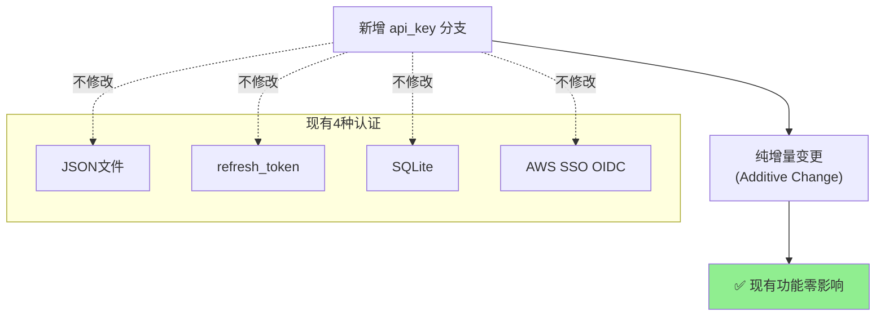

### 7.2 兼容性保障矩阵

| 现有能力 | 是否受影响 | 保障措施 |
|----------|-----------|----------|
| JSON/SQLite/refresh_token 认证 | ❌ 不受影响 | 新增 `elif` 分支，不碰现有分支 |
| Token 自动刷新 | ❌ 不受影响 | API_KEY 走独立分支 |
| 403 force_refresh | ⚠️ 需适配 | API_KEY 模式下 force_refresh 应安全降级（无refresh则报错或重用Key） |
| 多账号故障切换 | ✅ 增强 | API Key 账号自动纳入切换池 |
| 单账号模式 | ❌ 不受影响 | API Key 单账号同样 bypass Circuit Breaker |
| 错误分类(account_errors) | ✅ 复用 | 429/402/403 分类逻辑通用 |
| 调试日志/脱敏 | ⚠️ 需注意 | 确保 api_key 不被明文记录 |

### 7.3 force_refresh 的边界处理

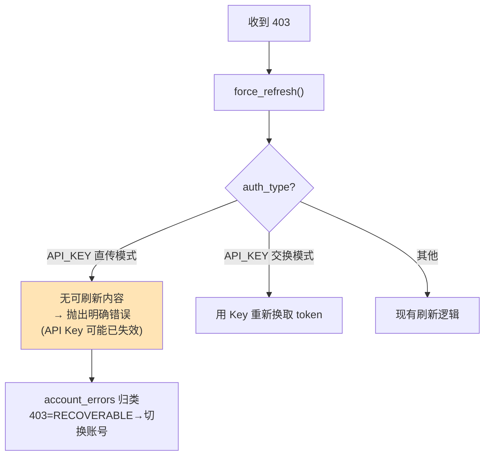

**关键设计**：API Key 直传模式下若收到 403（Key 失效），无法刷新，应：
1. 抛出清晰错误信息（提示 Key 可能失效）
2. 多账号模式下，403 归类为 RECOVERABLE → 自动切换到下一个账号
3. 单账号模式下，将原始错误返回给客户端

### 7.4 安全注意事项

| 风险点 | 防护措施 |
|--------|----------|
| API Key 明文泄露 | 日志中对 api_key 脱敏（仅显示前 8 位 + `...`） |
| state.json 持久化 | account_id 用 hash，不存储原始 Key |
| 调试日志 | debug_logger 不应记录 Authorization 头明文 |
| credentials.json 权限 | 文档提示用户设置文件权限 600 |


---

## 8. 测试策略

> 遵循项目 AGENTS.md 的"偏执测试哲学"：覆盖边界、错误、双API、流式与非流式。

### 8.1 测试覆盖矩阵

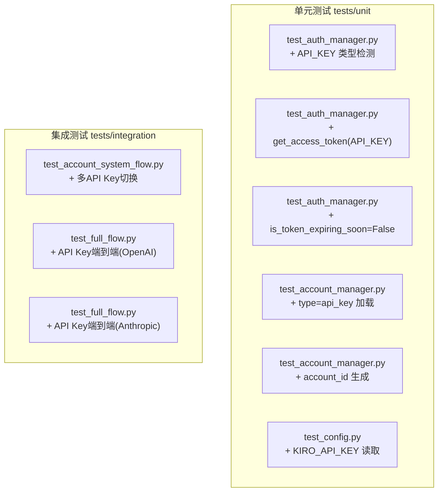

### 8.2 关键测试用例

| 用例 | 验证点 |
|------|--------|
| 仅 API Key 单账号 | 正常认证、无刷新调用、请求成功 |
| 多个 API Key | 故障切换、Sticky、冷却 |
| API Key + JSON 混合 | 异构账号共存编排 |
| API Key 失效(403) | 多账号切换 / 单账号返回错误 |
| API Key 限流(429) | RECOVERABLE 分类 + 切换 |
| Key 脱敏 | 日志中无明文 Key |
| .env 迁移 | KIRO_API_KEY → credentials.json |
| 流式 + 非流式 | 两种模式都正常 |

### 8.3 网络隔离

复用 `conftest.py` 的 `block_all_network_calls`，对 API Key 的认证/请求全部 Mock。

---

## 9. 实施步骤清单（Checklist）

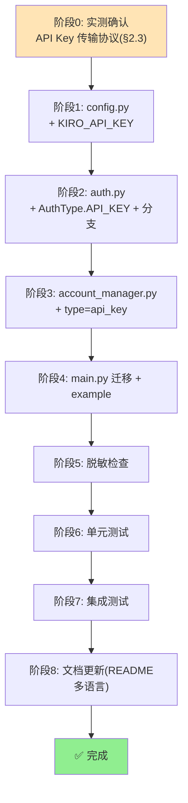

### 9.1 步骤明细

| # | 步骤 | 涉及文件 | 风险 |
|---|------|----------|------|
| 0 | 实测 API Key 协议 | (抓包/测试) | 🟠 决定A/B方案 |
| 1 | 新增环境变量 | `config.py` | 🟢 低 |
| 2 | 扩展认证类型 | `auth.py` | 🟠 中 |
| 3 | 多账号集成 | `account_manager.py` | 🟠 中 |
| 4 | 迁移+示例 | `main.py`, `credentials.json.example` | 🟢 低 |
| 5 | 安全脱敏 | `auth.py`, `debug_logger.py` | 🟢 低 |
| 6 | 单元测试 | `tests/unit/` | 🟠 中 |
| 7 | 集成测试 | `tests/integration/` | 🟠 中 |
| 8 | 文档 | `README.md` + `docs/*` | 🟢 低 |

---

## 10. 总结

### 10.1 结论

| 问题 | 答案 |
|------|------|
| 能否新增 API Key 凭证来源? | ✅ **能，且高度契合现有架构** |
| 是否兼容现有功能? | ✅ **纯增量变更，零破坏性** |
| 与多账号融合度? | ✅ **极高，每个 Key = 一个账号，自动复用所有编排能力** |
| 实现复杂度? | 🟢 **低**（API Key 是现有逻辑的简化子集，无需刷新） |
| 主要不确定性? | 🟠 **API Key 传输协议需实测确认**（§2.3） |

### 10.2 核心设计要点回顾

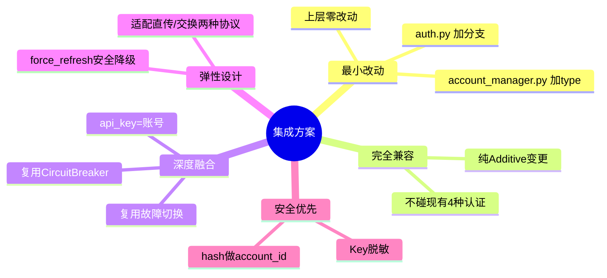

---

> **文档性质**：调研分析 + 集成方案设计（不含实际代码改动）
> **分析版本**：v2.4.dev.13
> **参考来源**：
> - [Kiro CLI 认证方法](https://kiro.dev/docs/cli/authentication/)
> - [Kiro Headless 模式](https://kiro.dev/docs/cli/headless/)
> - [Kiro 企业 API Key 治理](https://kiro.dev/docs/enterprise/governance/api-keys/)
> - [Headless 模式介绍博客](https://kiro.dev/blog/introducing-headless-mode/)
>
> 上述外部内容已按授权许可要求改写。
