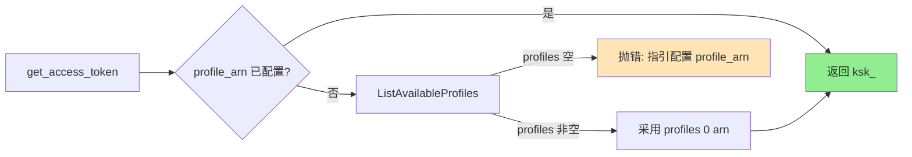
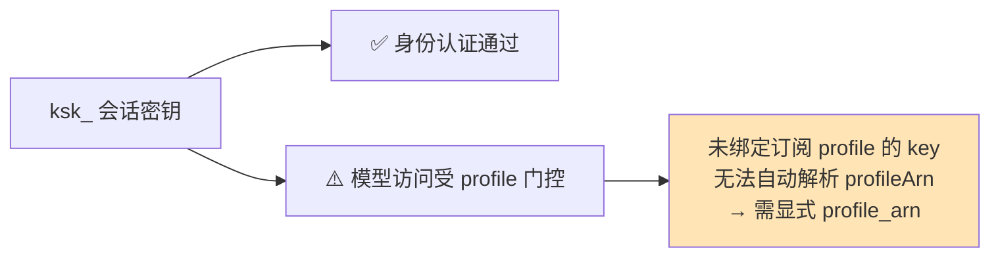

# API Key 认证凭证来源 — POC 实施结果

> 版本：v2.4.dev.13 | 完成时间：2026-06-01 | 测试：1719 passed（零回归）

为 Kiro Gateway 实现了第 5 种凭证来源 **API Key 认证（`type=api_key`）**，
每个 API Key 作为一个独立账号融入多账号系统。

---

## 1. 验证结论（协议）

通过**官方 Kiro CLI 二进制分析** + **真实端点探测**确定 API Key 的工作方式。
（外部信息已按授权许可改写。）

| 维度 | 结论 |
|------|------|
| 传输方式 | `ksk_` 直接作为 `Authorization: Bearer` | 
| 目标端点 | **`q.{region}.amazonaws.com`**（CodeWhisperer/Q 服务） |
| profileArn | 需**显式提供**；`ListAvailableProfiles` 对会话密钥返回空 |
| 模型列表 | API Key 在 `ListAvailableModels` 上 403 → 用静态 fallback 模型 |
| 过期 | 长期有效，无需刷新 |

### `ksk_` 是身份/会话密钥

实测两个独立 `ksk_` key 行为完全一致：

| 操作 @ q.us-east-1.amazonaws.com | 结果 |
|----------------------------------|------|
| 无 Authorization 头 | `400 Missing bearer token`（证明强制鉴权） |
| 带 `ksk_` Bearer → `ListAvailableProfiles` | `200 {"profiles":[]}`（认证通过，但无 profile） |
| 带 `ksk_` Bearer → `ListAvailableModels` | `403`（模型访问被 profile 门控） |

**结论**：`ksk_` 能完成身份认证，但模型访问由分配的 profile 门控。未绑定订阅
profile 的会话密钥无法自动解析 profileArn，因此**必须显式提供 `profile_arn`**。


---

## 2. 实现总览

```mermaid
flowchart TD
    CFG[".env: KIRO_API_KEY + PROFILE_ARN<br/>或 credentials.json: type=api_key"] --> AM[AccountManager]
    AM -->|"account_id = api_key_{hash}"| INIT[_initialize_account]
    INIT --> KAM["KiroAuthManager(api_key, profile_arn)"]
    KAM --> HOST["host 覆盖为 q.region.amazonaws.com"]
    INIT --> SM{"_should_use_static_models?"}
    SM -->|API_KEY → True| FB["静态 fallback 模型<br/>(跳过 ListAvailableModels 403)"]

    REQ[请求] --> GAT[get_access_token]
    GAT --> PA{profile_arn 已知?}
    PA -->|是 (推荐)| RET["返回 ksk_ 作为 Bearer"]
    PA -->|否| DISC["ListAvailableProfiles (best-effort)"]
    DISC -->|空| ERR["清晰错误: 请配置 profile_arn"]
    DISC -->|非空| RET
    RET --> GEN["generateAssistantResponse<br/>Bearer ksk_ + profileArn"]

    style RET fill:#90EE90
    style FB fill:#90EE90
    style ERR fill:#FFE4B5
```

## 3. 改动文件清单（与代码一一对应）

| 文件 | 改动 |
|------|------|
| `kiro/config.py` | `KIRO_API_KEY`；`KIRO_API_KEY_SERVICE_HOST_TEMPLATE`（默认 `q.{region}.amazonaws.com`）；`get_kiro_api_key_service_host()`；`KIRO_API_KEY_SERVICE_CONFIGURED` |
| `kiro/auth.py` | `AuthType.API_KEY`；`api_key` 参数；`_detect_auth_type` 优先识别；host 覆盖为 q.amazonaws.com；`get_access_token` 直传 + 懒发现；`_discover_profile_arn()`；`is_token_expiring_soon=False`；`force_refresh` 返回 key；`_redact_secret()` 脱敏 |
| `kiro/account_manager.py` | `type=api_key`（校验 / 哈希 account_id / 匹配 / 构造）；`_should_use_static_models()`（API_KEY 跳过 ListAvailableModels）；无 profile_arn 时警告 |
| `main.py` | `KIRO_API_KEY` 迁移（最高优先级）+ 配置校验 |
| `.env.example` / `credentials.json.example` | `api_key` + `profile_arn` 示例（标注会话密钥需显式 profile_arn） |
| 4 个测试文件 | +28 个测试 |


---

## 4. 关键技术变更说明

### 4.1 端点路由覆盖（auth.py）

API_KEY 认证必须发往 CodeWhisperer/Q 服务，而非默认的 `runtime.kiro.dev`
（后者对 API Key 返回 403）。在 `__init__` 中按认证类型覆盖 host：

```python
if self._auth_type == AuthType.API_KEY:
    api_key_host = get_kiro_api_key_service_host(final_api_region)  # q.{region}.amazonaws.com
    self._api_host = api_key_host
    self._q_host = api_key_host
```

### 4.2 profileArn 解析（显式优先 + best-effort 发现）



### 4.3 跳过 ListAvailableModels（account_manager.py）

API Key 在 `ListAvailableModels` 上返回 403，故初始化/刷新时跳过该调用，
直接使用静态 fallback 模型，避免 3 次必败重试：

```python
def _should_use_static_models(auth_manager) -> bool:
    if auth_manager.auth_type == AuthType.API_KEY:
        return True            # 跳过 ListAvailableModels
    return _is_runtime_endpoint(auth_manager)
```

### 4.4 安全脱敏

| 风险点 | 处理 |
|--------|------|
| 日志泄露 Key | `_redact_secret()` 仅显示前 8 位 + 长度 |
| state.json | `account_id` 为 SHA256 哈希，不存原始 key |
| 调试日志 | 不记录 Authorization 头 |

---

## 5. 测试结果

| 指标 | 结果 |
|------|------|
| 总测试数 | **1719 passed** |
| 失败 / 回归 | 0 |
| 新增 | 28（26 单元 + 2 集成） |
| 环境 | Python 3.11.15 |

```
$ pytest -q
1719 passed, 1 warning
```

新增测试覆盖：AuthType 检测优先级、host 路由、永不过期、直传返回 key、
profile 发现（成功/空报错/已配置则跳过）、force_refresh、脱敏、
`_should_use_static_models`、config helper、api_key 账号加载/确定性 ID/缺字段/
多 key 独立/混合类型/显式 profile_arn 初始化、双 key 故障切换。


---

## 6. 使用方式

### 方式一：.env（单账号）

```bash
KIRO_API_KEY="ksk_xxxxxxxxxxxx"
# 推荐显式提供 profile_arn（ksk_ 会话密钥无法自动发现 profile）
PROFILE_ARN="arn:aws:codewhisperer:us-east-1:...:profile/..."
# 可选：覆盖服务端点（默认 https://q.{region}.amazonaws.com）
# KIRO_API_KEY_SERVICE_URL="https://q.{region}.amazonaws.com"
```

### 方式二：credentials.json（多账号）

```json
[
  {
    "type": "api_key",
    "api_key": "ksk_xxxxxxxxxxxx",
    "profile_arn": "arn:aws:codewhisperer:us-east-1:...:profile/...",
    "region": "us-east-1"
  }
]
```

---

## 7. 总结与限制

### 已完成

- ✅ 协议已验证：直传 Bearer → `q.{region}.amazonaws.com`（无交换）
- ✅ 多账号融合：每个 Key = 一个账号，复用故障切换 / Circuit Breaker / Sticky
- ✅ 跳过 `ListAvailableModels`（API Key 403）→ 静态 fallback 模型
- ✅ 安全脱敏；1719 测试零回归

### 限制（平台侧，非实现问题）



- `ksk_` 是身份/会话密钥；模型访问由分配的 profile 门控。
- 未绑定可用订阅 profile 的 key：`ListAvailableProfiles` 返回空，需**显式配置 `profile_arn`**。
- 端到端模型调用最终是否成功，取决于该 Key 对应账号的订阅与 profile 开通情况；
  网关会原样透传平台返回的错误（403/402 等），并由失效切换逻辑处理。

> 关联方案文档：[`API_KEY_AUTH_DESIGN.md`](API_KEY_AUTH_DESIGN.md)
