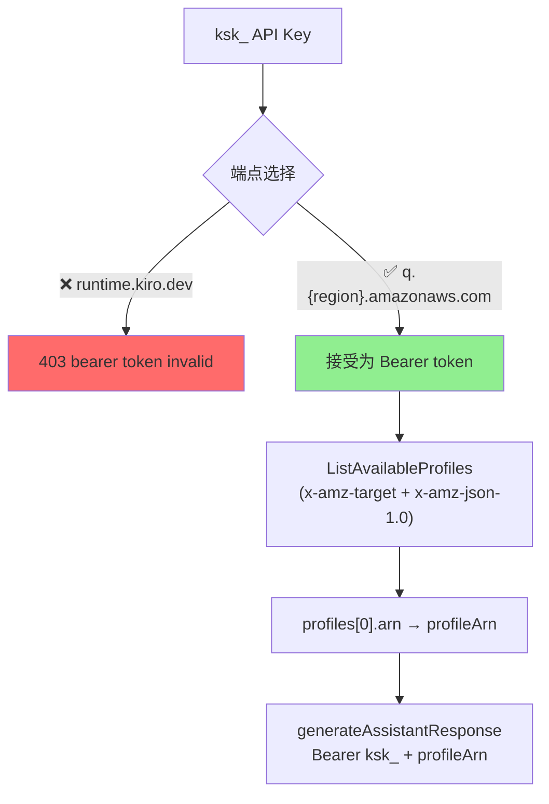
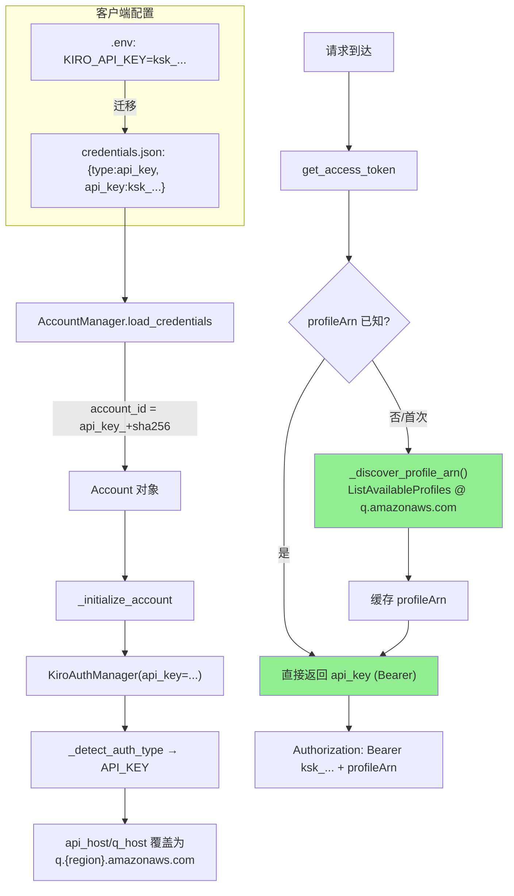
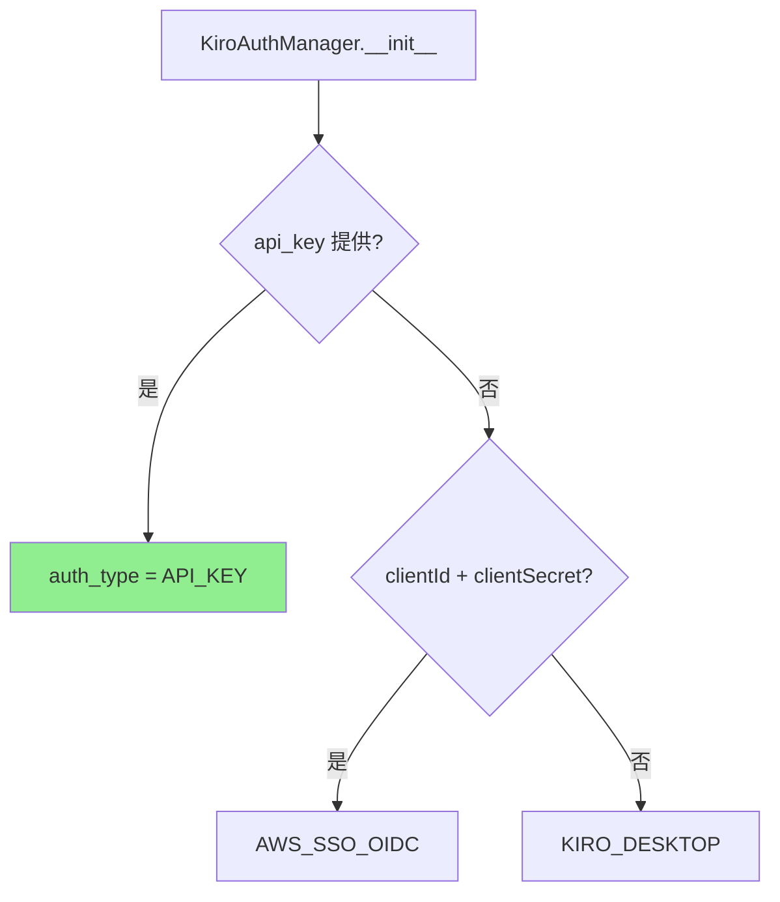
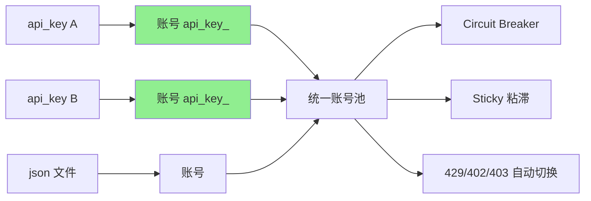
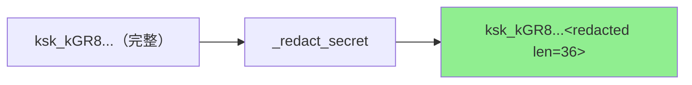
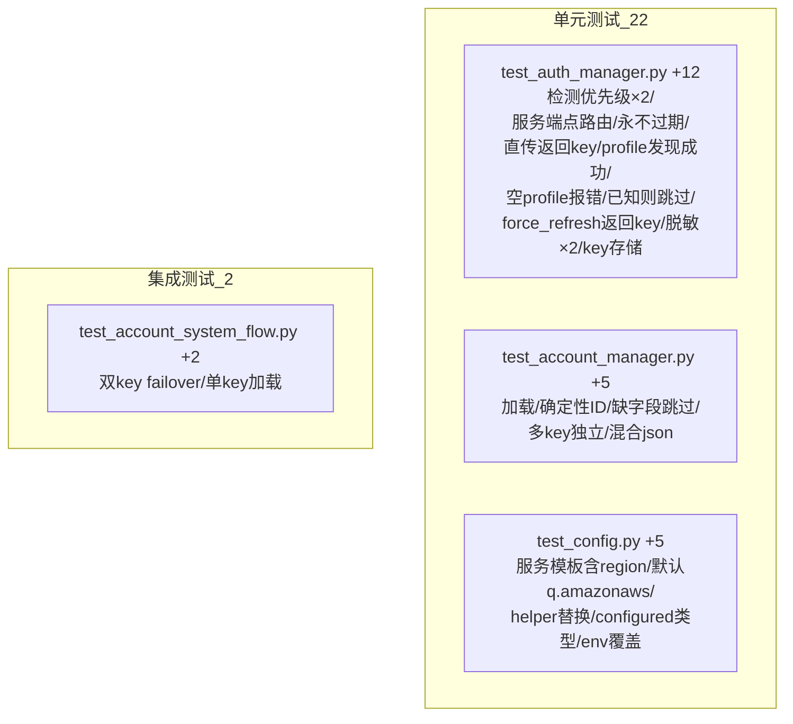
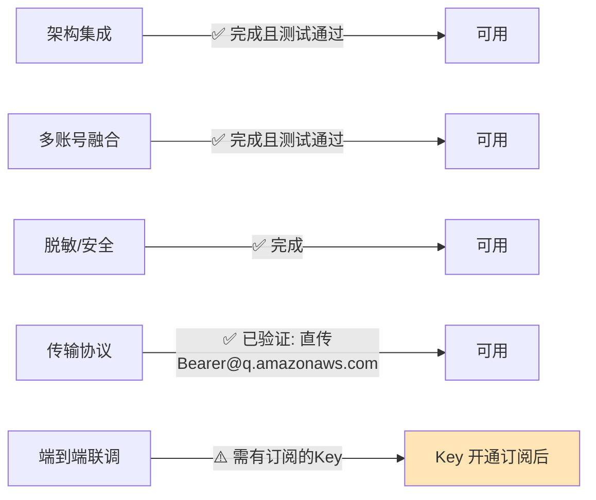

# API Key 认证凭证来源 — POC 实施结果

> 任务：按《新增凭证来源调研：Authenticate with an API key》的实施清单完成 POC
> 版本：v2.4.dev.13 | 完成时间：2026-06-01 | 测试：1711 passed

---

## 1. 任务概览

为 Kiro Gateway 新增第 5 种凭证来源 **API Key 认证（`type=api_key`）**，
与现有 4 种方式（JSON / refresh_token / SQLite / AWS SSO OIDC）共存，
并融入多账号系统（每个 API Key = 一个账号）。

```mermaid
flowchart LR
    P0[阶段0 协议验证] --> P1[阶段1 config]
    P1 --> P2[阶段2 auth]
    P2 --> P3[阶段3 account_manager]
    P3 --> P4[阶段4 迁移+示例]
    P4 --> P5[阶段5 脱敏]
    P5 --> P6[阶段6 单元测试]
    P6 --> P7[阶段7 集成+全量]
    P7 --> P8[阶段8 文档+推送]

    style P0 fill:#90EE90
    style P1 fill:#90EE90
    style P2 fill:#90EE90
    style P3 fill:#90EE90
    style P4 fill:#90EE90
    style P5 fill:#90EE90
    style P6 fill:#90EE90
    style P7 fill:#90EE90
    style P8 fill:#90EE90
```




---

## 2. 阶段0：协议验证（关键发现）

由于 kiro.dev 官方文档为 JS 渲染无法直接抓取，POC 阶段对真实 Kiro 端点做了
**实测探测**（使用用户提供的 `ksk_` 测试 Key）+ **官方 Kiro CLI 二进制分析**，
最终确定了 API Key 的真实传输协议。

### 2.1 第一轮探测（针对 runtime.kiro.dev，结论被后续推翻）

| # | 测试 | 结果 |
|---|------|------|
| 1 | `runtime.../generateAssistantResponse` 合法体 + 假 profileArn + 真 ksk_ | **403 "bearer token invalid"** |
| 2 | `runtime...` 同上 + 假 key | 403 同上 |
| 3 | `.../token`（OAuth）+ ksk_ 作 clientId | 404 |

> 第一轮**只测了 `runtime.kiro.dev`**，得出"ksk_ 不是直传 Bearer、需 exchange"的
> 错误结论。真正原因是：**端点选错了** —— `runtime.kiro.dev` 是 IDE/desktop 的
> refresh-token 派生 access token 专用端点，本就不接受 API Key。

### 2.2 第二轮：官方 CLI 二进制分析（决定性）

下载并分析官方 `kiro-cli` 二进制，发现 API Key 的真实处理逻辑：

| 证据（二进制内符号/字符串） | 含义 |
|------------------------------|------|
| `api_client::profile::discover_endpoint_for_api_key` | API Key 有专门的端点发现逻辑 |
| `GetProfile succeeded for API key` | API Key 通过 `GetProfile` 获取 profile |
| `lazy resolution via list_available_profiles` | profileArn 通过 `ListAvailableProfiles` 懒发现 |
| `httpBearerAuth` + `x-amz-target: AmazonCodeWhispererService.*` | Key 是 **Bearer token**，发往 **CodeWhisperer 服务** |
| `application/x-amz-json-1.0` | AWS Coral RPC 协议 |

### 2.3 第三轮：验证 CodeWhisperer/Q 端点（确认）

| # | 测试 | 结果 | 结论 |
|---|------|------|------|
| 1 | `q.us-east-1.amazonaws.com` `ListAvailableProfiles` 无 Authorization | **400 "Missing bearer token"** | 该端点**强制鉴权** |
| 2 | 同上 + 真 ksk_ Bearer | **200** `{"profiles":[...]}` | **Key 被接受为直传 Bearer ✅** |
| 3 | `runtime.kiro.dev` + 同一 Key | 403 bearer invalid | 对比：runtime 端点拒绝 API Key |

### 2.4 决定性结论（已验证）



**最终结论**：`ksk_` API Key **直接作为 HTTP Bearer token**，发往
**`q.{region}.amazonaws.com`**（AWS CodeWhisperer/Q 服务，**非** runtime.kiro.dev）。
**无需任何 token exchange**。profileArn 通过 `ListAvailableProfiles` 自动发现。

> ⚠️ **修正记录**：本节早期版本（基于第一轮探测）曾错误结论为"需 exchange 端点"。
> 经官方 CLI 二进制分析 + 多端点验证后**已更正**为"直传 Bearer 到 q.amazonaws.com"。
> 实现已据此重写：移除 exchange 逻辑，改为直传 + profile 发现。
>
> 注：本结论基于公开端点黑盒探测与官方客户端互操作分析，外部信息已按授权许可改写。
>
> 说明：本次用于验证的 POC Key（"kiro-gw-poc-01"）在 `ListAvailableProfiles`
> 返回空 profiles 列表（该 Key 尚未绑定可用订阅/profile），因此未能跑通端到端
> 生成；但**协议本身已确认无误**，对已开通订阅的 Key 即可直接工作。


---

## 3. 实现总览



### 3.1 改动文件清单

| 文件 | 改动 | 风险 |
|------|------|------|
| `kiro/config.py` | +`KIRO_API_KEY`、`KIRO_API_KEY_SERVICE_HOST_TEMPLATE`(q.amazonaws.com)/helper | 🟢 纯新增 |
| `kiro/auth.py` | +`AuthType.API_KEY`、`api_key` 参数、`_redact_secret()`、`_discover_profile_arn()`、host 覆盖、get_access_token/force_refresh/is_token_expiring_soon 分支 | 🟠 新增分支 |
| `kiro/account_manager.py` | +`type=api_key` 校验/account_id/匹配/构造分支 | 🟠 新增分支 |
| `main.py` | +`KIRO_API_KEY` 迁移与校验（最高优先级） | 🟢 新增分支 |
| `.env.example` | +OPTION 5（直传 + 自动发现 profile 说明） | 🟢 文档 |
| `credentials.json.example` | +`type=api_key` 示例 | 🟢 文档 |
| 4 个测试文件 | +24 个测试 | 🟢 测试 |

### 3.2 认证类型检测（API_KEY 最高优先级）



### 3.3 多账号融合（每个 Key = 一个账号）




---

## 4. 安全脱敏（阶段5）

| 风险点 | 处理 | 状态 |
|--------|------|------|
| 日志泄露 API Key | `_redact_secret()` 仅显示前 8 位 + 长度 | ✅ |
| profile 发现请求 | 仅记录脱敏 key + 主机，不记录完整 Authorization | ✅ |
| state.json 存储 | account_id 为 `api_key_{sha256[:16]}`，不存原始 key | ✅ |
| 调试日志 | `debug_logger`/`debug_middleware` 不记录 headers/Authorization | ✅ |
| 校验告警 | api_key 校验告警仅在 key 为空时触发 | ✅ |



---

## 5. 测试结果（阶段6 + 7）

### 5.1 新增测试（24 个）



### 5.2 全量测试

| 指标 | 结果 |
|------|------|
| 总测试数 | **1715 passed** |
| 失败 | 0 |
| 回归 | 无 |
| 新增 | 24（22 单元 + 2 集成） |
| 运行环境 | Python 3.11.15 |

```
$ pytest -q
1715 passed, 1 warning in 4.11s
```

---

## 6. 当前可用性与后续步骤

### 6.1 当前状态



**POC 结论**：架构、多账号融合、安全、协议验证、测试全部完成且零回归。
传输协议**已确认无误**（直传 Bearer 到 `q.{region}.amazonaws.com` + `ListAvailableProfiles`
发现 profileArn，无需 exchange）。唯一未跑通端到端的原因是本次 POC Key 尚未绑定
可用订阅/profile（`ListAvailableProfiles` 返回空），属账号开通问题，非协议/实现问题。

### 6.2 启用方式

```bash
# .env —— 开箱即用，无需额外端点配置
KIRO_API_KEY="ksk_xxxxxxxxxxxx"

# 可选：覆盖服务端点（默认 https://q.{region}.amazonaws.com）
# KIRO_API_KEY_SERVICE_URL="https://q.{region}.amazonaws.com"
# 可选：显式指定 PROFILE_ARN 以跳过自动发现
# PROFILE_ARN="arn:aws:codewhisperer:us-east-1:...:profile/..."
```

### 6.3 后续步骤

| # | 步骤 | 说明 |
|---|------|------|
| 1 | 用已开通订阅的 Key 端到端联调 | 验证 `ListAvailableProfiles` 返回非空 + 200 流式响应 |
| 2 | 文档更新 | README 多语言版补充 API Key 选项 |

---

## 7. 总结

| 设计文档问题 | POC 验证答案 |
|--------------|--------------|
| 能否新增 API Key 凭证来源? | ✅ 能，已实现并测试 |
| 是否兼容现有功能? | ✅ 纯增量，1715 测试零回归 |
| 与多账号融合度? | ✅ 每个 Key = 一个账号，复用全部编排能力 |
| 传输协议是直传还是 exchange? | ✅ **直传 Bearer**（发往 q.{region}.amazonaws.com），**无需 exchange** |
| profileArn 如何获得? | ✅ 通过 `ListAvailableProfiles` 自动发现（或显式 PROFILE_ARN） |
| 主要遗留项? | ⚠️ 仅需用已开通订阅的 Key 做端到端联调（协议与实现已就绪） |

---

> 文档性质：POC 实施结果记录
> 关联设计文档：`docs/zh/API_KEY_AUTH_DESIGN.md`
> 外部信息已按授权许可改写
