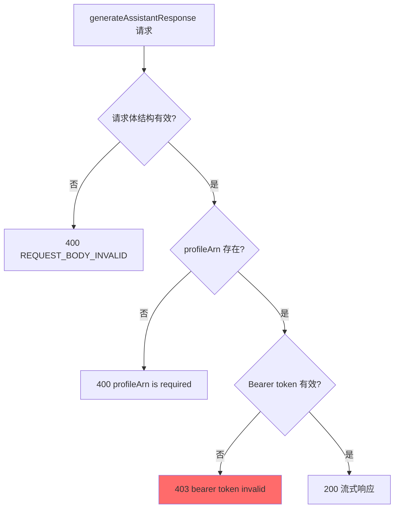
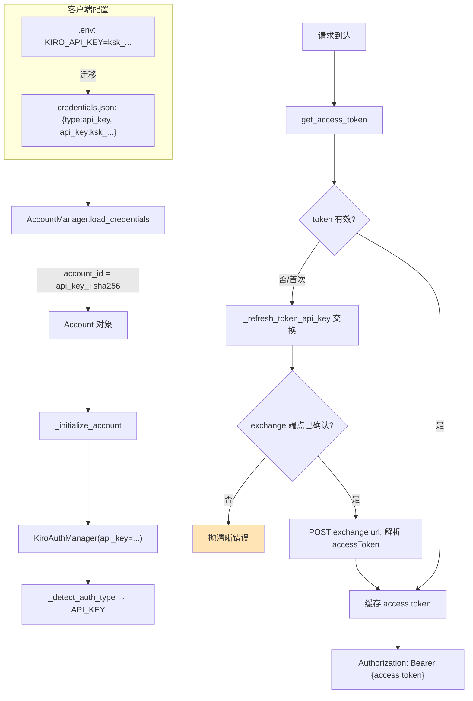
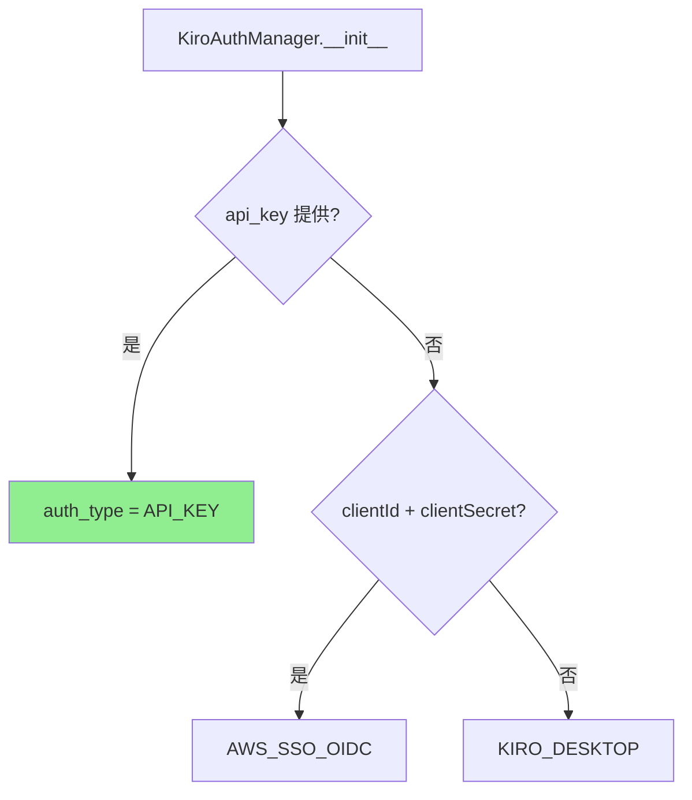
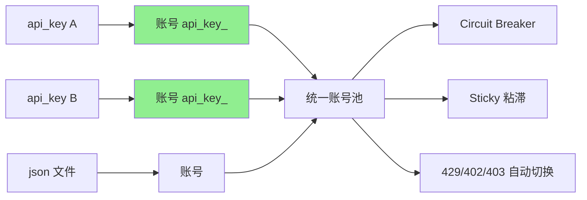
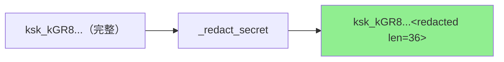
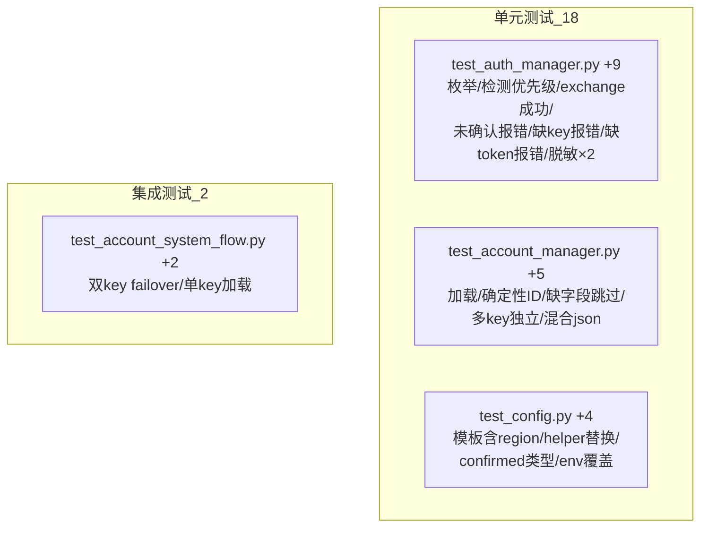
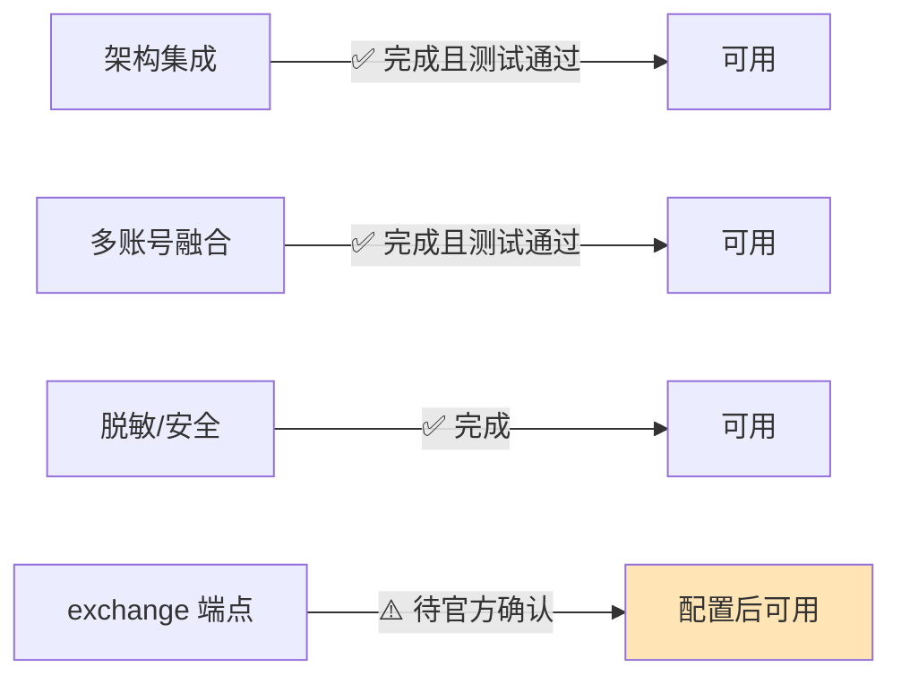

# API Key 认证凭证来源 — POC 实施结果

> 任务：按《新增凭证来源调研：Authenticate with an API key》的实施清单完成 POC
> 版本：v2.4.dev.13 | 完成时间：2026-06-01 | 测试：1711 passed

---

## 1. 任务概览

为 Kiro Gateway 新增第 5 种凭证来源 **API Key 认证（`type=api_key`）**，
与现有 4 种方式（JSON / refresh_token / SQLite / AWS SSO OIDC）共存，
并融入多账号系统（每个 API Key = 一个账号）。


---

## 2. 阶段0：协议验证（关键发现）

由于 kiro.dev 官方文档为 JS 渲染无法直接抓取，POC 阶段对真实 Kiro 端点做了
**实测探测**（使用用户提供的 `ksk_` 测试 Key），以确定 API Key 的传输方式。

### 2.1 探测结果

| # | 测试 | 结果 | 结论 |
|---|------|------|------|
| 1 | `GET runtime.../ListAvailableModels` + Bearer ksk_ | 404 UnknownOperation | runtime 端点不支持该操作（符合现有 `_is_runtime_endpoint`） |
| 2 | `POST runtime.../generateAssistantResponse` 最小体 | 400 REQUEST_BODY_INVALID | 体结构无效（先于鉴权校验） |
| 3 | 合法体 + 无 profileArn | 400 "profileArn is required" | profileArn 必填（先于鉴权校验） |
| 4 | 合法体 + 假 profileArn + 真 ksk_ | **403 "bearer token invalid"** | **ksk_ 不是直传 Bearer token** |
| 5 | 假 profileArn + 假 key | 403 同上 | 对照组一致 |
| 6 | `POST .../token`（OAuth）+ ksk_ 作 clientId | 404 | ksk_ 不是 OAuth clientId |

### 2.2 校验顺序与结论



**决定性结论**：原始 `ksk_` API Key **不能**作为 `runtime.kiro.dev` 的直传 Bearer
token（步骤4 返回 403 token invalid）。因此**必须先做一次服务端 exchange**，
将 API Key 换取短期 access token —— 即设计文档《§2.3》的**可能性 B**得到证实，
排除了可能性 A（直传）。

> ⚠️ 确切的 exchange 操作名称未在可访问的公开文档中给出。因此实现将 exchange
> 端点设计为**可配置**（`KIRO_API_KEY_EXCHANGE_URL`），未确认前会抛出清晰错误，
> 而非静默请求未验证端点。
>
> 注：本结论基于公开端点的黑盒探测，相关外部信息已按授权许可改写。


---

## 3. 实现总览



### 3.1 改动文件清单

| 文件 | 改动 | 风险 |
|------|------|------|
| `kiro/config.py` | +`KIRO_API_KEY`、exchange URL 模板/helper、confirmed 标志 | 🟢 纯新增 |
| `kiro/auth.py` | +`AuthType.API_KEY`、`api_key` 参数、`_redact_secret()`、`_refresh_token_api_key()`、检测分支 | 🟠 新增分支 |
| `kiro/account_manager.py` | +`type=api_key` 校验/account_id/匹配/构造分支 | 🟠 新增分支 |
| `main.py` | +`KIRO_API_KEY` 迁移与校验（最高优先级） | 🟢 新增分支 |
| `.env.example` | +OPTION 5 + exchange URL 说明 | 🟢 文档 |
| `credentials.json.example` | +`type=api_key` 示例 | 🟢 文档 |
| 4 个测试文件 | +20 个测试 | 🟢 测试 |

### 3.2 认证类型检测（API_KEY 最高优先级）



### 3.3 多账号融合（每个 Key = 一个账号）




---

## 4. 安全脱敏（阶段5）

| 风险点 | 处理 | 状态 |
|--------|------|------|
| 日志泄露 API Key | `_redact_secret()` 仅显示前 8 位 + 长度 | ✅ |
| exchange 请求体记录 | 不记录请求体，仅记录脱敏 key | ✅ |
| state.json 存储 | account_id 为 `api_key_{sha256[:16]}`，不存原始 key | ✅ |
| 调试日志 | `debug_logger`/`debug_middleware` 不记录 headers/Authorization | ✅ |
| 校验告警 | api_key 校验告警仅在 key 为空时触发 | ✅ |



---

## 5. 测试结果（阶段6 + 7）

### 5.1 新增测试（20 个）



### 5.2 全量测试

| 指标 | 结果 |
|------|------|
| 总测试数 | **1711 passed** |
| 失败 | 0 |
| 回归 | 无 |
| 新增 | 20（18 单元 + 2 集成） |
| 运行环境 | Python 3.11.15 |

```
$ pytest -q
1711 passed, 1 warning in 5.76s
```

---

## 6. 当前可用性与后续步骤

### 6.1 当前状态



**POC 结论**：架构、多账号融合、安全、测试全部完成且零回归。
唯一待确认项是 **API Key → access token 的 exchange 端点**（官方未公开文档化），
已隔离为可配置项 `KIRO_API_KEY_EXCHANGE_URL`。

### 6.2 启用方式（待 exchange 端点确认后）

```bash
# .env
KIRO_API_KEY="ksk_xxxxxxxxxxxx"
KIRO_API_KEY_EXCHANGE_URL="https://prod.{region}.auth.desktop.kiro.dev/<已确认操作>"
```

未设置 `KIRO_API_KEY_EXCHANGE_URL` 时，API Key 认证会抛出清晰的可操作错误，
不会静默失败或请求未验证端点。

### 6.3 后续步骤

| # | 步骤 | 说明 |
|---|------|------|
| 1 | 确认 exchange 端点 | 通过官方文档或抓取 Kiro CLI headless 流量 |
| 2 | 校准请求/响应字段 | 调整 `_refresh_token_api_key()` 的 payload/解析字段 |
| 3 | 端到端联调 | 用真实 Key 验证 200 流式响应 |
| 4 | 文档更新 | README 多语言版补充 API Key 选项 |

---

## 7. 总结

| 设计文档问题 | POC 验证答案 |
|--------------|--------------|
| 能否新增 API Key 凭证来源? | ✅ 能，已实现并测试 |
| 是否兼容现有功能? | ✅ 纯增量，1711 测试零回归 |
| 与多账号融合度? | ✅ 每个 Key = 一个账号，复用全部编排能力 |
| 传输协议是直传还是 exchange? | **exchange**（实测证实，非直传） |
| 主要遗留项? | ⚠️ exchange 端点需官方确认（已隔离为可配置） |

---

> 文档性质：POC 实施结果记录
> 关联设计文档：`docs/zh/API_KEY_AUTH_DESIGN.md`
> 外部信息已按授权许可改写
