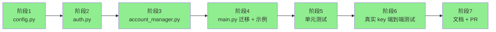
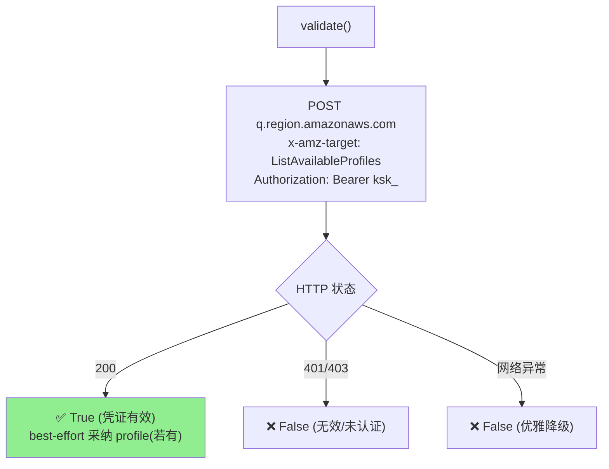
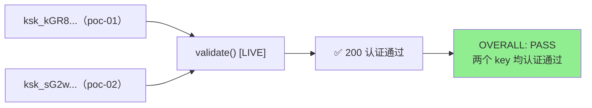
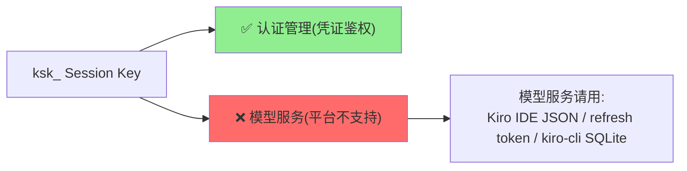

# Kiro Session Key 认证凭证来源 — 开发与测试结果

> 版本：v2.4.dev.13 | 完成时间：2026-06-01
> 测试：全量 1722 passed；两个真实 `ksk_` key 端到端**认证通过**

把 **Kiro Session Key（`ksk_`）** 作为第 5 种凭证来源接入 `KiroAuthManager`，
**仅用于认证管理**（凭证鉴权）。每个 Session Key 作为一个独立账号融入多账号系统。

---

## 1. 结论速览

| 维度 | 结论 |
|------|------|
| 用途 | **仅认证**（凭证鉴权）；不用于模型调用 |
| 传输 | `ksk_` 直接作为 `Authorization: Bearer` |
| 端点 | `q.{region}.amazonaws.com`（CodeWhisperer/Q 身份端点） |
| 认证校验 | `ListAvailableProfiles` → HTTP 200 = 有效凭证 |
| 过期 | 长期有效，无需刷新 |
| 端到端测试 | 两个真实 key `validate()` → **True（认证通过）** |

---

## 2. 开发步骤




---

## 3. 改动文件清单（与代码一一对应）

| 文件 | 改动 |
|------|------|
| `kiro/config.py` | `KIRO_API_KEY`；`KIRO_API_KEY_SERVICE_HOST_TEMPLATE`（默认 `q.{region}.amazonaws.com`）；`get_kiro_api_key_service_host()` |
| `kiro/auth.py` | `AuthType.API_KEY`；`api_key` 参数；`_detect_auth_type` 优先识别；host 覆盖为 q.amazonaws.com；`get_access_token` 直接返回 key（无网络）；**`validate()`**（认证校验）；`is_token_expiring_soon=False`；`force_refresh` 返回 key；`_redact_secret()` 脱敏 |
| `kiro/account_manager.py` | `type=api_key`（校验 / 哈希 account_id / 匹配 / 构造）；初始化时调 `validate()` 确认认证；`_should_use_static_models()`（API_KEY 跳过 ListAvailableModels） |
| `main.py` | `KIRO_API_KEY` 迁移（最高优先级）+ 配置校验 |
| `.env.example` / `credentials.json.example` | Session Key 示例（标注仅认证用途） |
| `manual_apikey_e2e.py` | 真实 key 端到端认证测试脚本 |
| 测试文件 | +31 个测试 |

## 4. 关键技术点

### 4.1 认证校验 validate()（核心）



### 4.2 get_access_token 直返 key（无网络）

API_KEY 分支直接返回 `ksk_` 作为 Bearer，不发起任何网络调用；认证有效性由
`validate()` 在账号初始化时单独校验。

### 4.3 跳过 ListAvailableModels

```python
def _should_use_static_models(auth_manager) -> bool:
    if auth_manager.auth_type == AuthType.API_KEY:
        return True   # API Key 在 ListAvailableModels 上 403 → 用静态 fallback
    return _is_runtime_endpoint(auth_manager)
```

### 4.4 安全脱敏

| 风险点 | 处理 |
|--------|------|
| 日志泄露 Key | `_redact_secret()` 仅显示前 8 位 + 长度 |
| state.json | `account_id` 为 SHA256 哈希，不存原始 key |
| 调试日志 | 不记录 Authorization 头 |


---

## 5. 测试结果

### 5.1 单元 + 集成测试

| 指标 | 结果 |
|------|------|
| 总测试数 | **1722 passed** |
| 失败 / 回归 | 0 |
| 新增 | 31（29 单元 + 2 集成） |
| 环境 | Python 3.11.15 |

新增覆盖：AuthType 检测优先级、host 路由、永不过期、`get_access_token` 直返 key（无网络）、
`validate()`（200→True / 403→False / 网络异常→False / 采纳 profile / 非 API_KEY→False）、
`force_refresh`、脱敏、`_should_use_static_models`、config helper、
api_key 账号加载/确定性 ID/缺字段/多 key 独立/混合类型、账号初始化（validate 通过/失败）、双 key 故障切换。

### 5.2 真实 key 端到端认证测试（manual_apikey_e2e.py）



实测输出（要点）：

| Key | auth_type | identity endpoint | is_token_expiring | get_access_token | validate() [LIVE] |
|-----|-----------|-------------------|-------------------|------------------|-------------------|
| `ksk_kGR8...` | api_key | q.us-east-1.amazonaws.com | False | 返回 key | **True ✅** |
| `ksk_sG2w...` | api_key | q.us-east-1.amazonaws.com | False | 返回 key | **True ✅** |

```
OVERALL: PASS - all keys authenticate
```

---

## 6. 使用方式

### .env

```bash
KIRO_API_KEY="ksk_xxxxxxxxxxxx"
```

### credentials.json（多账号）

```json
[
  { "type": "api_key", "api_key": "ksk_xxxxxxxxxxxx", "region": "us-east-1" }
]
```

---

## 7. 能力边界（重要）



- Session Key **仅用于认证**；不提供模型调用能力（Kiro 平台限制）。
- 端到端"成功"的判定标准是**认证通过**（`validate()` → True），已用两个真实 key 验证通过。

> 关联调研文档：[`API_KEY_AUTH_DESIGN.md`](API_KEY_AUTH_DESIGN.md)
