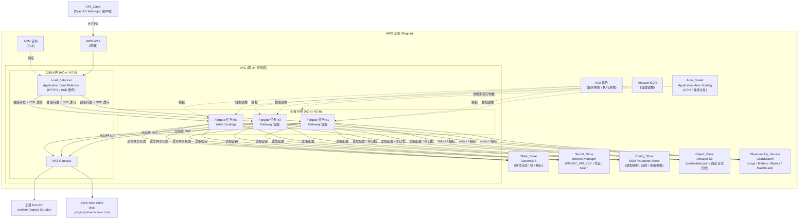
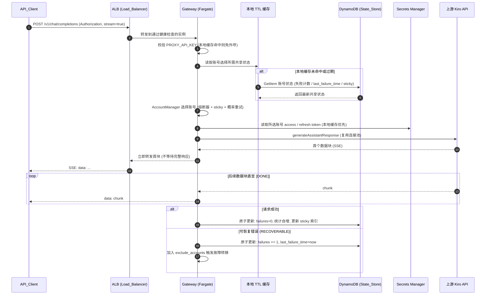
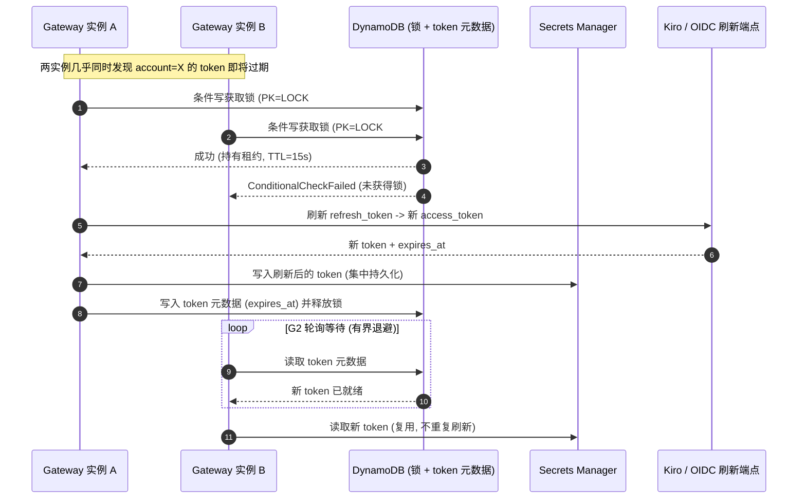

# Kiro Gateway —— AWS 云原生架构（中文）

> 本文档描述将单机版 **kiro-gateway**（Python / FastAPI，兼容 OpenAI 与 Anthropic API，反向代理 Kiro API / Amazon Q Developer）改造为 **AWS 云原生、池化、可水平伸缩** 服务后的整体架构。文档结构与章节组织对齐 AWS 官方方案《Guidance for Multi-Provider Generative AI Gateway on AWS》。
>
> 内容已根据 AWS 官方 guidance 仓库的公开结构进行改写与归纳，以符合内容许可与署名要求（Content was rephrased for compliance with licensing restrictions）。
>
> 对应需求：13.2。

---

## 目录

1. [方案概述](#1-方案概述)
2. [整体 AWS 架构图](#2-整体-aws-架构图)
3. [组件说明（AWS 服务 ↔ 网关组件映射）](#3-组件说明aws-服务--网关组件映射)
4. [运行时请求流（/v1/chat/completions 流式）](#4-运行时请求流v1chatcompletions-流式)
5. [令牌刷新单飞流（DynamoDB 租约锁）](#5-令牌刷新单飞流dynamodb-租约锁)
6. [数据模型概览](#6-数据模型概览)
7. [高可用（多可用区）](#7-高可用多可用区)
8. [自动伸缩](#8-自动伸缩)
9. [安全](#9-安全)
10. [可观测性](#10-可观测性)

---

## 1. 方案概述

改造借鉴 AWS 官方多提供商生成式 AI 网关方案的最佳实践，将单进程系统升级为多实例计算池：

- **池化与水平伸缩**：以容器镜像形式运行在 **ECS Fargate** 上，跨 ≥2 个可用区部署，由 **Application Load Balancer（ALB）** 统一入口分发，依据 CPU 与请求并发由 **Application Auto Scaling** 自动伸缩。
- **状态外置**：原本写本地磁盘的运行时共享状态（`state.json`：账号失败计数、熔断器状态、模型映射、sticky 索引、统计）迁移到 **DynamoDB**，使多实例对故障转移做出一致决策，并通过原子更新避免并发覆盖。
- **配置与密钥外置**：`.env` 等非敏感配置迁移到 **SSM Parameter Store**；`credentials.json` 骨架放 **S3**；敏感凭证（`PROXY_API_KEY`、refresh / access token）放 **Secrets Manager**，全部通过 **IAM 角色** 访问。
- **令牌刷新协调**：`KiroAuthManager` 由“刷新后写回本地文件”改造为 **DynamoDB 条件写租约锁（single-flight）**，确保同一账号在池内不会被多实例重复刷新。
- **可观测性**：结构化日志输出到 stdout，由 **CloudWatch Logs** 采集；自定义指标、告警、仪表板与请求 ID 关联；调试日志归档到 S3 并带保留期。
- **向后兼容**：完整保留 `/v1/models`、`/v1/chat/completions`、`/v1/messages`、`/`、`/health` 端点及 SSE 流式行为与 `PROXY_API_KEY` 鉴权契约，使现有客户端零改动接入。

应用通过 **存储后端抽象层**（`STORAGE_BACKEND=local|aws`）在“本地文件后端（开发态）”与“AWS 后端（生产态）”之间切换，路由层、转换层、流式层、解析层保持不变，仅替换“存储 / 状态 / 凭证 / 配置 / 日志”这几处 I/O 边界。

---

## 2. 整体 AWS 架构图

改造后的系统部署在单一 VPC 内，跨 ≥2 个可用区：公有子网放置 ALB 与 NAT Gateway，私有子网放置 ECS Fargate 任务。Fargate 任务通过 NAT Gateway 出站访问上游 `runtime.{region}.kiro.dev` 与 `oidc.{region}.amazonaws.com`，并通过 IAM 角色访问 AWS 托管服务（DynamoDB / Secrets Manager / SSM / S3 / CloudWatch）。



> 对应需求：13.2（架构图展示 Load_Balancer、Gateway_Service、Auto_Scaler、State_Store、Secret_Store、Config_Store、Object_Store、Observability_Service 之间的关系，并含 VPC / 子网 / NAT / ECR / IAM）。

---

## 3. 组件说明（AWS 服务 ↔ 网关组件映射）

下表将需求术语、AWS 实现与网关代码组件三者对应，便于在源码与基础设施之间双向定位。

| 需求术语 | AWS 实现 | 网关组件 / 代码位置 | 角色说明 |
|---|---|---|---|
| Gateway_Service | ECS Fargate Service | 整个 FastAPI 应用（`main.py` + `kiro/`） | 多实例池化计算，统一由编排器管理与替换 |
| Gateway | Fargate Task（容器实例） | 单个 uvicorn 进程 | 无状态运行，所有共享状态外置 |
| Load_Balancer | Application Load Balancer (ALB) | —— | 单一稳定入口、SSE 透传、按 `GET /health` 周期健康检查、空闲超时 ≥ 流式读取超时 |
| Auto_Scaler | Application Auto Scaling（ECS 目标跟踪） | `infra/lib/autoscaling-construct.ts` | 依据 CPU / 请求并发增减实例，受最小 / 最大值约束 |
| State_Store | DynamoDB（按需计费、多 AZ 冗余） | `AccountManager`（`kiro/account_manager.py`）经 `StateStore` 抽象 | 账号失败计数、熔断器状态、sticky 索引、模型映射、统计的跨实例共享存储 |
| Secret_Store | AWS Secrets Manager | `KiroAuthManager`（`kiro/auth.py`）经 `SecretProvider` 抽象 | `PROXY_API_KEY`、`credentials.json` 敏感字段、各账号 refresh / access token，静态加密 |
| Config_Store | SSM Parameter Store（+ S3） | `kiro/config.py` 经 `ConfigProvider` 抽象 | 非敏感运行配置：超时、模型映射、伸缩参数等 |
| Object_Store | Amazon S3 | `S3ConfigProvider` / `S3DebugLogSink`（`kiro/debug_logger.py` 经 `DebugLogSink` 抽象） | `credentials.json` 骨架、调试日志归档（带生命周期保留期） |
| Observability_Service | Amazon CloudWatch | loguru → stdout，自定义指标上报 | 日志采集、指标、告警、仪表板，日志条目含 `request_id` |
| Deployment_Template | AWS CDK（TypeScript） | `infra/`（`bin/app.ts` + `lib/*.ts`） | 一键部署全部资源，参数化实例规格 / 实例数 / 区域 |

关键网关组件在云原生形态下的接入点：

- **`AccountManager`（账号管理器）**：注入 `StateStore`，将 `load_state` / `_save_state` 改为 DynamoDB 读写，失败计数与统计改为原子操作；保留熔断器退避公式、sticky 选择、概率重试、TTL 刷新、单账号旁路等语义。
- **`KiroAuthManager`（认证管理器）**：注入 `SecretProvider` 与 `TokenRefreshCoordinator`，将“写回本地 JSON / SQLite”改为 `put_secret`；保留 token 过期判断、Desktop / SSO OIDC 刷新协议与 region 推导。
- **`ModelInfoCache`（模型缓存）**：保持每实例进程内 TTL 缓存（允许，用于降低读延迟与外呼成本）。
- **路由 / 转换 / 流式层**：完全不改动，保证对外 API 契约与 SSE 行为不变。

---

## 4. 运行时请求流（/v1/chat/completions 流式）

下图展示一次 `/v1/chat/completions`（`stream=true`）请求从客户端到上游再到 SSE 回流的完整路径，重点体现“从 DynamoDB 选择账号”与“收到上游首块即转发”。



要点：

- ALB 在整个 SSE 流式响应期间保持连接转发不中断，其空闲超时配置不小于 `STREAMING_READ_TIMEOUT`。
- 账号选择基于 DynamoDB 中的共享状态，使多实例对熔断 / 故障转移做出一致决策。
- 读路径叠加进程内 TTL 缓存，将“读取共享状态 / 配置 / 密钥”引入的非流式额外延迟控制在 P95 ≤ 50ms。

---

## 5. 令牌刷新单飞流（DynamoDB 租约锁）

`KiroAuthManager` 在云原生形态下不再写回本地文件，而是采用 **DynamoDB 条件写租约锁（single-flight）**：仅一个实例真正向上游刷新，其余实例等待并复用刷新结果，避免同一账号被池内多实例重复刷新。



要点：

- 租约锁以 `PK=LOCK#<account_id>` 行的条件写实现，条件为 `attribute_not_exists(lock_owner) OR lock_expires_at < now`。
- 刷新后的 token 真值写入 Secrets Manager，仅元数据（`expires_at`）写入 DynamoDB。
- 未获锁的实例在有界超时内轮询等待新 token；超时后允许其自行刷新（降级，避免永久阻塞），刷新结果仍写回集中存储。

---

## 6. 数据模型概览

### 6.1 State_Store（DynamoDB）单表设计

采用 **单表设计（single-table design）**，按需计费（`PAY_PER_REQUEST`），使用 TTL 控制租约与归档项过期。表名：`<stack>-gateway-state`。

主要属性：

| 属性 | 类型 | 说明 |
|---|---|---|
| `PK`（分区键） | String | 实体分区键（见下表前缀） |
| `SK`（排序键） | String | 实体排序键 |
| `failures` | Number | 连续失败计数（原子 `ADD`） |
| `last_failure_time` | Number | 最近失败时间戳（epoch 秒） |
| `models_cached_at` | Number | 模型缓存时间戳 |
| `total_requests` / `successful_requests` / `failed_requests` | Number | 统计（原子 `ADD`） |
| `accounts` | List / Set | 模型 → 账号映射 |
| `sticky_index` | Number | 全局 sticky 索引 |
| `lock_owner` | String | 锁持有者实例 ID |
| `lock_expires_at` | Number | 锁租约过期时间（用于条件写抢占） |
| `expires_at` | Number | DynamoDB TTL 属性（自动清理归档 / 过期项） |
| `version` | Number | 乐观锁版本号（可选） |

主键与实体布局：

| 实体 | PK | SK | 关键属性 |
|---|---|---|---|
| 账号状态 | `ACCT#<account_id>` | `STATE` | failures, last_failure_time, models_cached_at, stats |
| 全局 sticky 索引 | `GLOBAL` | `STICKY` | sticky_index |
| 模型 → 账号映射 | `MODEL#<model>` | `ACCOUNTS` | accounts |
| 令牌刷新锁 | `LOCK#<account_id>` | `LEASE` | lock_owner, lock_expires_at |
| 令牌元数据 | `TOKEN#<account_id>` | `META` | expires_at（access token 真值存于 Secrets Manager） |

原子更新策略：失败计数与统计使用 `UpdateItem` 的 `ADD`（服务端原子加，并发不丢失更新）；重置失败使用 `SET failures = 0`；模型映射追加使用 String Set 保证幂等去重；租约锁使用条件表达式抢占。

### 6.2 Secret_Store（Secrets Manager）密钥布局

| 密钥名 | 内容 | 静态加密 |
|---|---|---|
| `<stack>/proxy-api-key` | `PROXY_API_KEY` 字符串 | KMS |
| `<stack>/credentials-json` | `credentials.json` 完整内容（多账号配置） | KMS |
| `<stack>/account/<account_id>/token` | 该账号的 access / refresh token、expires_at、profile_arn | KMS |

### 6.3 Config_Store（SSM Parameter Store）参数布局

| 参数路径 | 类型 | 示例 |
|---|---|---|
| `/<stack>/config/STREAMING_READ_TIMEOUT` | String | `300` |
| `/<stack>/config/FIRST_TOKEN_TIMEOUT` | String | `15` |
| `/<stack>/config/ACCOUNT_RECOVERY_TIMEOUT` | String | `60` |
| `/<stack>/config/ACCOUNT_MAX_BACKOFF_MULTIPLIER` | String | `1440` |
| `/<stack>/config/ACCOUNT_PROBABILISTIC_RETRY_CHANCE` | String | `0.1` |
| `/<stack>/config/model-aliases/<alias>` | String | 模型别名映射 |
| `/<stack>/config/scaling/min` `/max` `/cpu-target` | String | 伸缩参数 |

> `credentials.json` 因体积较大且属配置而非单值密钥，结构化存放：非敏感骨架放 S3（`s3://<bucket>/config/credentials.json`），其中 refresh token 等敏感字段放 Secrets Manager，并在加载时合并。配置来源优先级为 **SSM 显式值 > 环境变量 > 代码默认值**。

---

## 7. 高可用（多可用区）

- **Gateway 实例多 AZ 分布**：Fargate 任务分布在不少于 2 个可用区的私有子网中。
- **ALB 多 AZ**：负载均衡器同样部署在不少于 2 个可用区的公有子网中。
- **AZ 故障容错**：当某个可用区不可用时，Gateway_Service 继续通过其余可用区中的健康实例处理请求。
- **实例自愈**：当某个实例终止或不健康时，ECS Service 自动创建新实例以恢复期望数量；ALB 停止向未通过 `GET /health` 的实例转发新请求。
- **状态冗余**：State_Store（DynamoDB）天然提供跨多个可用区的数据冗余，故无单点状态。

---

## 8. 自动伸缩

- **扩容**：当 Gateway_Service 的平均 CPU 利用率在持续约 3 分钟内超过 70% 时，Auto_Scaler 增加实例数量。
- **缩容**：当平均 CPU 利用率在持续约 10 分钟内低于 30% 时，Auto_Scaler 减少实例数量。
- **边界约束**：实例数量始终维持在 Operator 配置的最小值与最大值之间；达到最大值后停止继续扩容。
- **请求并发策略（可选）**：可基于每实例请求并发指标进行目标跟踪伸缩。
- **优雅停机**：缩容终止实例前，配合 SIGTERM 与 ALB 目标组 deregistration delay（draining），完成在途请求（含 SSE）后再退出，避免请求被中断。
- **实现位置**：`infra/lib/autoscaling-construct.ts`。

---

## 9. 安全

- **静态加密（at rest）**：DynamoDB、S3、Secrets Manager 均启用 **KMS** 加密。
- **传输加密（in transit）**：ALB 绑定 **ACM** 证书启用 HTTPS / TLS；客户端到入口全程加密。
- **最小权限 IAM**：任务角色仅授予所需的特定 DynamoDB 表、特定 Secrets、特定 SSM 路径、特定 S3 前缀，以及 CloudWatch `PutMetricData` / Logs 写入权限；不在配置或镜像中嵌入访问密钥（`infra/lib/iam.ts`）。
- **客户端鉴权**：保留 `Authorization` / `x-api-key` 头鉴权，当且仅当与 Secret_Store 中的 `PROXY_API_KEY` 匹配时通过，否则返回鉴权失败状态码。
- **日志脱敏**：所有日志经 `SecretProvider.redact` 脱敏后再输出 stdout，凭证与密钥值不会出现在日志中。
- **可选 WAF**：可在 ALB 前置 AWS WAF 提供基础防护。

---

## 10. 可观测性

- **应用日志**：loguru 结构化日志输出到 stdout，由 CloudWatch Logs 采集；每条日志包含 `request_id`，便于跨实例关联同一请求。
- **调试日志**：以 `s3://<bucket>/debug/<yyyy>/<mm>/<dd>/<request_id>.json` 归档，桶启用生命周期规则按保留期清除，不再写本地 `debug_logs/` 目录。
- **指标**：Gateway_Service 上报请求量、错误率与请求延迟等指标。
- **告警**：
  - 当 5 分钟内 5xx 错误率超过 5% 时触发告警；
  - 当没有任何实例通过健康检查时触发告警。
- **仪表板**：部署模板创建集中展示请求量、错误率、延迟与实例数量的 CloudWatch 仪表板。
- **实现位置**：`infra/lib/observability-stack.ts`。

---

## 附录：基础设施代码结构（CDK / TypeScript）

```text
infra/
  bin/app.ts                 # CDK 应用入口, 读取参数 (region / min / max / 实例规格)
  lib/
    network-stack.ts         # VPC, 公/私子网(2+ AZ), NAT Gateway, VPC Endpoints
    data-stack.ts            # DynamoDB(单表,按需), Secrets Manager, SSM 参数, S3 桶(KMS + 生命周期)
    compute-stack.ts         # ECR, ECS Cluster, Fargate Service/TaskDef, ALB, 目标组, ACM, (可选) WAF
    autoscaling-construct.ts # 目标跟踪策略 (CPU 70% 扩 / 30% 缩, 可选请求并发)
    observability-stack.ts   # CloudWatch 日志组 / 指标 / 告警 / 仪表板
    iam.ts                   # 最小权限任务角色 + 执行角色
    config.ts                # 参数解析与默认值
```

> 详细部署命令与参数说明见 `docs/zh/DEPLOYMENT_GUIDE.md`；本地文件到云端的迁移步骤见 `docs/zh/MIGRATION_GUIDE.md`；成本预估见 `docs/zh/COST_ESTIMATION.md`。
