# Kiro Gateway 全面技术解析

> 版本：v2.4.dev.13 | 最后更新：2026-05-18 | 作者：[@Jwadow](https://github.com/jwadow)

---

## 目录

1. [项目定位与需求分析](#1-项目定位与需求分析)
2. [整体架构设计](#2-整体架构设计)
3. [请求生命周期](#3-请求生命周期)
4. [核心模块详解](#4-核心模块详解)
5. [关键流程深度解析](#5-关键流程深度解析)
6. [配置与部署](#6-配置与部署)
7. [测试体系](#7-测试体系)
8. [版本演进历程](#8-版本演进历程)

---

## 1. 项目定位与需求分析

### 1.1 项目是什么

**Kiro Gateway** 是一个 Python FastAPI 反向代理网关，将 Kiro API（Amazon Q Developer / AWS CodeWhisperer）的私有协议封装为业界标准的 **OpenAI** 和 **Anthropic** 兼容 API。

### 1.2 解决什么问题

| 痛点 | 解决方案 |
|------|----------|
| Kiro API 使用 AWS 私有协议，无法被主流工具直接调用 | 网关提供标准 OpenAI/Anthropic 端点 |
| Token 认证复杂（多种来源、自动刷新） | 统一认证管理器自动处理 |
| 单账号配额/限流 | 多账号自动切换（Circuit Breaker） |
| 流式响应格式不兼容 | AWS SSE → 标准 SSE 转换 |
| 模型名称不统一 | 智能模型名解析管道 |

### 1.3 目标用户

使用 **Cursor、Cline、Claude Code、Continue、LangChain、OpenAI SDK** 等工具的开发者，希望通过 Kiro 免费/付费额度使用 Claude 模型。

### 1.4 支持的 API 协议

| 协议 | 端点 | 认证方式 |
|------|------|----------|
| OpenAI | `/v1/models`, `/v1/chat/completions` | `Authorization: Bearer {key}` |
| Anthropic | `/v1/messages`, `/v1/messages/count_tokens` | `x-api-key: {key}` |


---

## 2. 整体架构设计

### 2.1 分层架构总览

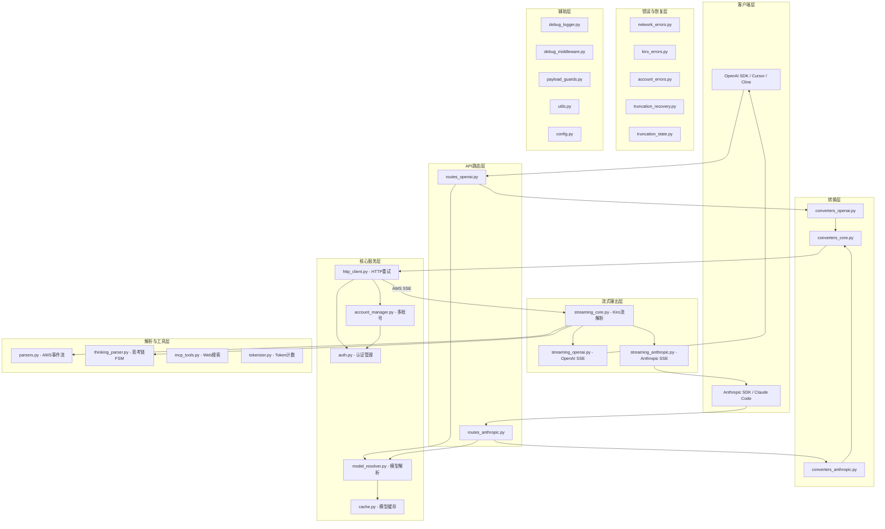

### 2.2 设计原则

| 原则 | 说明 |
|------|------|
| **适配器模式** | 通过薄适配器层将 OpenAI/Anthropic 协议适配到统一的 Kiro 载荷 |
| **共享核心** | `converters_core.py` + `streaming_core.py` 包含所有共用逻辑，避免重复 |
| **最小干预** | 只修复 API 怪癖，不改变用户原始意图 |
| **系统优于补丁** | 遇到问题建系统（如 truncation_recovery），不打临时补丁 |


---

## 3. 请求生命周期

### 3.1 OpenAI 完整请求流程

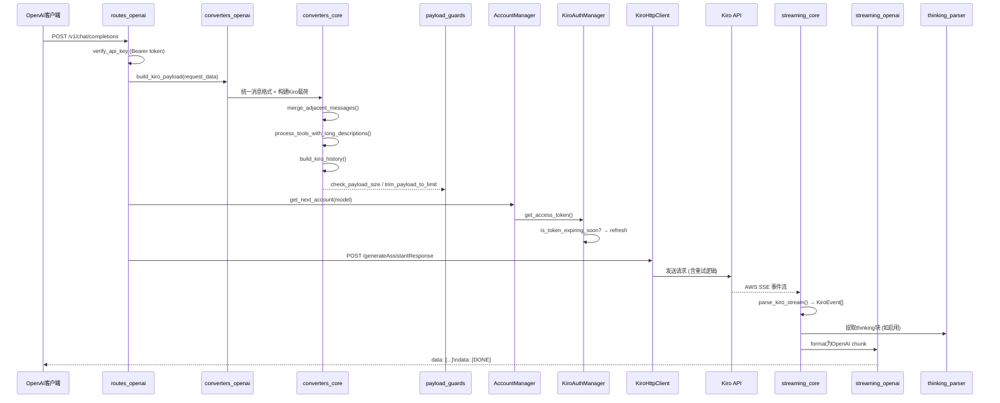

### 3.2 Anthropic 请求流程

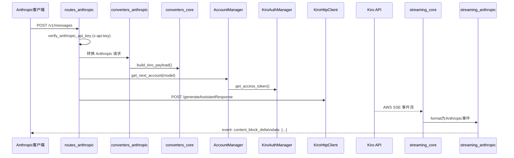

### 3.3 非流式（Non-Streaming）模式

非流式请求仍然内部使用流式连接 Kiro API，但在网关层通过 `collect_stream_response()` / `collect_anthropic_response()` 将所有 chunk 收集后组装为完整 JSON 一次性返回。


---

## 4. 核心模块详解

### 4.1 入口与生命周期 — `main.py`

| 职责 | 说明 |
|------|------|
| 日志配置 | Loguru 彩色输出 + 拦截 uvicorn/FastAPI 标准日志 |
| 配置验证 | `validate_configuration()` 检查凭证存在性 |
| VPN/代理 | 启动前设置 `HTTP_PROXY`/`HTTPS_PROXY` 环境变量 |
| Lifespan | 创建共享 httpx 连接池、AccountManager、初始化账号 |
| 中间件 | CORS → DebugLoggerMiddleware |
| 路由注册 | `openai_router` + `anthropic_router` |
| CLI 入口 | argparse 解析 `--host`/`--port`，优先级：CLI > ENV > 默认 |

### 4.2 配置中心 — `kiro/config.py`

集中管理所有常量与环境变量，关键参数：

| 参数 | 默认值 | 说明 |
|------|--------|------|
| `PROXY_API_KEY` | `changeme_proxy_secret` | 代理鉴权密钥 |
| `REGION` | `us-east-1` | AWS 区域 |
| `TOKEN_REFRESH_THRESHOLD` | 600s | 提前刷新Token阈值 |
| `MAX_RETRIES` | 3 | HTTP重试次数 |
| `MODEL_CACHE_TTL` | 3600s | 模型缓存过期 |
| `STREAMING_READ_TIMEOUT` | 300s | 流式读超时 |
| `DEBUG_MODE` | `off` | 调试日志模式 |
| `APP_VERSION` | `2.4.dev.13` | 当前版本号 |
| `HIDDEN_MODELS` | [...] | 隐藏/未文档化模型列表 |
| `MODEL_ALIASES` | {...} | 模型别名映射 |
| `ACCOUNT_SYSTEM` | `false` | 是否启用多账号系统 |

动态URL生成函数：
- `get_kiro_refresh_url(region)` → Token刷新端点
- `get_kiro_api_host(region)` → 主API `codewhisperer.{region}.amazonaws.com`
- `get_kiro_q_host(region)` → Q API `q.{region}.amazonaws.com`

### 4.3 认证管理 — `kiro/auth.py`

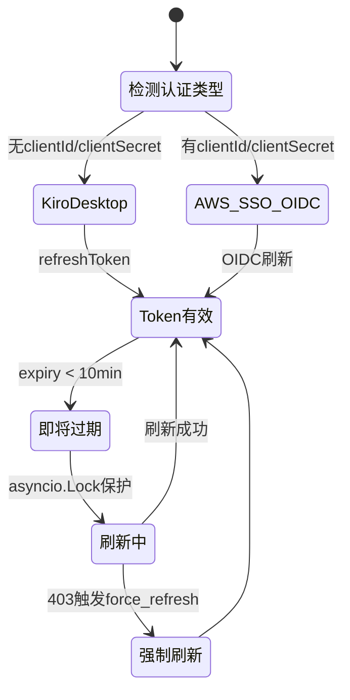

**类：`KiroAuthManager`**

| 方法 | 说明 |
|------|------|
| `get_access_token()` | 返回有效token，必要时自动刷新 |
| `force_refresh()` | 强制刷新（被403触发） |
| `is_token_expiring_soon()` | 检查是否即将过期 |

**支持的凭证来源（4种）：**
1. JSON 文件（Kiro IDE）
2. 环境变量（REFRESH_TOKEN）
3. SQLite 数据库（kiro-cli）
4. AWS SSO OIDC（Builder ID / Enterprise）

### 4.4 多账号管理 — `kiro/account_manager.py`

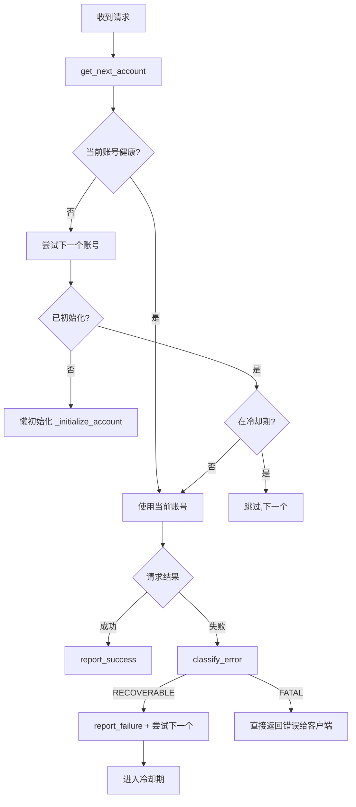

**核心类与函数：**

| 类/函数 | 说明 |
|---------|------|
| `AccountManager` | 管理多账号生命周期、切换、状态持久化 |
| `Account` | 单个账号封装（auth_manager + stats） |
| `AccountStats` | 成功/失败计数、冷却时间 |
| `get_next_account(model, exclude)` | 获取下一个可用账号 |
| `report_success/report_failure` | 上报结果更新统计 |
| `_initialize_account` | 懒初始化（加载凭证+获取模型列表） |
| `save_state_periodically` | 后台定时保存状态到 state.json |

### 4.5 错误分类 — `kiro/account_errors.py`

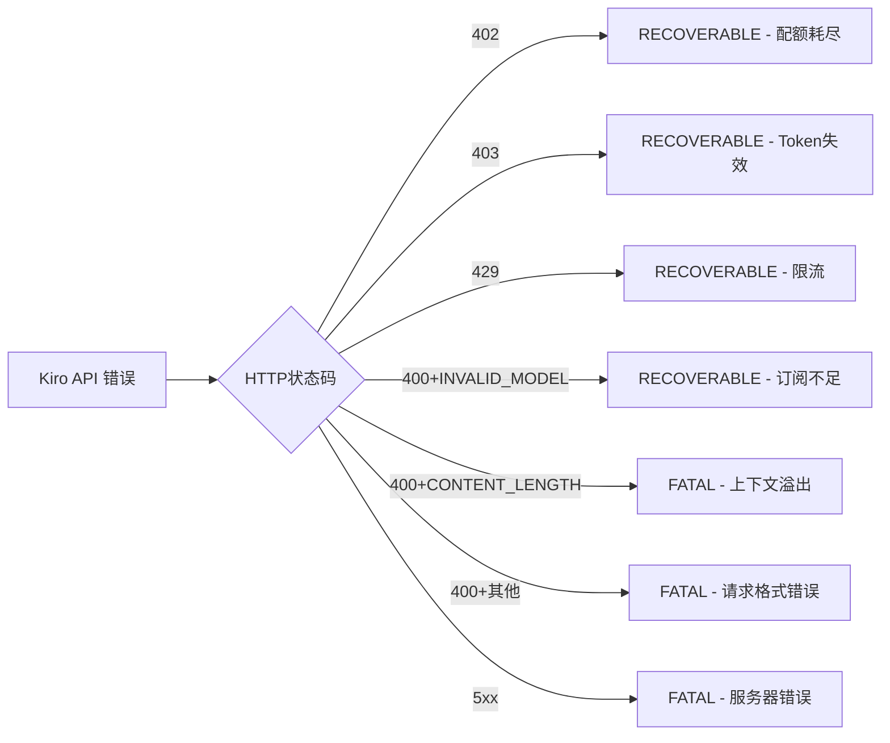

- **RECOVERABLE**：尝试下一个账号
- **FATAL**：立即返回错误给客户端（所有账号都会失败）


### 4.6 HTTP 客户端 — `kiro/http_client.py`

**类：`KiroHttpClient`** — 带指数退避的自动重试 HTTP 客户端。

| 错误码 | 处理策略 |
|--------|----------|
| 403 | 调用 `force_refresh()` 刷新 Token 后重试 |
| 429 | 指数退避：1s → 2s → 4s |
| 5xx | 指数退避，最多 MAX_RETRIES 次 |
| 超时 | 指数退避 |

关键设计：**流式请求使用 per-request 客户端**（防止 CLOSE_WAIT 泄漏），非流式请求共享连接池。

### 4.7 模型解析 — `kiro/model_resolver.py`

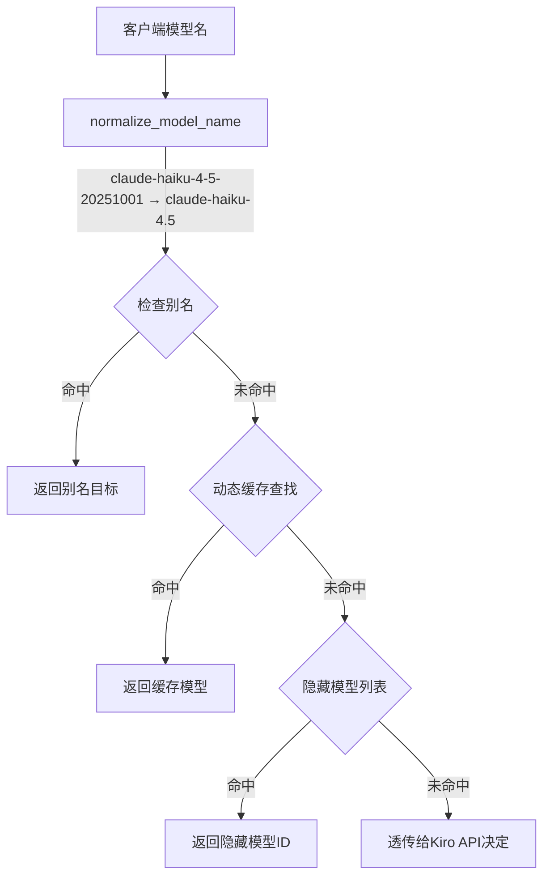

**4层解析管道：**
1. **名称标准化**：`claude-haiku-4-5` → `claude-haiku-4.5`（破折号转点号、去日期后缀）
2. **别名检查**：`auto` → `claude-sonnet-4.5`
3. **动态缓存**：从 `/ListAvailableModels` API 获取的模型列表
4. **透传**：未知模型直接发给 Kiro（网关是网关不是门卫）

### 4.8 转换器 — `kiro/converters_*.py`

#### 4.8.1 共享核心 `converters_core.py`

统一数据结构：

| 类 | 说明 |
|----|------|
| `UnifiedMessage` | 统一消息格式（role, content, tool_calls, tool_results, images） |
| `UnifiedTool` | 统一工具格式（name, description, parameters） |
| `ThinkingConfig` | 扩展思考配置 |
| `KiroPayloadResult` | 构建结果（payload + metadata） |

核心函数流水线：

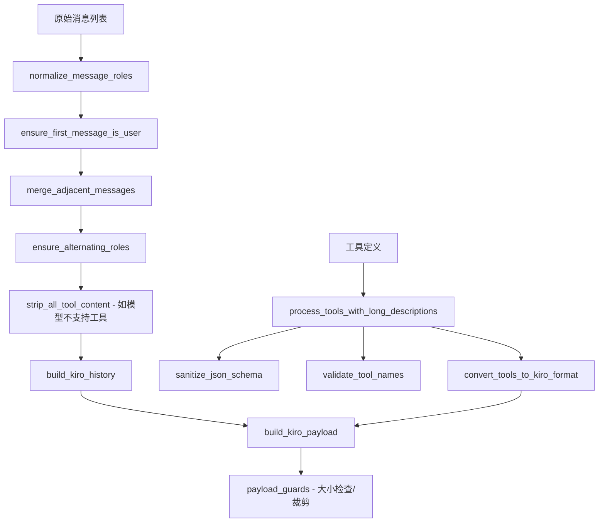

#### 4.8.2 OpenAI 适配器 `converters_openai.py`

- 从 `messages` 中提取 `system` 角色消息作为系统提示词
- 将 OpenAI 格式的 `tool_calls` / `tool_call_id` 转为 `UnifiedMessage`
- 处理 `content` 为字符串或数组两种形式

#### 4.8.3 Anthropic 适配器 `converters_anthropic.py`

- `system` 字段已独立于 `messages` 之外（Anthropic 标准）
- 将 `content` 块数组（text/image/tool_use/tool_result）转为统一格式

### 4.9 流式处理 — `kiro/streaming_*.py`

#### 4.9.1 核心解析 `streaming_core.py`

| 类/函数 | 说明 |
|---------|------|
| `KiroEvent` | Kiro 事件（type: content/tool_start/tool_input/tool_stop/usage） |
| `StreamResult` | 完整流结果（text, tool_calls, usage, thinking） |
| `parse_kiro_stream()` | 异步生成器，逐 chunk 解析 AWS SSE |
| `collect_stream_to_result()` | 收集全部事件为 StreamResult |
| `stream_with_first_token_retry()` | 首Token超时重试 |
| `calculate_tokens_from_context_usage()` | 从百分比计算token数 |

#### 4.9.2 OpenAI 格式化 `streaming_openai.py`

- `stream_kiro_to_openai_internal()` → 逐 chunk 生成 `data: {...}\n\n`
- `stream_kiro_to_openai()` → 带重试的外层包装
- `collect_stream_response()` → 非流式：收集后返回完整 JSON

#### 4.9.3 Anthropic 格式化 `streaming_anthropic.py`

- `stream_kiro_to_anthropic()` → 生成 `event: type\ndata: {...}\n\n`
- `collect_anthropic_response()` → 非流式收集
- 支持 `thinking` 块输出（Anthropic `content_block` 格式）


### 4.10 AWS 事件流解析 — `kiro/parsers.py`

**类：`AwsEventStreamParser`**

Kiro API 返回的 SSE 格式是 AWS 私有事件流，该解析器处理：
- **大括号计数**：正确解析嵌套 JSON
- **内容去重**：过滤重复事件
- **工具调用**：结构化 + 方括号格式 `[Called func with args: {...}]`
- **转义序列**：解码 `\n`、`\"` 等

辅助函数：
- `find_matching_brace()` — 找到配对右花括号
- `parse_bracket_tool_calls()` — 解析旧格式工具调用
- `deduplicate_tool_calls()` — 去重

### 4.11 思考链解析 — `kiro/thinking_parser.py`

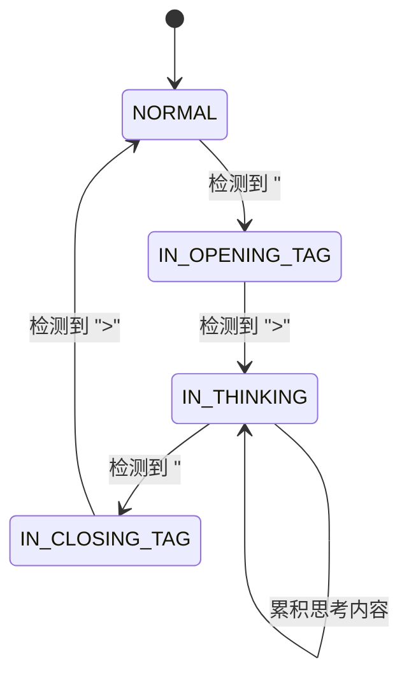

基于有限状态机（FSM）从流式文本中实时提取 `<thinking>...</thinking>` 块，将模型"推理过程"与最终输出分离。

**类：`ThinkingParser`** | **状态枚举：`ParserState`** | **结果：`ThinkingParseResult`**

### 4.12 Payload 守卫 — `kiro/payload_guards.py`

防止请求因过大被 Kiro API 拒绝：

| 函数 | 说明 |
|------|------|
| `check_payload_size()` | 计算 payload JSON 字节数 |
| `trim_payload_to_limit()` | 从历史开头逐条删除直到小于限制 |
| `_strip_empty_tool_uses()` | 清理空的工具调用块 |
| `_align_to_user_message()` | 裁剪后确保历史以 user 消息开头 |
| `_repair_orphaned_tool_results()` | 修复孤立的工具结果 |

### 4.13 截断恢复 — `kiro/truncation_recovery.py` + `truncation_state.py`

当 payload 过大被裁剪时，通过系统提示词告知模型"上下文被截断"，并注入恢复提示。

`truncation_state.py` 维护截断缓存（工具调用截断 / 内容截断），供后续请求查询恢复信息。

### 4.14 MCP 工具桥接 — `kiro/mcp_tools.py`

将 Kiro 原生的 Web Search 能力以标准 tool_use 形式暴露：

| 函数 | 说明 |
|------|------|
| `call_kiro_mcp_api()` | 调用 Kiro MCP 后端执行搜索 |
| `generate_search_summary()` | 格式化搜索结果为可读摘要 |
| `generate_openai_web_search_sse()` | 生成 OpenAI 格式搜索SSE |
| `generate_anthropic_web_search_sse()` | 生成 Anthropic 格式搜索SSE |
| `handle_native_web_search()` | 处理原生搜索工具调用 |
| `extract_query_from_messages()` | 从消息中提取搜索查询 |

### 4.15 Token 计数 — `kiro/tokenizer.py`

基于 `tiktoken`（OpenAI Rust 库）+ Claude 修正系数（1.15）进行 token 估算：

```
total_tokens = context_usage_percentage × max_input_tokens  (Kiro API返回)
completion_tokens = tiktoken(response_text)                  (本地计算)
prompt_tokens = total_tokens - completion_tokens             (差值)
```

精度约 97-99.7%。

### 4.16 模型缓存 — `kiro/cache.py`

**类：`ModelInfoCache`** — 线程安全的模型配置存储。

- 懒加载：首次请求时从 `/ListAvailableModels` 获取
- TTL：1小时自动过期
- 回退：缓存失效时使用静态 FALLBACK_MODELS

### 4.17 网络错误分类 — `kiro/network_errors.py`

将底层网络异常翻译为用户友好消息：

| 异常 | 分类 | 用户消息 |
|------|------|----------|
| `ConnectTimeout` | TIMEOUT | "连接超时" |
| `ReadTimeout` | TIMEOUT | "服务器响应超时" |
| DNS 错误 | DNS | "DNS解析失败" |
| SSL 错误 | SSL | "SSL证书问题" |
| 代理错误 | PROXY | "代理连接失败" |

### 4.18 Kiro 错误增强 — `kiro/kiro_errors.py`

`enhance_kiro_error()` 将 Kiro API 返回的模糊错误（如 "Improperly formed request"）增强为带建议的结构化信息。

### 4.19 调试系统 — `kiro/debug_logger.py` + `debug_middleware.py`

三种模式：`off` / `errors` / `all`

DebugMiddleware 在请求进入时初始化日志上下文，DebugLogger 单例在各阶段记录：
- `request_body.json` — 客户端原始请求
- `kiro_request_body.json` — 发给 Kiro 的请求
- `response_stream_raw.txt` — Kiro 原始流
- `response_stream_modified.txt` — 转换后的流

### 4.20 工具函数 — `kiro/utils.py`

| 函数 | 说明 |
|------|------|
| `get_machine_fingerprint()` | SHA256(hostname-username-kiro-gateway) |
| `get_kiro_headers()` | 构建 Kiro API 请求头 |
| `generate_completion_id()` | `chatcmpl-{uuid}` |
| `generate_conversation_id()` | 基于消息内容的确定性 UUID |
| `generate_tool_call_id()` | `call_{uuid[:8]}` |


---

## 5. 关键流程深度解析

### 5.1 多账号故障切换（Circuit Breaker）

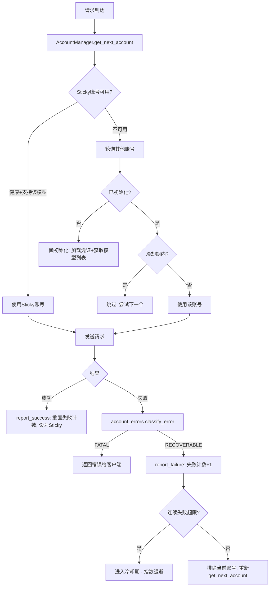

**状态持久化**：`state.json` 记录当前账号索引 + 各账号统计，后台每10s保存一次。

### 5.2 Token 刷新与认证流程

```mermaid
flowchart TD
    REQ[需要Token] --> CHECK{Token存在且未过期?}
    CHECK -->|是| RETURN[返回currentToken]
    CHECK -->|否/即将过期| LOCK[获取asyncio.Lock]
    LOCK --> DOUBLE_CHECK{再次检查}
    DOUBLE_CHECK -->|已被其他协程刷新| RETURN
    DOUBLE_CHECK -->|需要刷新| DETECT{认证类型}
    DETECT -->|KiroDesktop| KIRO[POST /refreshToken]
    DETECT -->|AWS_SSO_OIDC| OIDC[POST oidc.{region}.amazonaws.com/token]
    KIRO --> SAVE[保存新Token + 更新expiresAt]
    OIDC --> SAVE
    SAVE --> PERSIST[写回JSON文件/SQLite]
    PERSIST --> RETURN
```

### 5.3 流式解析与思考链提取

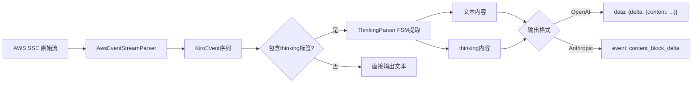

### 5.4 Payload 大小管理

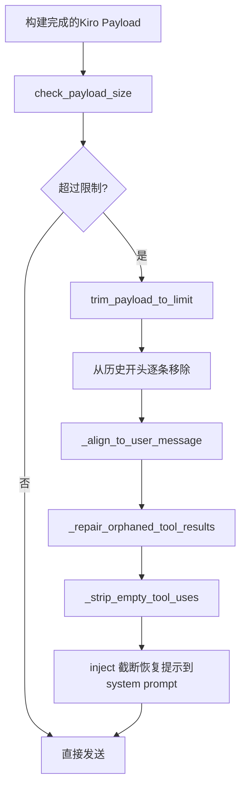

### 5.5 工具调用长描述处理

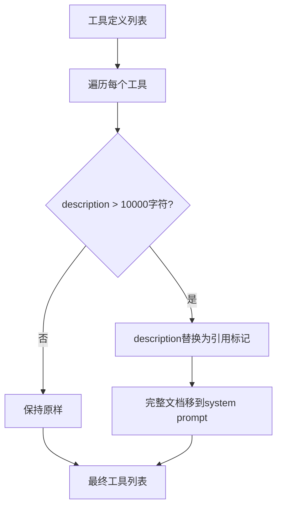


---

## 6. 配置与部署

### 6.1 环境变量一览（`.env.example`）

```bash
# === 必须 ===
PROXY_API_KEY="my-super-secret-password-123"

# === 认证（四选一）===
KIRO_CREDS_FILE="~/.aws/sso/cache/kiro-auth-token.json"  # JSON文件
REFRESH_TOKEN="your_refresh_token"                         # 直接Token
KIRO_CLI_DB_FILE="~/.local/share/kiro-cli/data.sqlite3"  # SQLite
# 或 AWS SSO（自动检测）

# === 可选 ===
PROFILE_ARN="arn:aws:codewhisperer:us-east-1:..."
KIRO_REGION="us-east-1"
KIRO_API_REGION="us-east-1"
SERVER_HOST="0.0.0.0"
SERVER_PORT="8000"
VPN_PROXY_URL="http://127.0.0.1:7890"
DEBUG_MODE="off"
ACCOUNT_SYSTEM="false"
```

### 6.2 多账号配置（`credentials.json`）

```json
[
  {"type": "json", "path": "~/.aws/sso/cache/kiro-auth-token.json"},
  {"type": "sqlite", "path": "~/.local/share/kiro-cli/data.sqlite3"},
  {"type": "refresh_token", "refresh_token": "eyJ...", "profile_arn": "arn:..."}
]
```

### 6.3 Docker 部署

```mermaid
flowchart LR
    DEV[开发者] -->|docker-compose up -d| COMPOSE[docker-compose.yml]
    COMPOSE --> BUILD[Dockerfile: 单阶段构建]
    BUILD --> IMAGE[非root用户kiro运行]
    IMAGE --> HEALTH[/health 健康检查]
    IMAGE --> VOLUMES[挂载凭证+日志]
```

**Dockerfile 特点：**
- 单阶段优化构建
- 非 root 用户 `kiro` 运行
- 健康检查端点 `/health`
- 支持所有4种认证方式

**CI/CD：** `.github/workflows/docker.yml`
- 自动测试 → Docker构建 → 健康检查 → 推送 ghcr.io

### 6.4 启动流程

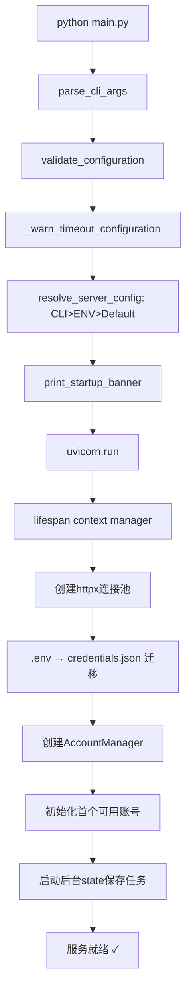

---

## 7. 测试体系

### 7.1 测试结构

```
tests/
├── conftest.py                        # 全局fixture: 网络隔离 + Mock
├── unit/
│   ├── test_account_errors.py         # 错误分类
│   ├── test_account_manager.py        # 多账号管理
│   ├── test_auth_manager.py           # 认证管理
│   ├── test_cache.py                  # 模型缓存
│   ├── test_config.py                 # 配置加载
│   ├── test_converters_anthropic.py   # Anthropic转换
│   ├── test_converters_core.py        # 核心转换
│   ├── test_converters_openai.py      # OpenAI转换
│   ├── test_debug_logger.py           # 调试日志
│   ├── test_debug_middleware.py       # 调试中间件
│   ├── test_exceptions.py            # 异常处理
│   ├── test_http_client.py            # HTTP客户端
│   ├── test_kiro_errors.py            # 错误增强
│   ├── test_main_cli.py              # CLI入口
│   ├── test_main_lifespan.py         # 生命周期
│   ├── test_mcp_tools.py             # MCP工具
│   ├── test_model_resolver.py        # 模型解析
│   └── ... (更多)
├── integration/
│   ├── test_account_system_flow.py   # 账号系统集成
│   └── test_full_flow.py             # 完整请求流程集成
```

### 7.2 测试哲学

- **完全网络隔离**：`conftest.py` 中 `block_all_network_calls` fixture 阻止所有真实请求
- **Arrange-Act-Assert** 模式
- **覆盖边界**：不只测快乐路径，重点测试错误/边界/畸形输入
- **双API对称**：OpenAI + Anthropic、流式 + 非流式

### 7.3 运行测试

```bash
pytest                          # 全部测试
pytest tests/unit/ -v           # 仅单元测试
pytest tests/integration/ -v    # 仅集成测试
pytest --cov=kiro --cov-report=html  # 覆盖率报告
```


---

## 8. 版本演进历程

> 基于 commit 历史与代码结构推断的主要里程碑。当前版本 **v2.4.dev.13**。

### 8.1 版本时间线

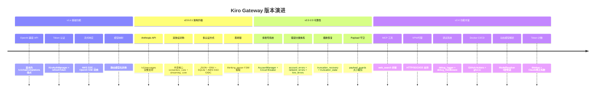

### 8.2 关键功能引入顺序

| 阶段 | 功能模块 | 核心文件 |
|------|----------|----------|
| **阶段1** | 基本代理功能 | `main.py`, `auth.py`, `config.py`, `routes_openai.py` |
| **阶段2** | 流式处理 | `streaming_openai.py`, `parsers.py` |
| **阶段3** | Anthropic 支持 | `routes_anthropic.py`, `converters_anthropic.py`, `streaming_anthropic.py` |
| **阶段4** | 共享核心重构 | `converters_core.py`, `streaming_core.py` |
| **阶段5** | 多账号 + 错误体系 | `account_manager.py`, `account_errors.py`, `network_errors.py` |
| **阶段6** | 高级功能 | `thinking_parser.py`, `truncation_recovery.py`, `mcp_tools.py` |
| **阶段7** | 运维 + DX | `debug_logger.py`, `debug_middleware.py`, `tokenizer.py`, Docker |

### 8.3 最新更新

| 日期 | Commit | 说明 |
|------|--------|------|
| 2026-05-18 | `a5292ca` | refactor(errors): 优化最后一个账号错误消息措辞 |

> 当前版本号 `2.4.dev.13` 表明处于 v2.4 的开发迭代中，已经过 13 次开发版本构建。

---

## 附录：模块依赖关系图

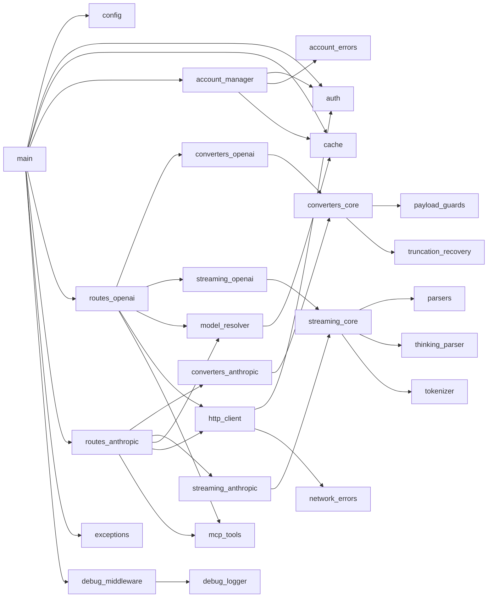

---

> **文档生成时间**：2026-05-28  
> **源码版本**：v2.4.dev.13 (commit a5292ca)  
> **许可证**：AGPL-3.0
