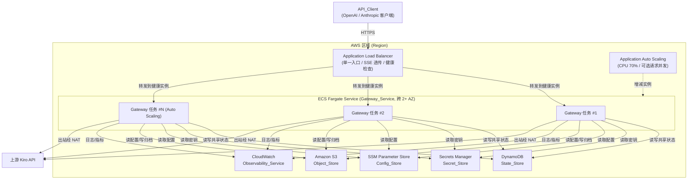

# kiro-gateway · AWS 云原生部署指南（Cloud-Native README）

> 本文档面向希望在 **AWS 上以池化、自动伸缩、高可用方式** 部署 kiro-gateway 的运维人员（Operator）。
> 整体结构与章节组织对齐 AWS 官方方案《[Guidance for Multi-Provider Generative AI Gateway on AWS](https://github.com/aws-solutions-library-samples/guidance-for-multi-provider-generative-ai-gateway-on-aws)》项目格式。
>
> 内容已根据该 AWS 官方 guidance 仓库的公开结构进行改写与归纳，以符合内容许可与署名要求（Content was rephrased for compliance with licensing restrictions）。

---

## 目录

1. [方案概述](#1-方案概述overview)
2. [架构简述](#2-架构简述architecture)
3. [前置条件](#3-前置条件prerequisites)
4. [部署步骤](#4-部署步骤deployment)
5. [配置说明](#5-配置说明configuration)
6. [卸载步骤](#6-卸载步骤teardown)
7. [相关文档](#7-相关文档)

---

## 1. 方案概述（Overview）

**kiro-gateway** 原本是一个基于 Python 3.10+ / FastAPI / uvicorn / httpx / loguru 的 **单机代理网关**，兼容 OpenAI 与 Anthropic API，反向代理 Kiro API / Amazon Q Developer。其配置与状态依赖本地文件（`.env`、`credentials.json`、`state.json`、本地凭证文件、`debug_logs/`），仅适合单机运行。

本方案将其改造为 **AWS 云原生、池化、可水平伸缩** 的部署形态，借鉴 AWS 官方 guidance 的最佳实践组合：

- **容器化计算池**：以 **Amazon ECS Fargate** 无服务器容器运行多个 Gateway 实例（默认 ≥ 2 个）。
- **统一入口与负载均衡**：通过 **Application Load Balancer（ALB）** 提供单一稳定入口，将请求分发到健康实例，并在整个 **SSE 流式响应** 期间保持连接透传。
- **自动伸缩**：基于 **ECS Service Auto Scaling**（CPU 目标跟踪、可选请求并发指标）在最小/最大实例数之间按负载自动增减。
- **高可用**：计算实例与 ALB 均跨 **≥ 2 个可用区（AZ）** 部署；单个 AZ 故障时服务仍可继续。
- **状态 / 配置 / 密钥外置**：
  - 运行时共享状态（账号失败计数、熔断器状态、模型映射、统计）→ **Amazon DynamoDB**
  - 敏感凭证（`PROXY_API_KEY`、`credentials.json`、各账号 token）→ **AWS Secrets Manager**（KMS 静态加密）
  - 非敏感配置（超时、熔断退避、伸缩参数、模型映射）→ **AWS Systems Manager（SSM）Parameter Store**
  - 配置骨架与调试日志归档 → **Amazon S3**
  - 日志、指标、告警与仪表板 → **Amazon CloudWatch**
- **向后兼容**：完整保留 `/v1/models`、`/v1/chat/completions`、`/v1/messages`、`/health` 端点及其请求/响应格式、SSE 流式行为与 `Authorization` 鉴权契约。**现有 OpenAI / Anthropic 客户端无需修改即可接入。**

### 双运行形态（local | aws）

应用通过 **存储后端抽象层（Storage Backend Abstraction）** 实现同一份代码的两种运行形态，由环境变量 `STORAGE_BACKEND` 选择：

| `STORAGE_BACKEND` | 形态 | 配置/状态来源 | 适用场景 |
|---|---|---|---|
| `local`（默认） | 单机本地文件后端 | `.env` / `credentials.json` / `state.json` / `debug_logs/` | 本地开发、`docker-compose`，行为等价于改造前现状 |
| `aws` | AWS 云原生后端 | SSM / Secrets Manager / DynamoDB / S3 / CloudWatch | 生产环境池化部署（本文档） |

> 本方案的 CDK 模板在容器内自动注入 `STORAGE_BACKEND=aws`，运维人员无需手动设置。

---

## 2. 架构简述（Architecture）

改造后的系统部署在单一 VPC 内，跨 ≥ 2 个可用区：公有子网放置 ALB 与 NAT Gateway，私有子网放置 ECS Fargate 任务。Fargate 任务通过 NAT Gateway 出站访问上游 `runtime.{region}.kiro.dev` 与 AWS SSO OIDC 端点，并访问 DynamoDB / Secrets Manager / SSM / S3 / CloudWatch 等托管服务。



| 需求术语 | AWS 实现 |
|---|---|
| Gateway_Service | ECS Fargate Service（多实例池化计算） |
| Gateway | Fargate Task（无状态容器实例，监听 `8000`） |
| Load_Balancer | Application Load Balancer（ALB） |
| Auto_Scaler | Application Auto Scaling（ECS 目标跟踪） |
| State_Store | DynamoDB（单表、按需计费、多 AZ 冗余） |
| Secret_Store | AWS Secrets Manager（KMS 加密） |
| Config_Store | SSM Parameter Store + S3 |
| Object_Store | Amazon S3 |
| Observability_Service | Amazon CloudWatch |
| Deployment_Template | AWS CDK（TypeScript） |

> 完整的架构图与组件交互（含运行时请求流、令牌刷新分布式锁流）请参阅 **[ARCHITECTURE_AWS.md](./ARCHITECTURE_AWS.md)**。

---

## 3. 前置条件（Prerequisites）

在部署前，请确保具备以下条件：

| 项目 | 说明 |
|---|---|
| **AWS 账号** | 一个具备创建 VPC、ECS、ALB、DynamoDB、Secrets Manager、SSM、S3、CloudWatch、IAM、KMS 资源权限的账号。 |
| **AWS CLI** | 已安装并完成凭证配置（`aws configure` 或环境变量 / SSO），具备目标区域的访问权限。 |
| **Node.js** | 建议 Node.js 18 或更高版本（CDK 运行依赖）。 |
| **AWS CDK** | CDK v2（仓库 `infra/` 已锁定 `aws-cdk-lib ^2.150.0`）。无需全局安装，可使用 `npx cdk`。 |
| **Docker** | 本地需运行 Docker，CDK 通过 `ContainerImage.fromAsset` 基于仓库根目录的 `Dockerfile` 构建镜像并推送至 ECR。 |
| **CDK Bootstrap** | 目标账号 + 区域需执行过一次 `cdk bootstrap`（首次部署前）。 |
| **IAM 权限** | 执行部署的身份需具备创建上述资源及 IAM 角色的权限（用于创建最小权限任务角色与执行角色）。 |
| **（可选）ACM 证书** | 若需启用 HTTPS:443，准备一张目标区域的 ACM 证书 ARN。未提供时回退到 HTTP:80（仅建议开发/无域名场景）。 |

---

## 4. 部署步骤（Deployment）

本方案提供一键部署流程。全部 IaC 位于仓库的 `infra/` 目录（AWS CDK / TypeScript）。

### 4.1 安装依赖

```bash
cd infra
npm ci
```

### 4.2 引导（仅首次）

对目标账号 + 区域执行一次性 bootstrap（已执行过可跳过）：

```bash
npx cdk bootstrap
```

### 4.3 一键部署全部 Stack

`npm run deploy` 等价于 `cdk deploy --all`，将按依赖顺序创建全部资源：

```
network → data → compute → observability
```

```bash
# 使用默认参数部署（区域 us-east-1，2~6 实例，0.5 vCPU / 1024 MiB）
npm run deploy
```

可通过 CDK context（`-c key=value`）覆盖参数：

```bash
cdk deploy --all \
  -c region=ap-southeast-1 \
  -c stackName=kiro-gateway \
  -c minInstances=2 \
  -c maxInstances=10 \
  -c cpu=1024 \
  -c memory=2048
```

启用 HTTPS + WAF + 请求并发伸缩（可选参数）：

```bash
cdk deploy --all \
  -c certificateArn=arn:aws:acm:us-east-1:123456789012:certificate/abcd-... \
  -c enableWaf=true \
  -c requestsPerTarget=200
```

#### 支持的参数

| 参数（context 键） | 环境变量 | 默认值 | 说明 |
|---|---|---|---|
| `region` | `AWS_REGION` | `us-east-1` | 部署目标 AWS 区域 |
| `stackName` | `GATEWAY_STACK_NAME` | `kiro-gateway` | Stack 名称前缀（同时用于资源命名前缀） |
| `minInstances` | `GATEWAY_MIN_INSTANCES` | `2` | Auto Scaling 最小实例数 |
| `maxInstances` | `GATEWAY_MAX_INSTANCES` | `6` | Auto Scaling 最大实例数 |
| `cpu` | `GATEWAY_CPU` | `512` | 单实例 CPU 单位（1024 = 1 vCPU） |
| `memory` | `GATEWAY_MEMORY_MIB` | `1024` | 单实例内存（MiB） |
| `certificateArn` | — | （无） | ACM 证书 ARN；提供时启用 HTTPS:443 并将 HTTP:80 重定向 |
| `enableWaf` | — | `false` | 是否在 ALB 前置 AWS WAF |
| `requestsPerTarget` | — | （不启用） | 每目标请求并发伸缩阈值 |
| `streamingReadTimeout` | — | `300` | 流式读取超时秒数（决定 ALB 空闲超时下限） |
| `gracefulShutdownTimeout` | — | `120` | 优雅停机超时秒数（上限 120） |

> 参数优先级：**CDK context（`-c` 或 cdk.json）> 环境变量 > 代码默认值**。

#### 通过环境变量传参

```bash
GATEWAY_MAX_INSTANCES=12 AWS_REGION=eu-west-1 npm run deploy
```

### 4.4 获取访问入口（ALB Endpoint）

部署成功后，CDK 会在输出中打印 Load_Balancer 访问入口地址（完整 URL）：

```
kiro-gateway-compute.GatewayEndpoint = http://kiro-gateway-...elb.amazonaws.com
kiro-gateway-compute.AppGatewayEndpoint = http://kiro-gateway-...elb.amazonaws.com
```

> 提供 `certificateArn` 时入口为 `https://...`。

验证服务健康：

```bash
curl http://<ALB-DNS>/health
```

> 在完成 [配置说明](#5-配置说明configuration) 中的凭证设置之前，`/v1/*` 推理端点可能因缺少有效账号而无法返回结果，但 `/health` 应已可用。

### 4.5 仅合成模板（可选）

如需在部署前检查生成的 CloudFormation：

```bash
npm run synth     # cdk synth
npm run diff      # cdk diff（与已部署状态对比）
```

---

## 5. 配置说明（Configuration）

云原生形态下，容器内由 CDK 自动注入 `STORAGE_BACKEND=aws`、`STACK_NAME`、`AWS_REGION` 等环境变量。配置、密钥与状态分别存放在以下托管服务中（`<stack>` 为 `stackName` 参数，默认 `kiro-gateway`）：

### 5.1 资源清单

| 类别 | 服务 | 资源名 / 路径 | 内容 |
|---|---|---|---|
| 配置（Config_Store） | SSM Parameter Store | `/<stack>/config/*` | `STREAMING_READ_TIMEOUT`、`FIRST_TOKEN_TIMEOUT`、`ACCOUNT_RECOVERY_TIMEOUT`、`ACCOUNT_MAX_BACKOFF_MULTIPLIER`、`ACCOUNT_PROBABILISTIC_RETRY_CHANCE`、`scaling/min`、`scaling/max`、`scaling/cpu-target`、模型别名等 |
| 密钥（Secret_Store） | Secrets Manager | `<stack>/proxy-api-key` | 客户端鉴权密钥 `PROXY_API_KEY`（部署时随机生成，可覆盖） |
| 密钥（Secret_Store） | Secrets Manager | `<stack>/credentials-json` | 多账号 `credentials.json` 的敏感内容（初始为占位骨架 `{"accounts": []}`） |
| 密钥（Secret_Store） | Secrets Manager | `<stack>/account/<account_id>/token` | 各账号的 access/refresh token、expires_at、profile_arn（由应用运行时刷新后写回） |
| 共享状态（State_Store） | DynamoDB | `<stack>-gateway-state` | 账号失败计数、熔断器状态、sticky 索引、统计、模型映射、令牌元数据、刷新租约锁 |
| 对象（Object_Store） | S3 | `<stack>-gateway-config` | 非敏感配置骨架（如 `config/credentials.json`） |
| 对象（Object_Store） | S3 | `<stack>-gateway-debug` | 调试日志归档（含按保留期过期的生命周期规则，默认 30 天） |
| 加密 | KMS | 别名 `<stack>-gateway-data` | 统一用于 DynamoDB / Secrets Manager / S3 的静态加密 |

### 5.2 部署后必做：设置 `credentials.json` 与 `PROXY_API_KEY`

部署创建的 `credentials-json` 密钥初始为占位骨架，需替换为真实的多账号配置；`proxy-api-key` 已随机生成，如需自定义可覆盖。

**1）写入真实的 `credentials.json`（多账号配置）到 Secrets Manager：**

```bash
aws secretsmanager put-secret-value \
  --secret-id kiro-gateway/credentials-json \
  --secret-string file://credentials.json \
  --region <region>
```

> `credentials.json` 的格式参考仓库根目录的 `credentials.json.example`。

**2）设置 / 覆盖客户端鉴权密钥 `PROXY_API_KEY`：**

```bash
# 查看部署时自动生成的值
aws secretsmanager get-secret-value \
  --secret-id kiro-gateway/proxy-api-key \
  --query SecretString --output text --region <region>

# 覆盖为自定义值（可选）
aws secretsmanager put-secret-value \
  --secret-id kiro-gateway/proxy-api-key \
  --secret-string "<your-strong-api-key>" \
  --region <region>
```

**3）（可选）调整 Config_Store 参数：**

```bash
aws ssm put-parameter \
  --name /kiro-gateway/config/STREAMING_READ_TIMEOUT \
  --value 600 --type String --overwrite --region <region>
```

> **配置生效时机**：SSM / Secrets 的读取结果在应用侧带 TTL 缓存，更新配置后在缓存过期或 **实例重启 / 重新部署** 后采用新值。如需立即生效，可强制 ECS 服务进行一次滚动部署（`aws ecs update-service ... --force-new-deployment`）。

### 5.3 客户端调用示例

```bash
curl http://<ALB-DNS>/v1/chat/completions \
  -H "Authorization: Bearer <PROXY_API_KEY>" \
  -H "Content-Type: application/json" \
  -d '{"model": "auto-kiro", "messages": [{"role": "user", "content": "你好"}], "stream": true}'
```

> 关于从单机本地文件配置迁移到 SSM / Secrets Manager / S3 / DynamoDB 的完整步骤，请参阅 **[MIGRATION_GUIDE.md](./MIGRATION_GUIDE.md)**。

---

## 6. 卸载步骤（Teardown）

`npm run destroy` 等价于 `cdk destroy --all`，将按逆序（observability → compute → data → network）移除本次部署创建的资源：

```bash
cd infra
npm run destroy
```

### 保留资源（RETAIN 策略）说明

为防止误删导致 **共享状态 / 凭证 / 加密密钥** 丢失，以下资源采用 `RETAIN` 删除策略，在 `cdk destroy` 后 **不会被自动删除**，需在确认无需保留后手动清理：

| 资源 | 原因 | 手动清理方式 |
|---|---|---|
| DynamoDB 表 `<stack>-gateway-state` | 承载运行时共享状态 | `aws dynamodb delete-table --table-name <stack>-gateway-state` |
| KMS 密钥（别名 `<stack>-gateway-data`） | 静态加密密钥 | 在 KMS 控制台计划删除（含等待期） |
| Secrets Manager 密钥（`<stack>/proxy-api-key`、`<stack>/credentials-json`、`<stack>/account/*`） | 敏感凭证 | `aws secretsmanager delete-secret --secret-id <name>`（默认含恢复窗口） |
| S3 配置桶 `<stack>-gateway-config` | 配置骨架 | 清空后 `aws s3 rb s3://<stack>-gateway-config` |

> 调试日志桶 `<stack>-gateway-debug` 采用 `DESTROY` 策略并启用 `autoDeleteObjects`，会随 Stack 一并清理。
>
> 各账号 token 密钥（`<stack>/account/<account_id>/token`）由应用在运行时创建，不在 CDK 管理范围内，需单独清理。

---

## 7. 相关文档

| 文档 | 内容 |
|---|---|
| [ARCHITECTURE_AWS.md](./ARCHITECTURE_AWS.md) | 完整 AWS 架构与组件交互（含 Mermaid 架构图、请求流、令牌刷新流） |
| [DEPLOYMENT_GUIDE.md](./DEPLOYMENT_GUIDE.md) | 一键部署命令与参数的详细说明、销毁命令 |
| [MIGRATION_GUIDE.md](./MIGRATION_GUIDE.md) | 从本地文件配置迁移至 SSM / Secrets Manager / S3 / DynamoDB 的步骤 |
| [COST_ESTIMATION.md](./COST_ESTIMATION.md) | 预估成本与主要成本因素（Fargate / NAT / ALB / DynamoDB 等） |
| [README.md](./README.md) | kiro-gateway 中文总览（单机使用） |

---

_本文档对应需求：13.1（中文说明文档覆盖概述/架构/前置条件/部署/配置/卸载）、13.3（结构对齐 AWS guidance 项目格式）、13.4（一键部署命令与参数说明）。_
