# Kiro Gateway 风险分析：欺诈检测命中点

> **声明**：本文档仅为代码审计与风险识别，目的是让项目使用者理解哪些功能特征
> 可能触发 Kiro 的欺诈检测系统。**不包含任何规避方案。**

---

## 概述

Kiro 欺诈检测系统监控三大类信号：

| # | 检测维度 | 核心规则 |
|---|----------|----------|
| 1 | **消耗异常** | 短时间窗口(30min/1h)内的 Token/Credit 峰值 |
| 2 | **对话模式** | 大量对话 + 每个对话极少请求数（自动化特征） |
| 3 | **IP 信号** | 同时多 IP / 数据中心 IP / VPN 范围 |

---

## 风险热力图总览

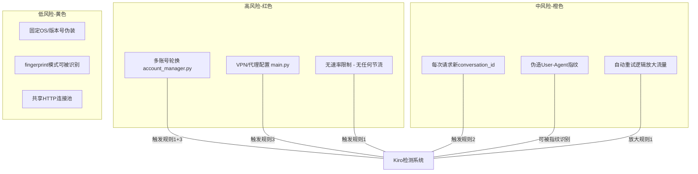
```mermaid
graph TB
    subgraph 高风险-红色
        R1[多账号轮换 account_manager.py]
        R2[VPN/代理配置 main.py]
        R3[无速率限制 - 无任何节流]
    end

    subgraph 中风险-橙色
        O1[每次请求新conversation_id]
        O2[伪造User-Agent指纹]
        O3[自动重试逻辑放大流量]
    end

    subgraph 低风险-黄色
        L1[固定OS/版本号伪装]
        L2[fingerprint模式可被识别]
        L3[共享HTTP连接池]
    end

    R1 --- |触发规则1+3| DET[Kiro检测系统]
    R2 --- |触发规则3| DET
    R3 --- |触发规则1| DET
    O1 --- |触发规则2| DET
    O2 --- |可被指纹识别| DET
    O3 --- |放大规则1| DET
```

---


## 1. 高风险命中点

### 1.1 多账号快速轮换（命中规则 #1 + #3）

**代码位置**：`kiro/account_manager.py` → `get_next_account()`

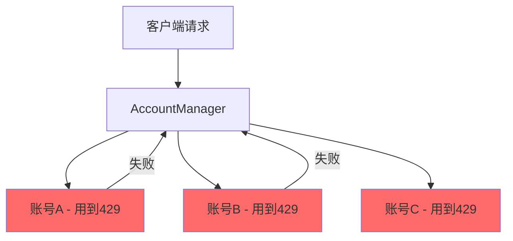
```mermaid
flowchart TD
    REQ[客户端请求] --> AM[AccountManager]
    AM --> ACC1[账号A - 用到429]
    ACC1 -->|失败| AM
    AM --> ACC2[账号B - 用到429]
    ACC2 -->|失败| AM
    AM --> ACC3[账号C - 用到429]
    
    style ACC1 fill:#ff6b6b
    style ACC2 fill:#ff6b6b
    style ACC3 fill:#ff6b6b
```

**风险特征分析：**

| 特征 | 代码证据 | 命中规则 |
|------|----------|----------|
| 单账号被限流后立即切到下一个 | `get_next_account(exclude_accounts)` | 规则1：Credit消耗峰值 |
| 429(限流)被归为 RECOVERABLE | `account_errors.py:classify_error` | 多账号规避单账号限制 |
| 多账号来自不同凭证来源 | `credentials.json` 支持多条目 | 规则3：多IP/多身份 |
| 冷却期仅 60s 基础值 | `ACCOUNT_RECOVERY_TIMEOUT=60` | 恢复过快，继续消耗 |

**核心问题**：该系统设计目的是"一个账号用完马上用下一个"，这正是检测系统重点监控的模式——**跨账号聚合消耗**。

---

### 1.2 VPN/代理流量路由（命中规则 #3）

**代码位置**：`main.py` L185-196、`kiro/config.py` L117-121

```python
# main.py
if VPN_PROXY_URL:
    os.environ['HTTP_PROXY'] = proxy_url_with_scheme
    os.environ['HTTPS_PROXY'] = proxy_url_with_scheme
    os.environ['ALL_PROXY'] = proxy_url_with_scheme
```

**风险特征分析：**

| 特征 | 说明 | 命中规则 |
|------|------|----------|
| 所有流量经过代理 | 数据中心 IP 范围已被标记 | 规则3 |
| 支持 SOCKS5 | 常见代理工具特征 | 规则3 |
| 单一出口 IP | 多账号共用一个代理 IP → 关联分析 | 规则3 |
| 无 IP 轮转逻辑 | 长期固定在一个非住宅 IP | 规则3 |

---

### 1.3 无任何速率限制（命中规则 #1）

**代码位置**：`kiro/routes_openai.py`、`kiro/routes_anthropic.py`

**关键发现：整个项目没有任何客户端侧的请求速率限制。**

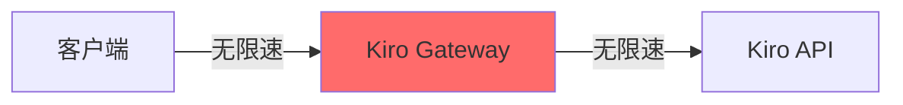
```mermaid
flowchart LR
    CLIENT[客户端] -->|无限速| GW[Kiro Gateway]
    GW -->|无限速| KIRO[Kiro API]
    
    style GW fill:#ff6b6b
```

| 缺失 | 影响 |
|------|------|
| 无 requests/min 限制 | 客户端可瞬时发大量请求 |
| 无 tokens/hour 限制 | 30min内Token消耗无上界 |
| 无并发控制 | 100个连接池全部可同时请求 |
| 无队列/排队机制 | 突发流量直接打到 Kiro API |

---


## 2. 中风险命中点

### 2.1 每次请求生成新 Conversation ID（命中规则 #2）

**代码位置**：`kiro/utils.py:102` → `generate_conversation_id()`

**当前行为**：路由中调用 `generate_conversation_id()` 时**未传入 messages 参数**：

```python
# routes_openai.py L323, L571
conversation_id = generate_conversation_id()  # 无参数 → 随机 UUID
```

这意味着**每次请求都是一个新的随机 conversation_id**。

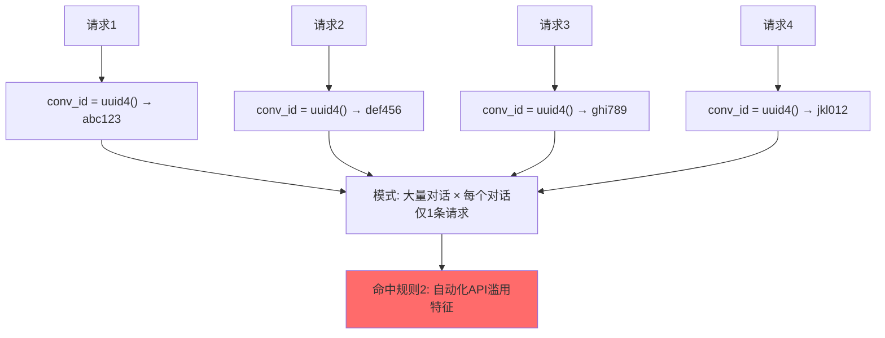
```mermaid
flowchart TD
    REQ1[请求1] --> CID1["conv_id = uuid4() → abc123"]
    REQ2[请求2] --> CID2["conv_id = uuid4() → def456"]
    REQ3[请求3] --> CID3["conv_id = uuid4() → ghi789"]
    REQ4[请求4] --> CID4["conv_id = uuid4() → jkl012"]
    
    CID1 --> PATTERN[模式: 大量对话 × 每个对话仅1条请求]
    CID2 --> PATTERN
    CID3 --> PATTERN
    CID4 --> PATTERN
    
    PATTERN --> DETECT[命中规则2: 自动化API滥用特征]
    style DETECT fill:#ff6b6b
```

**Kiro 视角**：该账号在短时间内创建了数百个"对话"，每个对话只有1条消息。这与真实编程会话（少量对话、每个对话多轮交互）完全相反。

---

### 2.2 伪造 User-Agent 指纹（可被指纹识别）

**代码位置**：`kiro/utils.py:83-84`

```python
"User-Agent": f"aws-sdk-js/1.0.27 ua/2.1 os/win32#10.0.19044 lang/js md/nodejs#22.21.1 api/codewhispererstreaming#1.0.27 m/E KiroIDE-0.7.45-{fingerprint}",
```

**风险特征：**

| 特征 | 问题 |
|------|------|
| 硬编码 `os/win32#10.0.19044` | 服务器实际运行在 Linux 上 |
| 硬编码 `nodejs#22.21.1` | 实际是 Python 进程 |
| 硬编码 `KiroIDE-0.7.45` | 版本号不更新，很快过时 |
| `fingerprint` = SHA256(hostname-user) | 可预测、不变化 |

Kiro 可通过以下方式识别：
- OS 声称 win32，但 IP 来自 Linux 服务器
- Kiro IDE 版本号过旧/固定不变
- 多个"不同机器"使用相同网络出口

---

### 2.3 自动重试放大流量（加剧规则 #1）

**代码位置**：`kiro/http_client.py`、`kiro/streaming_openai.py`

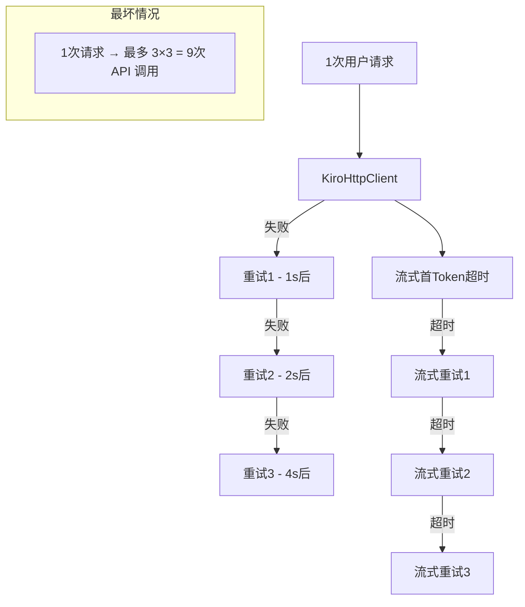
```mermaid
flowchart TD
    REQ[1次用户请求] --> HTTP[KiroHttpClient]
    HTTP -->|失败| R1[重试1 - 1s后]
    R1 -->|失败| R2[重试2 - 2s后]
    R2 -->|失败| R3[重试3 - 4s后]
    
    HTTP --> STREAM[流式首Token超时]
    STREAM -->|超时| SR1[流式重试1]
    SR1 -->|超时| SR2[流式重试2]
    SR2 -->|超时| SR3[流式重试3]
    
    subgraph 最坏情况
        TOTAL["1次请求 → 最多 3×3 = 9次 API 调用"]
    end
```

**配置证据：**
- `MAX_RETRIES = 3`
- `FIRST_TOKEN_MAX_RETRIES = 3`
- 两层重试可叠加

---


## 3. 低风险命中点

### 3.1 固定伪装参数不更新

| 参数 | 硬编码值 | 风险 |
|------|----------|------|
| Windows 版本 | `10.0.19044` (Win10 21H2) | 已过时，可被标记 |
| Node.js 版本 | `22.21.1` | 如果Kiro内部知道真实版本分布，可排查 |
| SDK 版本 | `aws-sdk-js/1.0.27` | 固定不变 |
| IDE 版本 | `KiroIDE-0.7.45` | 不随官方更新 |

### 3.2 Fingerprint 模式单一

`get_machine_fingerprint()` = `SHA256(hostname-username-kiro-gateway)`

- 一台服务器部署后 fingerprint 永不变化
- 多账号共享同一 fingerprint → 关联信号
- "kiro-gateway" 字符串参与 hash，若 Kiro 知道该算法可直接识别

### 3.3 连接池行为特征

```python
limits = httpx.Limits(max_connections=100, max_keepalive_connections=20)
```

单个网关实例最多 100 并发连接。若短时间内打满，从 Kiro 服务端看：
- 单一 IP 高并发长连接
- 连接复用模式与真实 IDE 不同（IDE 通常 1-2 并发）

---

## 4. 综合风险矩阵

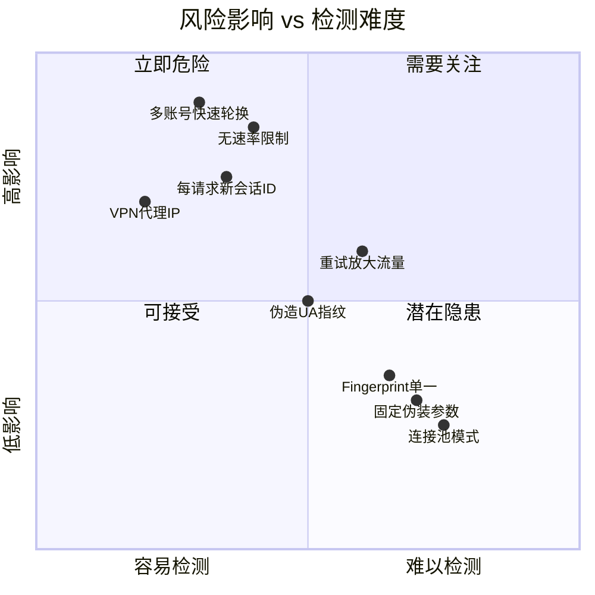
```mermaid
quadrantChart
    title 风险影响 vs 检测难度
    x-axis 容易检测 --> 难以检测
    y-axis 低影响 --> 高影响
    quadrant-1 需要关注
    quadrant-2 立即危险
    quadrant-3 可接受
    quadrant-4 潜在隐患
    多账号快速轮换: [0.3, 0.9]
    无速率限制: [0.4, 0.85]
    VPN代理IP: [0.2, 0.7]
    每请求新会话ID: [0.35, 0.75]
    伪造UA指纹: [0.5, 0.5]
    重试放大流量: [0.6, 0.6]
    固定伪装参数: [0.7, 0.3]
    连接池模式: [0.75, 0.25]
    Fingerprint单一: [0.65, 0.35]
```

---

## 5. 按检测规则分类总结

### 规则1：短时间窗口内的异常消耗

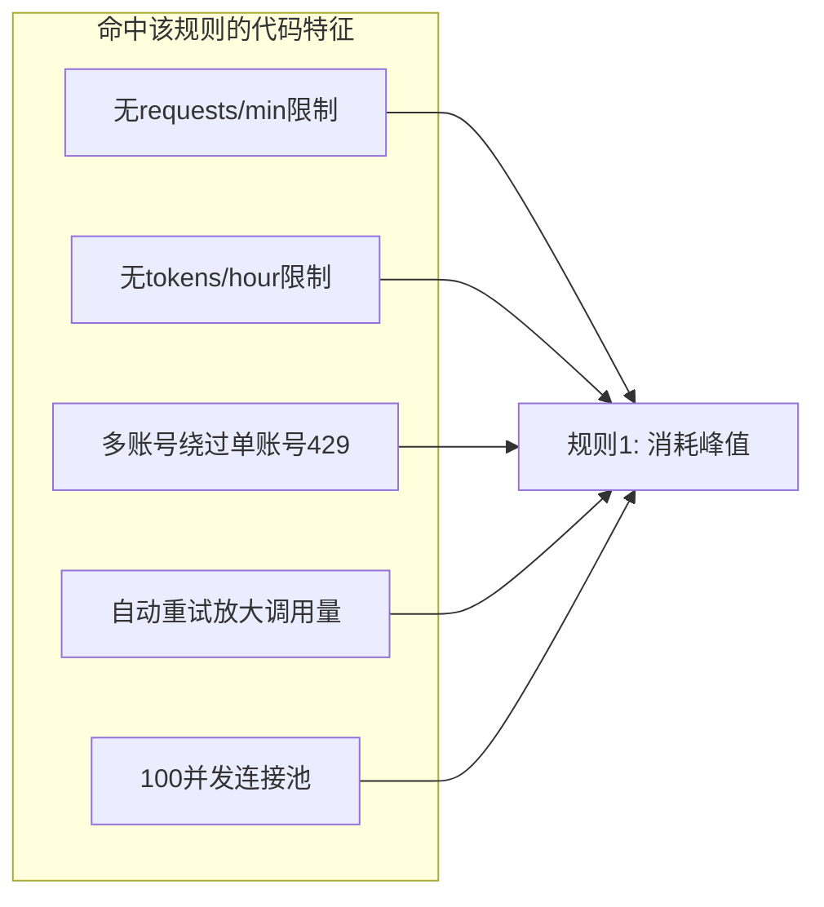
```mermaid
flowchart LR
    subgraph 命中该规则的代码特征
        A[无requests/min限制]
        B[无tokens/hour限制]
        C[多账号绕过单账号429]
        D[自动重试放大调用量]
        E[100并发连接池]
    end
    
    A --> R1[规则1: 消耗峰值]
    B --> R1
    C --> R1
    D --> R1
    E --> R1
```

### 规则2：可疑对话模式

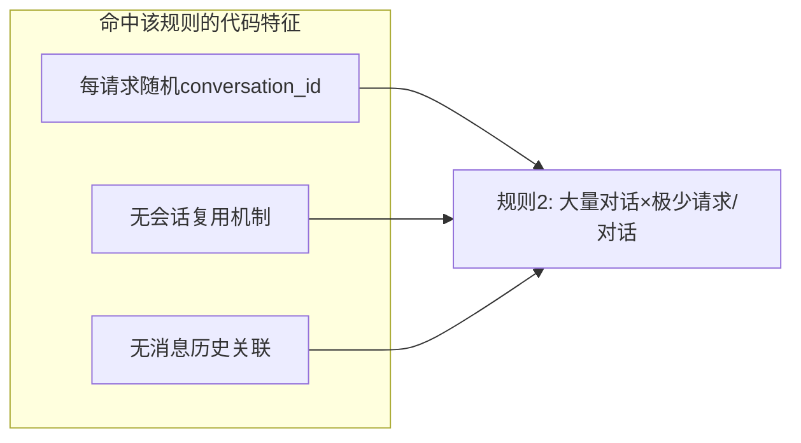
```mermaid
flowchart LR
    subgraph 命中该规则的代码特征
        F["每请求随机conversation_id"]
        G[无会话复用机制]
        H[无消息历史关联]
    end
    
    F --> R2["规则2: 大量对话×极少请求/对话"]
    G --> R2
    H --> R2
```

### 规则3：IP 信号

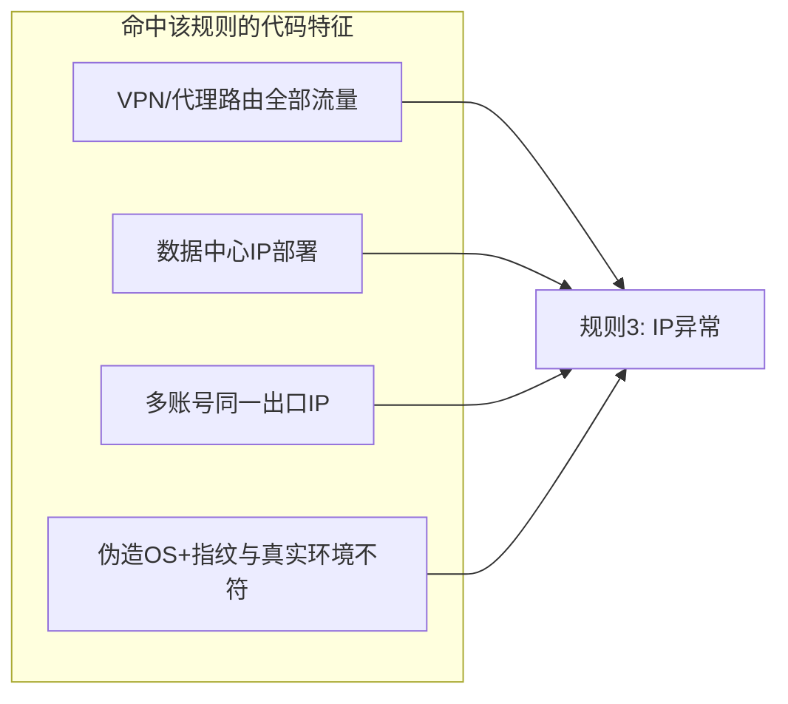
```mermaid
flowchart LR
    subgraph 命中该规则的代码特征
        I[VPN/代理路由全部流量]
        J[数据中心IP部署]
        K[多账号同一出口IP]
        L[伪造OS+指纹与真实环境不符]
    end
    
    I --> R3[规则3: IP异常]
    J --> R3
    K --> R3
    L --> R3
```

---

## 6. 结论

| 风险等级 | 命中点数量 | 最可能触发的检测规则 |
|----------|-----------|---------------------|
| 🔴 高 | 3 | 多账号轮换、VPN路由、无速率限制 |
| 🟠 中 | 3 | 新会话ID、UA伪造、重试放大 |
| 🟡 低 | 3 | 固定参数、fingerprint、连接池 |

**该项目作为网关代理工具，其设计模式天然具备多个与"自动化 API 滥用"一致的行为特征。** 尤其是：

1. **缺乏任何自我节流机制** — 完全依赖上游限制
2. **每次请求新会话** — 最典型的"非人类使用"信号
3. **多账号 + 同 IP** — 最容易被关联分析的模式

---

> **本文档目的**：帮助使用者了解风险暴露面，做出知情决策。  
> **生成时间**：2026-05-28  
> **分析版本**：v2.4.dev.13


---

## 7. 防御加固建议（合规使用 - 降低误伤率）

> **适用场景**：合法使用单账号/团队账号时，如何让行为模式更接近正常 IDE 使用，
> 避免因工具自动化特征被误判为滥用。

### 7.1 建议总览

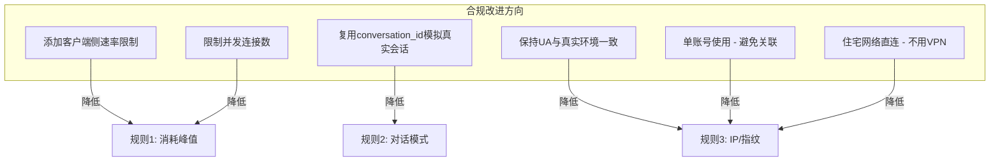
```mermaid
flowchart TD
    subgraph 合规改进方向
        A[添加客户端侧速率限制]
        B[复用conversation_id模拟真实会话]
        C[限制并发连接数]
        D[保持UA与真实环境一致]
        E[单账号使用 - 避免关联]
        F[住宅网络直连 - 不用VPN]
    end

    A -->|降低| R1[规则1: 消耗峰值]
    B -->|降低| R2[规则2: 对话模式]
    C -->|降低| R1
    D -->|降低| R3[规则3: IP/指纹]
    E -->|降低| R3
    F -->|降低| R3
```

### 7.2 具体建议

| # | 改进项 | 当前状态 | 建议 | 降低的风险 |
|---|--------|----------|------|-----------|
| 1 | **添加请求速率限制** | 无任何限制 | 增加 RPM(requests/min) 和 TPH(tokens/hour) 上限 | 规则1 |
| 2 | **复用 conversation_id** | 每次随机UUID | 对同一客户端会话复用稳定的conversation_id | 规则2 |
| 3 | **降低并发连接** | max_connections=100 | 限制为 2-5 个并发（匹配真实 IDE 行为） | 规则1+3 |
| 4 | **随真实版本更新 UA** | 硬编码固定版本 | 定期从官方 IDE 更新版本号 | 规则3 |
| 5 | **单账号模式** | 支持多账号轮换 | 合规场景下只使用自己的单个账号 | 规则1+3 |
| 6 | **住宅网络直连** | 支持 VPN/代理 | 合规场景不使用 VPN，直接连接 | 规则3 |
| 7 | **请求间隔随机化** | 立即发送 | 添加 1-5s 随机间隔模拟人类节奏 | 规则1+2 |
| 8 | **每日使用量监控** | 无自监控 | 增加每日 token 使用量统计 + 告警阈值 | 规则1 |

### 7.3 合规使用模式 vs 异常使用模式

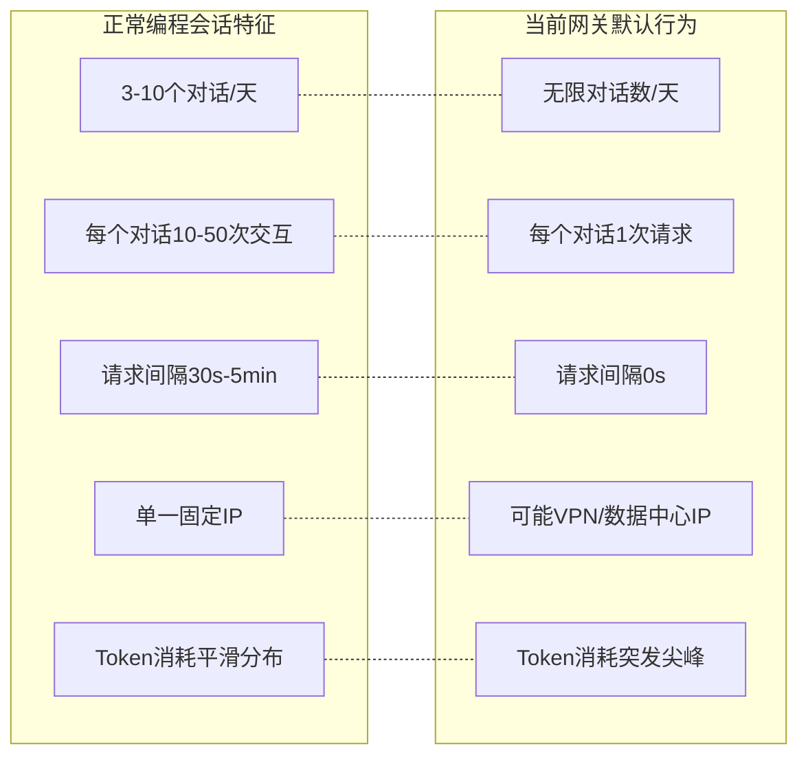
```mermaid
flowchart LR
    subgraph 正常编程会话特征
        N1["3-10个对话/天"]
        N2["每个对话10-50次交互"]
        N3["请求间隔30s-5min"]
        N4["单一固定IP"]
        N5["Token消耗平滑分布"]
    end

    subgraph 当前网关默认行为
        A1["无限对话数/天"]
        A2["每个对话1次请求"]
        A3["请求间隔0s"]
        A4["可能VPN/数据中心IP"]
        A5["Token消耗突发尖峰"]
    end

    N1 -.- A1
    N2 -.- A2
    N3 -.- A3
    N4 -.- A4
    N5 -.- A5
```

---

## 8. 检测系统技术原理分析

> 基于公开的反欺诈技术文献推断 Kiro 检测系统可能采用的技术栈。

### 8.1 检测系统架构推测

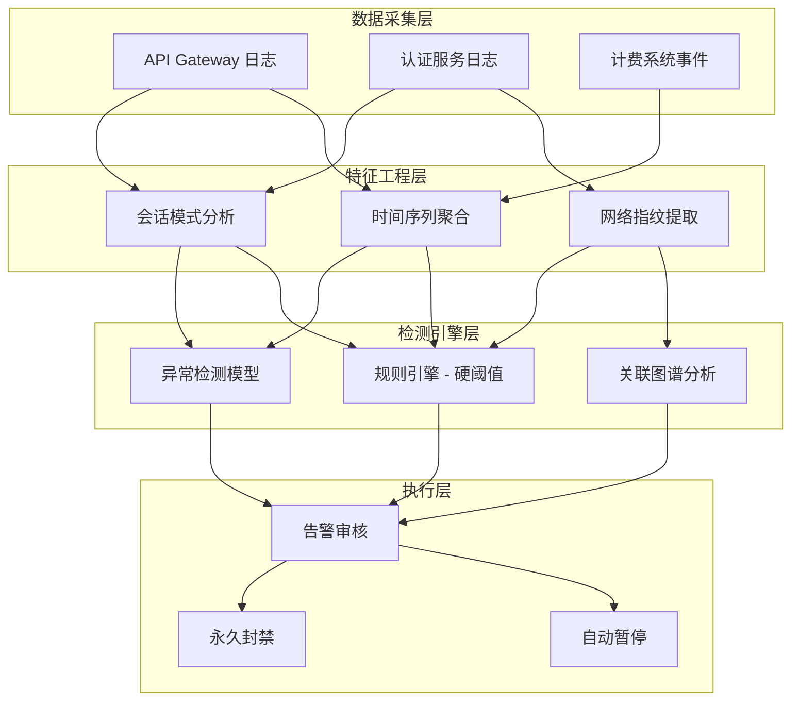
```mermaid
flowchart TD
    subgraph 数据采集层
        API[API Gateway 日志]
        AUTH[认证服务日志]
        BILL[计费系统事件]
    end

    subgraph 特征工程层
        TS[时间序列聚合]
        SESS[会话模式分析]
        NET[网络指纹提取]
    end

    subgraph 检测引擎层
        RULE[规则引擎 - 硬阈值]
        ML[异常检测模型]
        GRAPH[关联图谱分析]
    end

    subgraph 执行层
        ALERT[告警审核]
        SUSPEND[自动暂停]
        BAN[永久封禁]
    end

    API --> TS
    AUTH --> NET
    BILL --> TS
    API --> SESS
    AUTH --> SESS

    TS --> RULE
    TS --> ML
    SESS --> RULE
    SESS --> ML
    NET --> GRAPH
    NET --> RULE

    RULE --> ALERT
    ML --> ALERT
    GRAPH --> ALERT
    ALERT --> SUSPEND
    ALERT --> BAN
```

### 8.2 各检测维度的技术实现推测

#### 规则1：消耗异常检测

| 技术 | 实现方式 | 指标 |
|------|----------|------|
| **滑动窗口计数** | 30min/1h/24h 窗口内的 credit 消耗总量 | credits_used > threshold |
| **基线对比** | 用户历史平均值 vs 当前窗口值 | current / avg_7d > N倍 |
| **突变检测** | 相邻时间窗口消耗差值 | delta > absolute_threshold |
| **速率计算** | requests_per_minute 指标 | RPM > plan_limit × safety_factor |

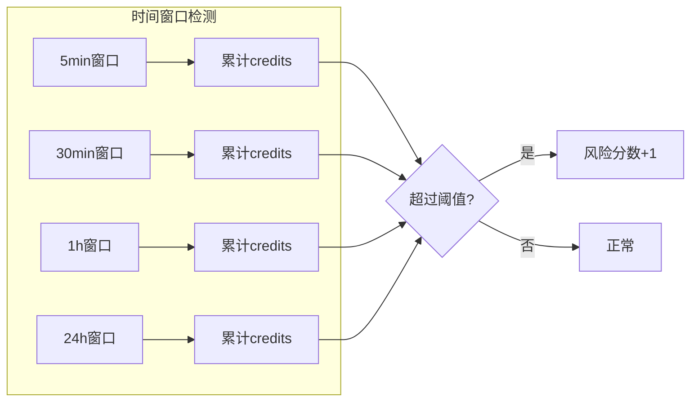
```mermaid
graph LR
    subgraph 时间窗口检测
        W1[5min窗口] --> AGG1[累计credits]
        W2[30min窗口] --> AGG2[累计credits]
        W3[1h窗口] --> AGG3[累计credits]
        W4[24h窗口] --> AGG4[累计credits]
    end
    
    AGG1 --> CMP{超过阈值?}
    AGG2 --> CMP
    AGG3 --> CMP
    AGG4 --> CMP
    
    CMP -->|是| SCORE[风险分数+1]
    CMP -->|否| OK[正常]
```

#### 规则2：会话模式检测

| 技术 | 实现方式 | 异常信号 |
|------|----------|----------|
| **对话聚合统计** | GROUP BY conversation_id → COUNT(requests) | 大量 count=1 的对话 |
| **对话密度** | conversations_created / hour | 远超正常 IDE 使用频率 |
| **会话时长分布** | 对话首末请求的时间差 | 所有对话时长=0（瞬时对话） |
| **消息深度比** | avg(messages_per_conversation) | 接近1.0表示自动化 |

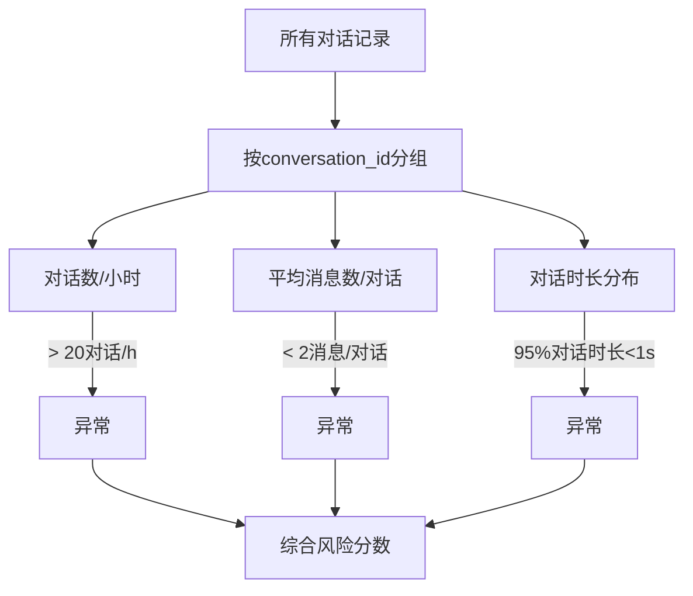
```mermaid
graph TD
    DATA[所有对话记录] --> AGG[按conversation_id分组]
    AGG --> METRIC1["对话数/小时"]
    AGG --> METRIC2["平均消息数/对话"]
    AGG --> METRIC3["对话时长分布"]
    
    METRIC1 -->|> 20对话/h| FLAG1[异常]
    METRIC2 -->|< 2消息/对话| FLAG2[异常]
    METRIC3 -->|95%对话时长<1s| FLAG3[异常]
    
    FLAG1 --> SCORE[综合风险分数]
    FLAG2 --> SCORE
    FLAG3 --> SCORE
```

#### 规则3：IP/网络检测

| 技术 | 实现方式 | 异常信号 |
|------|----------|----------|
| **IP信誉库** | 查询 MaxMind/IPinfo 数据库 | 数据中心/VPN/代理 ASN |
| **IP多样性** | 同一账号 distinct IP count / day | 短时间多IP切换 |
| **IP聚合** | 同一IP下的不同账号数量 | 多账号共用一个IP |
| **地理一致性** | IP地理位置 vs 账号注册地 | 突然跨洲使用 |
| **TLS指纹** | JA3/JA4 指纹 | Python httpx vs 真实浏览器/Node |

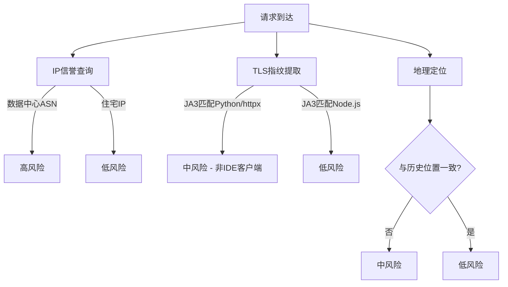
```mermaid
graph TD
    REQ[请求到达] --> IP_CHECK[IP信誉查询]
    REQ --> TLS[TLS指纹提取]
    REQ --> GEO[地理定位]
    
    IP_CHECK -->|数据中心ASN| RISK_HIGH[高风险]
    IP_CHECK -->|住宅IP| RISK_LOW[低风险]
    
    TLS -->|JA3匹配Python/httpx| RISK_MED[中风险 - 非IDE客户端]
    TLS -->|JA3匹配Node.js| RISK_LOW2[低风险]
    
    GEO --> HISTORY{与历史位置一致?}
    HISTORY -->|否| RISK_MED2[中风险]
    HISTORY -->|是| RISK_LOW3[低风险]
```

### 8.3 综合评分机制（推测）

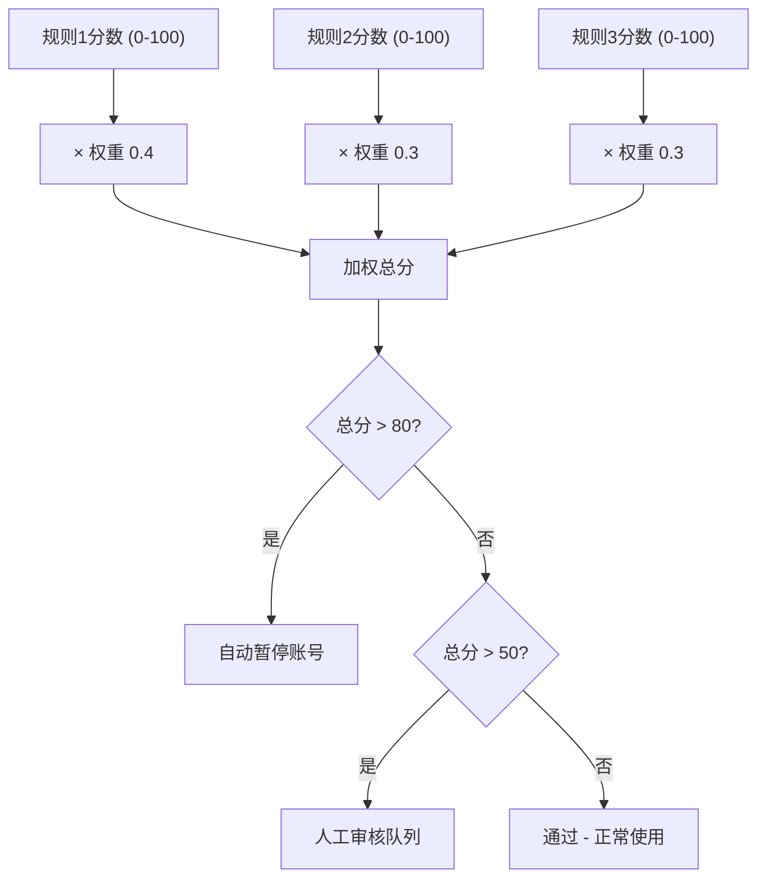
```mermaid
flowchart TD
    R1_SCORE["规则1分数 (0-100)"] --> WEIGHT1["× 权重 0.4"]
    R2_SCORE["规则2分数 (0-100)"] --> WEIGHT2["× 权重 0.3"]
    R3_SCORE["规则3分数 (0-100)"] --> WEIGHT3["× 权重 0.3"]
    
    WEIGHT1 --> SUM[加权总分]
    WEIGHT2 --> SUM
    WEIGHT3 --> SUM
    
    SUM --> T1{总分 > 80?}
    T1 -->|是| AUTO_SUSPEND[自动暂停账号]
    T1 -->|否| T2{总分 > 50?}
    T2 -->|是| REVIEW[人工审核队列]
    T2 -->|否| PASS[通过 - 正常使用]
```

### 8.4 额外可能的检测维度

| 维度 | 说明 | 该项目暴露程度 |
|------|------|----------------|
| **TLS 指纹 (JA3/JA4)** | Python httpx 的 TLS 握手特征与 Electron/Node 不同 | 🟠 中 |
| **HTTP/2 行为** | 请求流的多路复用模式与真实 IDE 不同 | 🟡 低 |
| **请求时间分布** | 7×24h均匀分布 vs 人类作息规律 | 🟠 中（服务器24h运行） |
| **响应消费模式** | 流式响应是否被完整读取/中途断开频率 | 🟡 低 |
| **API 调用模式** | 是否调用 /ListAvailableModels、频率是否异常 | 🟡 低 |

---

## 9. 总结与风险评估

### 整体风险等级

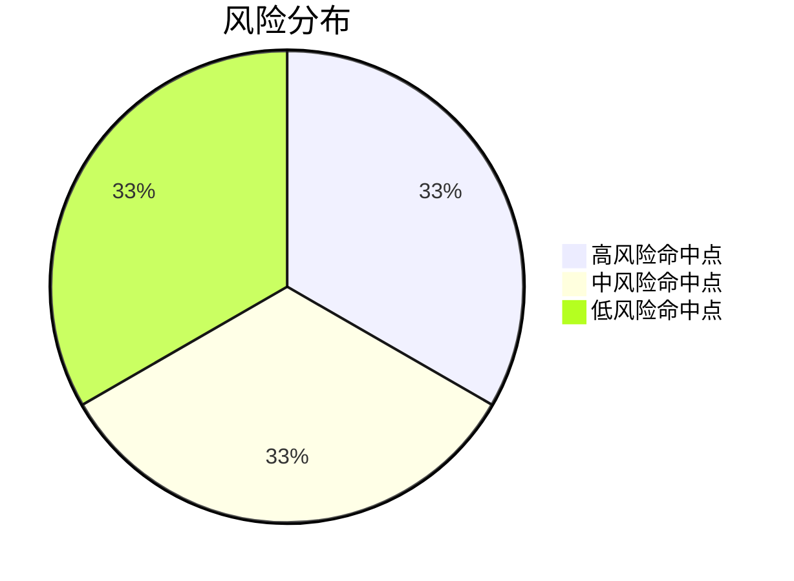
```mermaid
pie title 风险分布
    "高风险命中点" : 3
    "中风险命中点" : 3
    "低风险命中点" : 3
```

### 结论

该项目的设计目标（代理网关 + 多账号 + VPN支持）与 Kiro 欺诈检测系统的检测目标
存在**结构性冲突**。项目的核心功能特征恰好是检测系统重点监控的行为模式。

**对使用者的风险告知：**

| 使用方式 | 被检测概率 | 说明 |
|----------|-----------|------|
| 单账号 + 住宅IP + 低频使用 | 🟢 低 | 接近正常 IDE 行为 |
| 单账号 + VPN + 中频使用 | 🟠 中 | IP 信号可能触发审核 |
| 多账号 + VPN + 高频使用 | 🔴 极高 | 几乎必然触发三条规则 |

---

> **文档更新时间**：2026-05-28  
> **分析版本**：v2.4.dev.13  
> **性质**：纯风险识别 + 检测原理分析（不含规避方案）
