# Kiro Gateway 风险分析：欺诈检测命中点

> **声明**：本文档仅为代码审计与风险识别，目的是让项目使用者理解哪些功能特征
> 可能触发 Kiro 的欺诈检测系统。**不包含任何规避方案。**

---

## 概述

Kiro 欺诈检测系统监控三大类信号：

| # | 检测维度 | 核心规则 |
|---|----------|----------|
| 1 | **消耗异常** | 短时间窗口(30min/1h)内的 Token/Credit 峰值 |
| 2 | **对话模式** | 大量对话 + 每个对话极少请求数（自动化特征） |
| 3 | **IP 信号** | 同时多 IP / 数据中心 IP / VPN 范围 |

---

## 风险热力图总览

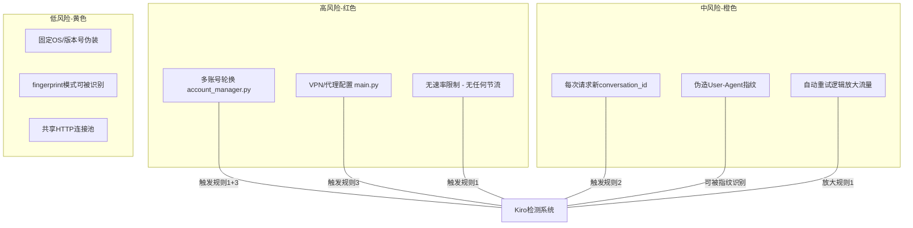
```mermaid
graph TB
    subgraph 高风险-红色
        R1[多账号轮换 account_manager.py]
        R2[VPN/代理配置 main.py]
        R3[无速率限制 - 无任何节流]
    end

    subgraph 中风险-橙色
        O1[每次请求新conversation_id]
        O2[伪造User-Agent指纹]
        O3[自动重试逻辑放大流量]
    end

    subgraph 低风险-黄色
        L1[固定OS/版本号伪装]
        L2[fingerprint模式可被识别]
        L3[共享HTTP连接池]
    end

    R1 --- |触发规则1+3| DET[Kiro检测系统]
    R2 --- |触发规则3| DET
    R3 --- |触发规则1| DET
    O1 --- |触发规则2| DET
    O2 --- |可被指纹识别| DET
    O3 --- |放大规则1| DET
```

---


## 1. 高风险命中点

### 1.1 多账号快速轮换（命中规则 #1 + #3）

**代码位置**：`kiro/account_manager.py` → `get_next_account()`

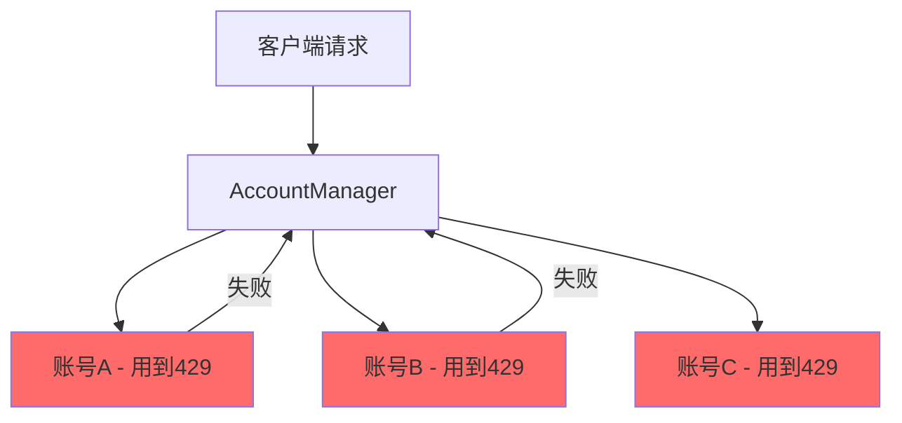
```mermaid
flowchart TD
    REQ[客户端请求] --> AM[AccountManager]
    AM --> ACC1[账号A - 用到429]
    ACC1 -->|失败| AM
    AM --> ACC2[账号B - 用到429]
    ACC2 -->|失败| AM
    AM --> ACC3[账号C - 用到429]
    
    style ACC1 fill:#ff6b6b
    style ACC2 fill:#ff6b6b
    style ACC3 fill:#ff6b6b
```

**风险特征分析：**

| 特征 | 代码证据 | 命中规则 |
|------|----------|----------|
| 单账号被限流后立即切到下一个 | `get_next_account(exclude_accounts)` | 规则1：Credit消耗峰值 |
| 429(限流)被归为 RECOVERABLE | `account_errors.py:classify_error` | 多账号规避单账号限制 |
| 多账号来自不同凭证来源 | `credentials.json` 支持多条目 | 规则3：多IP/多身份 |
| 冷却期仅 60s 基础值 | `ACCOUNT_RECOVERY_TIMEOUT=60` | 恢复过快，继续消耗 |

**核心问题**：该系统设计目的是"一个账号用完马上用下一个"，这正是检测系统重点监控的模式——**跨账号聚合消耗**。

---

### 1.2 VPN/代理流量路由（命中规则 #3）

**代码位置**：`main.py` L185-196、`kiro/config.py` L117-121

```python
# main.py
if VPN_PROXY_URL:
    os.environ['HTTP_PROXY'] = proxy_url_with_scheme
    os.environ['HTTPS_PROXY'] = proxy_url_with_scheme
    os.environ['ALL_PROXY'] = proxy_url_with_scheme
```

**风险特征分析：**

| 特征 | 说明 | 命中规则 |
|------|------|----------|
| 所有流量经过代理 | 数据中心 IP 范围已被标记 | 规则3 |
| 支持 SOCKS5 | 常见代理工具特征 | 规则3 |
| 单一出口 IP | 多账号共用一个代理 IP → 关联分析 | 规则3 |
| 无 IP 轮转逻辑 | 长期固定在一个非住宅 IP | 规则3 |

---

### 1.3 无任何速率限制（命中规则 #1）

**代码位置**：`kiro/routes_openai.py`、`kiro/routes_anthropic.py`

**关键发现：整个项目没有任何客户端侧的请求速率限制。**

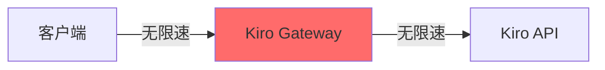
```mermaid
flowchart LR
    CLIENT[客户端] -->|无限速| GW[Kiro Gateway]
    GW -->|无限速| KIRO[Kiro API]
    
    style GW fill:#ff6b6b
```

| 缺失 | 影响 |
|------|------|
| 无 requests/min 限制 | 客户端可瞬时发大量请求 |
| 无 tokens/hour 限制 | 30min内Token消耗无上界 |
| 无并发控制 | 100个连接池全部可同时请求 |
| 无队列/排队机制 | 突发流量直接打到 Kiro API |

---


## 2. 中风险命中点

### 2.1 每次请求生成新 Conversation ID（命中规则 #2）

**代码位置**：`kiro/utils.py:102` → `generate_conversation_id()`

**当前行为**：路由中调用 `generate_conversation_id()` 时**未传入 messages 参数**：

```python
# routes_openai.py L323, L571
conversation_id = generate_conversation_id()  # 无参数 → 随机 UUID
```

这意味着**每次请求都是一个新的随机 conversation_id**。

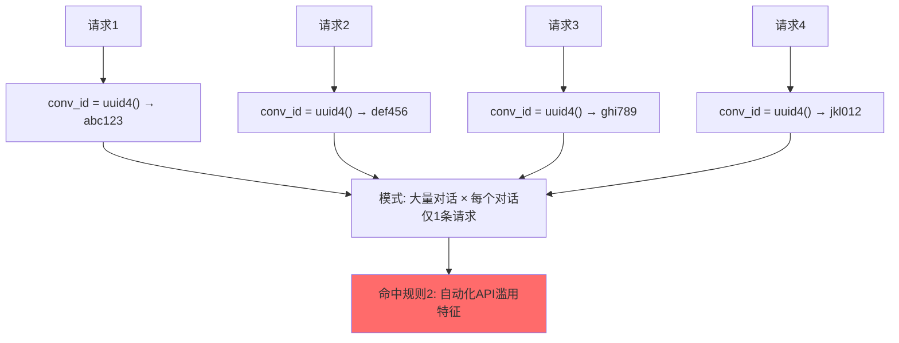
```mermaid
flowchart TD
    REQ1[请求1] --> CID1["conv_id = uuid4() → abc123"]
    REQ2[请求2] --> CID2["conv_id = uuid4() → def456"]
    REQ3[请求3] --> CID3["conv_id = uuid4() → ghi789"]
    REQ4[请求4] --> CID4["conv_id = uuid4() → jkl012"]
    
    CID1 --> PATTERN[模式: 大量对话 × 每个对话仅1条请求]
    CID2 --> PATTERN
    CID3 --> PATTERN
    CID4 --> PATTERN
    
    PATTERN --> DETECT[命中规则2: 自动化API滥用特征]
    style DETECT fill:#ff6b6b
```

**Kiro 视角**：该账号在短时间内创建了数百个"对话"，每个对话只有1条消息。这与真实编程会话（少量对话、每个对话多轮交互）完全相反。

---

### 2.2 伪造 User-Agent 指纹（可被指纹识别）

**代码位置**：`kiro/utils.py:83-84`

```python
"User-Agent": f"aws-sdk-js/1.0.27 ua/2.1 os/win32#10.0.19044 lang/js md/nodejs#22.21.1 api/codewhispererstreaming#1.0.27 m/E KiroIDE-0.7.45-{fingerprint}",
```

**风险特征：**

| 特征 | 问题 |
|------|------|
| 硬编码 `os/win32#10.0.19044` | 服务器实际运行在 Linux 上 |
| 硬编码 `nodejs#22.21.1` | 实际是 Python 进程 |
| 硬编码 `KiroIDE-0.7.45` | 版本号不更新，很快过时 |
| `fingerprint` = SHA256(hostname-user) | 可预测、不变化 |

Kiro 可通过以下方式识别：
- OS 声称 win32，但 IP 来自 Linux 服务器
- Kiro IDE 版本号过旧/固定不变
- 多个"不同机器"使用相同网络出口

---

### 2.3 自动重试放大流量（加剧规则 #1）

**代码位置**：`kiro/http_client.py`、`kiro/streaming_openai.py`

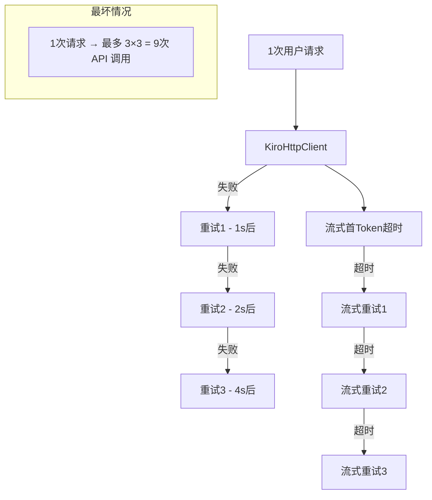
```mermaid
flowchart TD
    REQ[1次用户请求] --> HTTP[KiroHttpClient]
    HTTP -->|失败| R1[重试1 - 1s后]
    R1 -->|失败| R2[重试2 - 2s后]
    R2 -->|失败| R3[重试3 - 4s后]
    
    HTTP --> STREAM[流式首Token超时]
    STREAM -->|超时| SR1[流式重试1]
    SR1 -->|超时| SR2[流式重试2]
    SR2 -->|超时| SR3[流式重试3]
    
    subgraph 最坏情况
        TOTAL["1次请求 → 最多 3×3 = 9次 API 调用"]
    end
```

**配置证据：**
- `MAX_RETRIES = 3`
- `FIRST_TOKEN_MAX_RETRIES = 3`
- 两层重试可叠加

---


## 3. 低风险命中点

### 3.1 固定伪装参数不更新

| 参数 | 硬编码值 | 风险 |
|------|----------|------|
| Windows 版本 | `10.0.19044` (Win10 21H2) | 已过时，可被标记 |
| Node.js 版本 | `22.21.1` | 如果Kiro内部知道真实版本分布，可排查 |
| SDK 版本 | `aws-sdk-js/1.0.27` | 固定不变 |
| IDE 版本 | `KiroIDE-0.7.45` | 不随官方更新 |

### 3.2 Fingerprint 模式单一

`get_machine_fingerprint()` = `SHA256(hostname-username-kiro-gateway)`

- 一台服务器部署后 fingerprint 永不变化
- 多账号共享同一 fingerprint → 关联信号
- "kiro-gateway" 字符串参与 hash，若 Kiro 知道该算法可直接识别

### 3.3 连接池行为特征

```python
limits = httpx.Limits(max_connections=100, max_keepalive_connections=20)
```

单个网关实例最多 100 并发连接。若短时间内打满，从 Kiro 服务端看：
- 单一 IP 高并发长连接
- 连接复用模式与真实 IDE 不同（IDE 通常 1-2 并发）

---

## 4. 综合风险矩阵

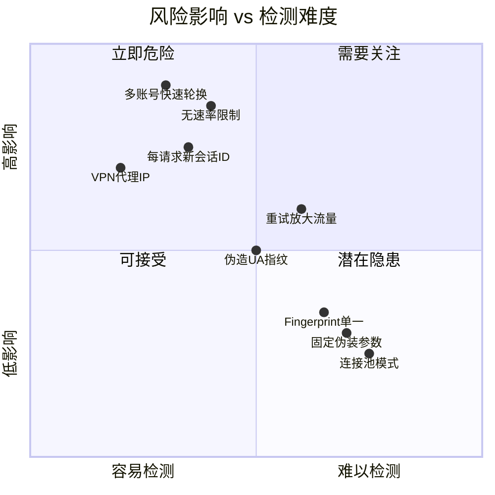
```mermaid
quadrantChart
    title 风险影响 vs 检测难度
    x-axis 容易检测 --> 难以检测
    y-axis 低影响 --> 高影响
    quadrant-1 需要关注
    quadrant-2 立即危险
    quadrant-3 可接受
    quadrant-4 潜在隐患
    多账号快速轮换: [0.3, 0.9]
    无速率限制: [0.4, 0.85]
    VPN代理IP: [0.2, 0.7]
    每请求新会话ID: [0.35, 0.75]
    伪造UA指纹: [0.5, 0.5]
    重试放大流量: [0.6, 0.6]
    固定伪装参数: [0.7, 0.3]
    连接池模式: [0.75, 0.25]
    Fingerprint单一: [0.65, 0.35]
```

---

## 5. 按检测规则分类总结

### 规则1：短时间窗口内的异常消耗

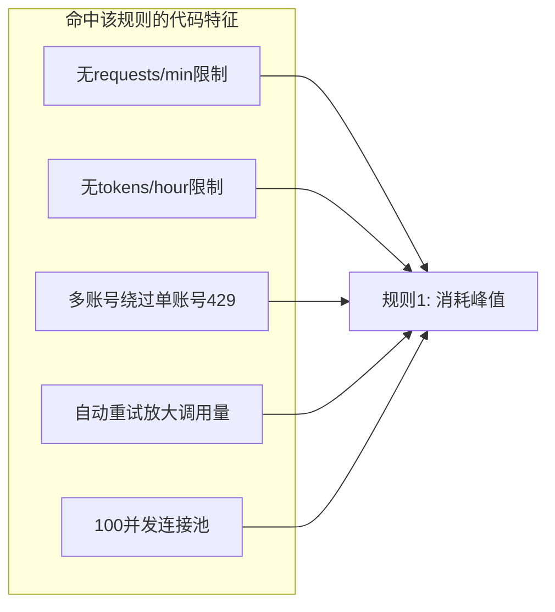
```mermaid
flowchart LR
    subgraph 命中该规则的代码特征
        A[无requests/min限制]
        B[无tokens/hour限制]
        C[多账号绕过单账号429]
        D[自动重试放大调用量]
        E[100并发连接池]
    end
    
    A --> R1[规则1: 消耗峰值]
    B --> R1
    C --> R1
    D --> R1
    E --> R1
```

### 规则2：可疑对话模式

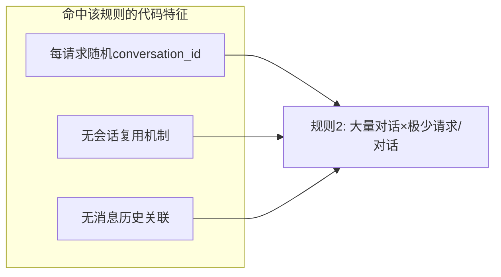
```mermaid
flowchart LR
    subgraph 命中该规则的代码特征
        F["每请求随机conversation_id"]
        G[无会话复用机制]
        H[无消息历史关联]
    end
    
    F --> R2["规则2: 大量对话×极少请求/对话"]
    G --> R2
    H --> R2
```

### 规则3：IP 信号

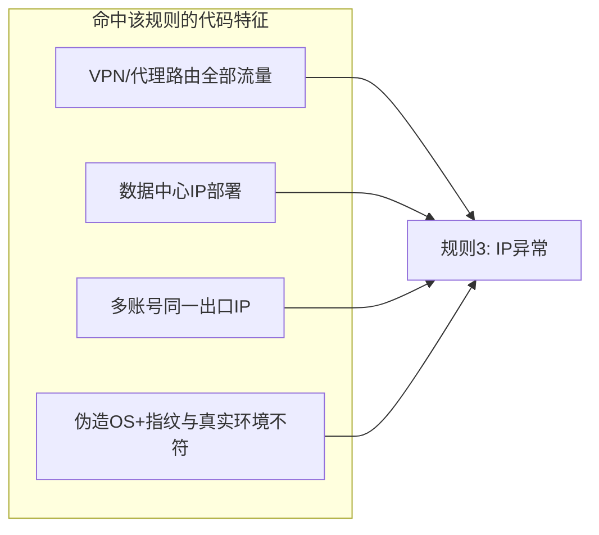
```mermaid
flowchart LR
    subgraph 命中该规则的代码特征
        I[VPN/代理路由全部流量]
        J[数据中心IP部署]
        K[多账号同一出口IP]
        L[伪造OS+指纹与真实环境不符]
    end
    
    I --> R3[规则3: IP异常]
    J --> R3
    K --> R3
    L --> R3
```

---

## 6. 结论

| 风险等级 | 命中点数量 | 最可能触发的检测规则 |
|----------|-----------|---------------------|
| 🔴 高 | 3 | 多账号轮换、VPN路由、无速率限制 |
| 🟠 中 | 3 | 新会话ID、UA伪造、重试放大 |
| 🟡 低 | 3 | 固定参数、fingerprint、连接池 |

**该项目作为网关代理工具，其设计模式天然具备多个与"自动化 API 滥用"一致的行为特征。** 尤其是：

1. **缺乏任何自我节流机制** — 完全依赖上游限制
2. **每次请求新会话** — 最典型的"非人类使用"信号
3. **多账号 + 同 IP** — 最容易被关联分析的模式

---

> **本文档目的**：帮助使用者了解风险暴露面，做出知情决策。  
> **生成时间**：2026-05-28  
> **分析版本**：v2.4.dev.13


---

## 7. 防御加固建议（合规使用 - 降低误伤率）

> **适用场景**：合法使用单账号/团队账号时，如何让行为模式更接近正常 IDE 使用，
> 避免因工具自动化特征被误判为滥用。

### 7.1 建议总览

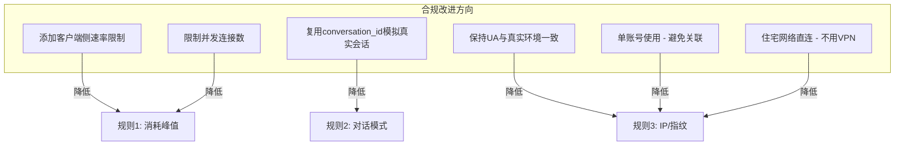
```mermaid
flowchart TD
    subgraph 合规改进方向
        A[添加客户端侧速率限制]
        B[复用conversation_id模拟真实会话]
        C[限制并发连接数]
        D[保持UA与真实环境一致]
        E[单账号使用 - 避免关联]
        F[住宅网络直连 - 不用VPN]
    end

    A -->|降低| R1[规则1: 消耗峰值]
    B -->|降低| R2[规则2: 对话模式]
    C -->|降低| R1
    D -->|降低| R3[规则3: IP/指纹]
    E -->|降低| R3
    F -->|降低| R3
```

### 7.2 具体建议

| # | 改进项 | 当前状态 | 建议 | 降低的风险 |
|---|--------|----------|------|-----------|
| 1 | **添加请求速率限制** | 无任何限制 | 增加 RPM(requests/min) 和 TPH(tokens/hour) 上限 | 规则1 |
| 2 | **复用 conversation_id** | 每次随机UUID | 对同一客户端会话复用稳定的conversation_id | 规则2 |
| 3 | **降低并发连接** | max_connections=100 | 限制为 2-5 个并发（匹配真实 IDE 行为） | 规则1+3 |
| 4 | **随真实版本更新 UA** | 硬编码固定版本 | 定期从官方 IDE 更新版本号 | 规则3 |
| 5 | **单账号模式** | 支持多账号轮换 | 合规场景下只使用自己的单个账号 | 规则1+3 |
| 6 | **住宅网络直连** | 支持 VPN/代理 | 合规场景不使用 VPN，直接连接 | 规则3 |
| 7 | **请求间隔随机化** | 立即发送 | 添加 1-5s 随机间隔模拟人类节奏 | 规则1+2 |
| 8 | **每日使用量监控** | 无自监控 | 增加每日 token 使用量统计 + 告警阈值 | 规则1 |

### 7.3 合规使用模式 vs 异常使用模式

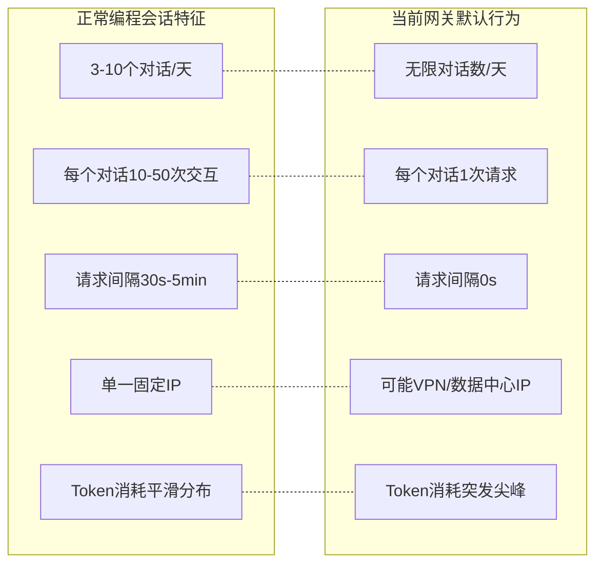
```mermaid
flowchart LR
    subgraph 正常编程会话特征
        N1["3-10个对话/天"]
        N2["每个对话10-50次交互"]
        N3["请求间隔30s-5min"]
        N4["单一固定IP"]
        N5["Token消耗平滑分布"]
    end

    subgraph 当前网关默认行为
        A1["无限对话数/天"]
        A2["每个对话1次请求"]
        A3["请求间隔0s"]
        A4["可能VPN/数据中心IP"]
        A5["Token消耗突发尖峰"]
    end

    N1 -.- A1
    N2 -.- A2
    N3 -.- A3
    N4 -.- A4
    N5 -.- A5
```

---

## 8. 检测系统技术原理分析

> 基于公开的反欺诈技术文献推断 Kiro 检测系统可能采用的技术栈。

### 8.1 检测系统架构推测

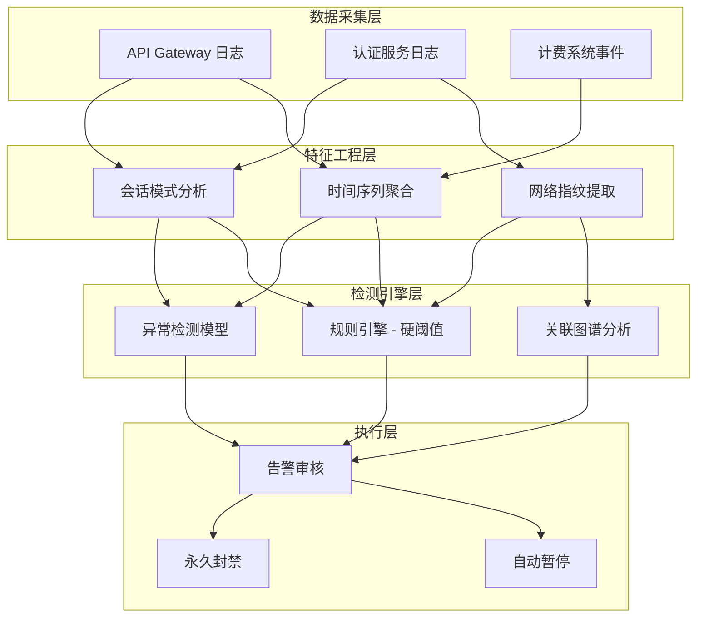
```mermaid
flowchart TD
    subgraph 数据采集层
        API[API Gateway 日志]
        AUTH[认证服务日志]
        BILL[计费系统事件]
    end

    subgraph 特征工程层
        TS[时间序列聚合]
        SESS[会话模式分析]
        NET[网络指纹提取]
    end

    subgraph 检测引擎层
        RULE[规则引擎 - 硬阈值]
        ML[异常检测模型]
        GRAPH[关联图谱分析]
    end

    subgraph 执行层
        ALERT[告警审核]
        SUSPEND[自动暂停]
        BAN[永久封禁]
    end

    API --> TS
    AUTH --> NET
    BILL --> TS
    API --> SESS
    AUTH --> SESS

    TS --> RULE
    TS --> ML
    SESS --> RULE
    SESS --> ML
    NET --> GRAPH
    NET --> RULE

    RULE --> ALERT
    ML --> ALERT
    GRAPH --> ALERT
    ALERT --> SUSPEND
    ALERT --> BAN
```

### 8.2 各检测维度的技术实现推测

#### 规则1：消耗异常检测

| 技术 | 实现方式 | 指标 |
|------|----------|------|
| **滑动窗口计数** | 30min/1h/24h 窗口内的 credit 消耗总量 | credits_used > threshold |
| **基线对比** | 用户历史平均值 vs 当前窗口值 | current / avg_7d > N倍 |
| **突变检测** | 相邻时间窗口消耗差值 | delta > absolute_threshold |
| **速率计算** | requests_per_minute 指标 | RPM > plan_limit × safety_factor |

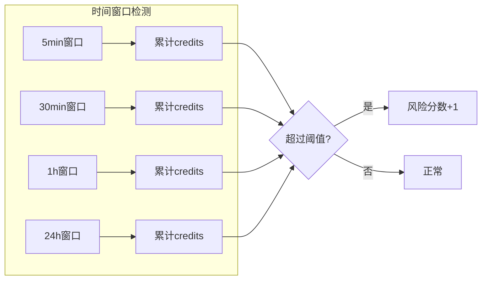
```mermaid
graph LR
    subgraph 时间窗口检测
        W1[5min窗口] --> AGG1[累计credits]
        W2[30min窗口] --> AGG2[累计credits]
        W3[1h窗口] --> AGG3[累计credits]
        W4[24h窗口] --> AGG4[累计credits]
    end
    
    AGG1 --> CMP{超过阈值?}
    AGG2 --> CMP
    AGG3 --> CMP
    AGG4 --> CMP
    
    CMP -->|是| SCORE[风险分数+1]
    CMP -->|否| OK[正常]
```

#### 规则2：会话模式检测

| 技术 | 实现方式 | 异常信号 |
|------|----------|----------|
| **对话聚合统计** | GROUP BY conversation_id → COUNT(requests) | 大量 count=1 的对话 |
| **对话密度** | conversations_created / hour | 远超正常 IDE 使用频率 |
| **会话时长分布** | 对话首末请求的时间差 | 所有对话时长=0（瞬时对话） |
| **消息深度比** | avg(messages_per_conversation) | 接近1.0表示自动化 |

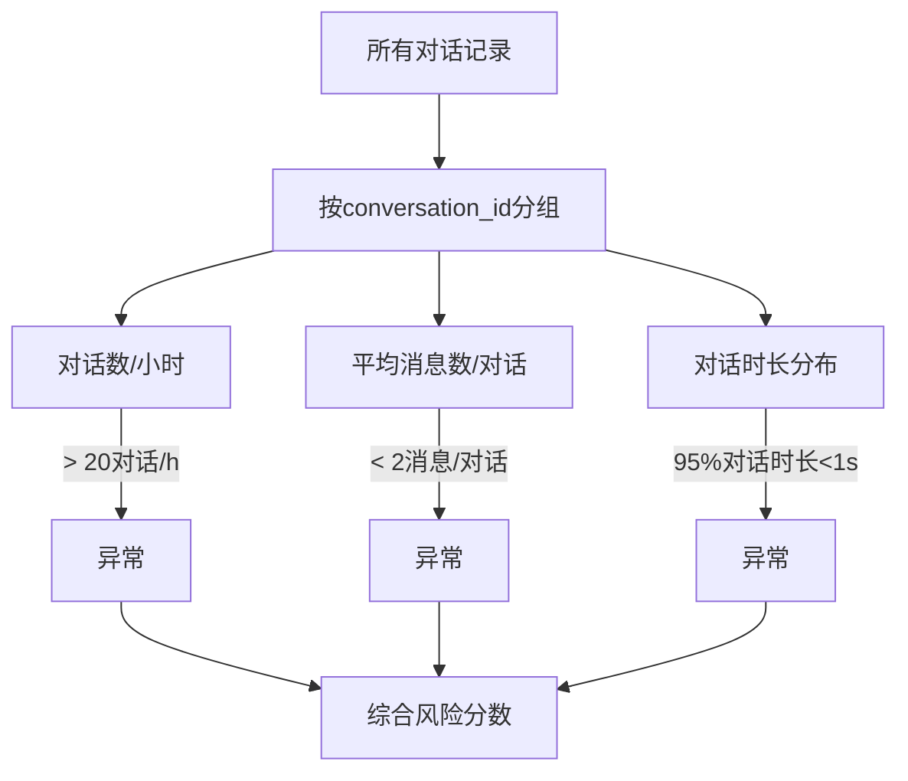
```mermaid
graph TD
    DATA[所有对话记录] --> AGG[按conversation_id分组]
    AGG --> METRIC1["对话数/小时"]
    AGG --> METRIC2["平均消息数/对话"]
    AGG --> METRIC3["对话时长分布"]
    
    METRIC1 -->|> 20对话/h| FLAG1[异常]
    METRIC2 -->|< 2消息/对话| FLAG2[异常]
    METRIC3 -->|95%对话时长<1s| FLAG3[异常]
    
    FLAG1 --> SCORE[综合风险分数]
    FLAG2 --> SCORE
    FLAG3 --> SCORE
```

#### 规则3：IP/网络检测

| 技术 | 实现方式 | 异常信号 |
|------|----------|----------|
| **IP信誉库** | 查询 MaxMind/IPinfo 数据库 | 数据中心/VPN/代理 ASN |
| **IP多样性** | 同一账号 distinct IP count / day | 短时间多IP切换 |
| **IP聚合** | 同一IP下的不同账号数量 | 多账号共用一个IP |
| **地理一致性** | IP地理位置 vs 账号注册地 | 突然跨洲使用 |
| **TLS指纹** | JA3/JA4 指纹 | Python httpx vs 真实浏览器/Node |

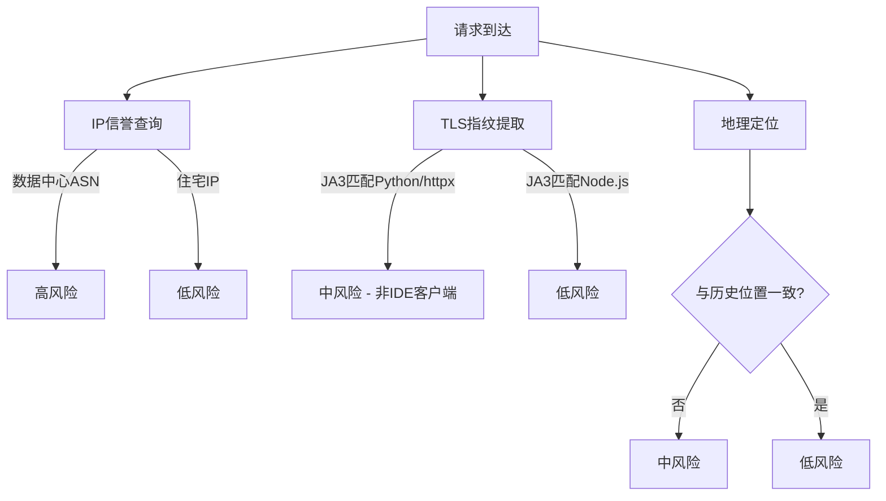
```mermaid
graph TD
    REQ[请求到达] --> IP_CHECK[IP信誉查询]
    REQ --> TLS[TLS指纹提取]
    REQ --> GEO[地理定位]
    
    IP_CHECK -->|数据中心ASN| RISK_HIGH[高风险]
    IP_CHECK -->|住宅IP| RISK_LOW[低风险]
    
    TLS -->|JA3匹配Python/httpx| RISK_MED[中风险 - 非IDE客户端]
    TLS -->|JA3匹配Node.js| RISK_LOW2[低风险]
    
    GEO --> HISTORY{与历史位置一致?}
    HISTORY -->|否| RISK_MED2[中风险]
    HISTORY -->|是| RISK_LOW3[低风险]
```

### 8.3 综合评分机制（推测）

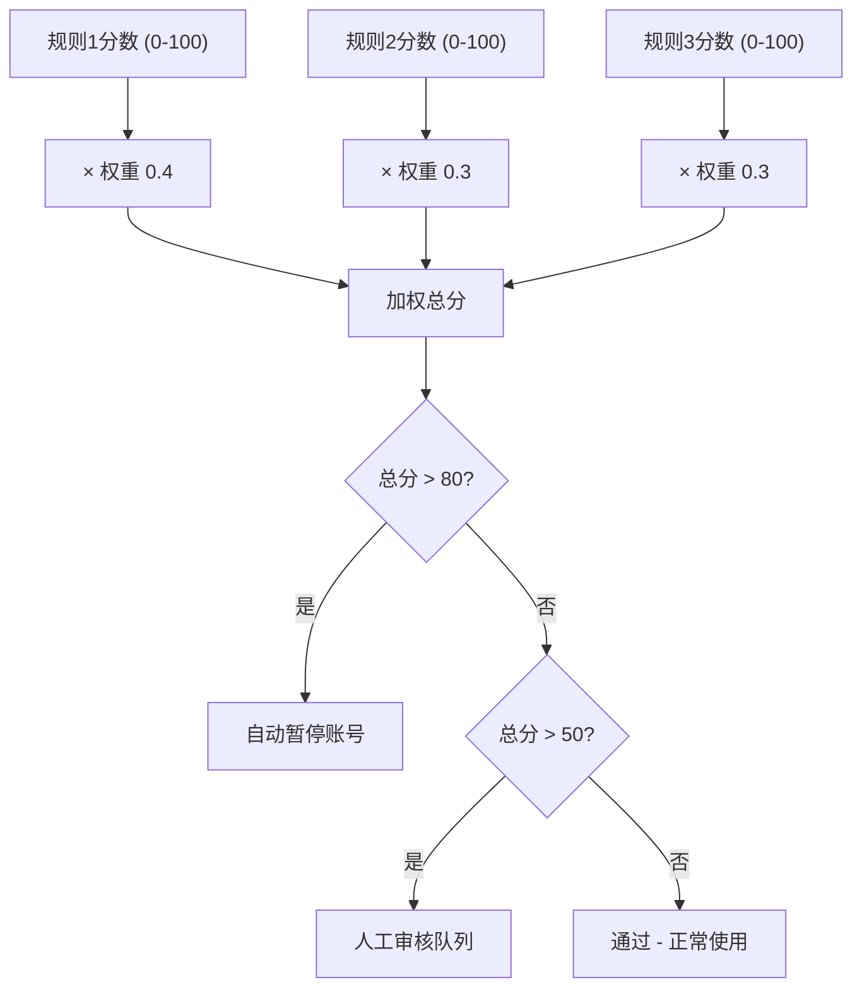
```mermaid
flowchart TD
    R1_SCORE["规则1分数 (0-100)"] --> WEIGHT1["× 权重 0.4"]
    R2_SCORE["规则2分数 (0-100)"] --> WEIGHT2["× 权重 0.3"]
    R3_SCORE["规则3分数 (0-100)"] --> WEIGHT3["× 权重 0.3"]
    
    WEIGHT1 --> SUM[加权总分]
    WEIGHT2 --> SUM
    WEIGHT3 --> SUM
    
    SUM --> T1{总分 > 80?}
    T1 -->|是| AUTO_SUSPEND[自动暂停账号]
    T1 -->|否| T2{总分 > 50?}
    T2 -->|是| REVIEW[人工审核队列]
    T2 -->|否| PASS[通过 - 正常使用]
```

### 8.4 额外可能的检测维度

| 维度 | 说明 | 该项目暴露程度 |
|------|------|----------------|
| **TLS 指纹 (JA3/JA4)** | Python httpx 的 TLS 握手特征与 Electron/Node 不同 | 🟠 中 |
| **HTTP/2 行为** | 请求流的多路复用模式与真实 IDE 不同 | 🟡 低 |
| **请求时间分布** | 7×24h均匀分布 vs 人类作息规律 | 🟠 中（服务器24h运行） |
| **响应消费模式** | 流式响应是否被完整读取/中途断开频率 | 🟡 低 |
| **API 调用模式** | 是否调用 /ListAvailableModels、频率是否异常 | 🟡 低 |

---

## 9. 总结与风险评估

### 整体风险等级

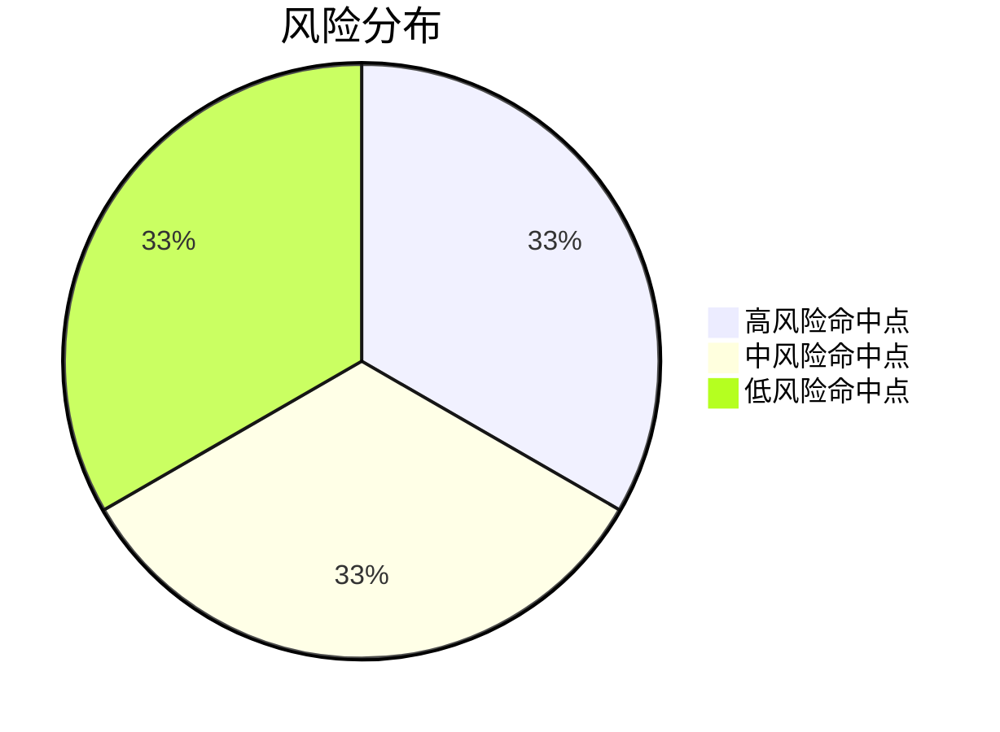
```mermaid
pie title 风险分布
    "高风险命中点" : 3
    "中风险命中点" : 3
    "低风险命中点" : 3
```

### 结论

该项目的设计目标（代理网关 + 多账号 + VPN支持）与 Kiro 欺诈检测系统的检测目标
存在**结构性冲突**。项目的核心功能特征恰好是检测系统重点监控的行为模式。

**对使用者的风险告知：**

| 使用方式 | 被检测概率 | 说明 |
|----------|-----------|------|
| 单账号 + 住宅IP + 低频使用 | 🟢 低 | 接近正常 IDE 行为 |
| 单账号 + VPN + 中频使用 | 🟠 中 | IP 信号可能触发审核 |
| 多账号 + VPN + 高频使用 | 🔴 极高 | 几乎必然触发三条规则 |

---

> **文档更新时间**：2026-05-28  
> **分析版本**：v2.4.dev.13  
> **性质**：纯风险识别 + 检测原理分析（不含规避方案）


---

## 10. TLS 指纹深度分析

### 10.1 JA3/JA4 指纹原理

TLS 握手过程中，客户端的 ClientHello 包含可被指纹化的信息：

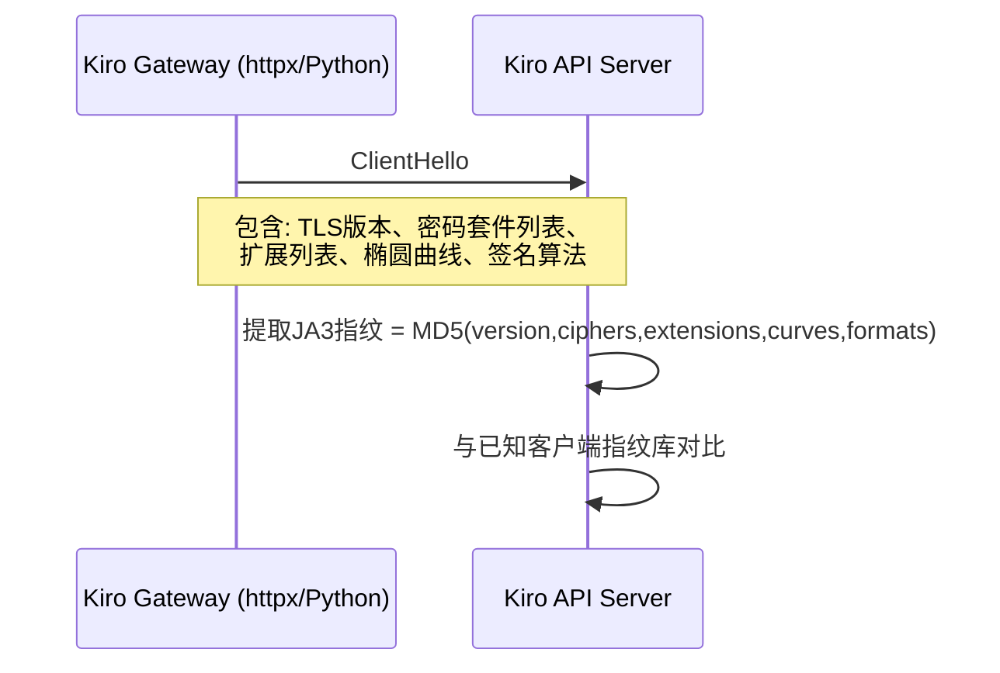
```mermaid
sequenceDiagram
    participant C as Kiro Gateway (httpx/Python)
    participant S as Kiro API Server

    C->>S: ClientHello
    Note over C,S: 包含: TLS版本、密码套件列表、<br/>扩展列表、椭圆曲线、签名算法
    S->>S: 提取JA3指纹 = MD5(version,ciphers,extensions,curves,formats)
    S->>S: 与已知客户端指纹库对比
```

### 10.2 不同客户端的 TLS 指纹差异

| 客户端 | TLS库 | JA3特征 | 是否可区分 |
|--------|-------|---------|-----------|
| **真实 Kiro IDE** | Electron/Chromium → BoringSSL | Chrome-like fingerprint | 基线 |
| **Node.js SDK** | OpenSSL (via node) | Node 特有的密码套件排序 | 可区分 |
| **Python httpx** | Python ssl / certifi | Python 特有指纹 | **明显可区分** |
| **curl** | libcurl/OpenSSL | curl 特有指纹 | 可区分 |

### 10.3 该项目的暴露点

```python
# 项目使用 httpx (基于 Python ssl 模块)
app.state.http_client = httpx.AsyncClient(...)
```

**风险**：即使 User-Agent 伪装为 `KiroIDE-0.7.45`，TLS 握手层面暴露为 Python 客户端。Kiro 服务端只需对比 JA3 指纹与 User-Agent 声称的客户端类型，就能发现不一致。

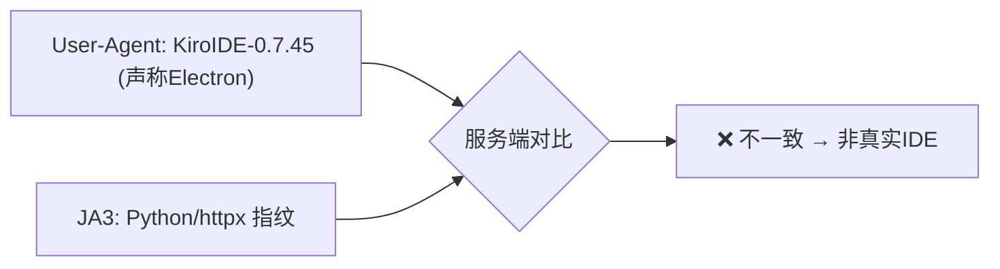
```mermaid
flowchart LR
    UA["User-Agent: KiroIDE-0.7.45 (声称Electron)"]
    TLS["JA3: Python/httpx 指纹"]
    
    UA --> CMP{服务端对比}
    TLS --> CMP
    CMP --> MISMATCH["❌ 不一致 → 非真实IDE"]
```

### 10.4 HTTP/2 帧行为差异

| 行为 | 真实 Kiro IDE | 本项目 |
|------|---------------|--------|
| 初始窗口大小 | Chromium 默认 6MB | httpx 默认值 |
| SETTINGS帧参数 | Chrome 固定模式 | httpx/h2 库默认 |
| 头部压缩表大小 | 65536 (Chrome) | 4096 (httpx默认) |
| 流优先级 | Chrome 复杂优先级树 | httpx 平坦优先级 |

---

## 11. 请求时间分布特征分析

### 11.1 人类 vs 机器的时间模式


```mermaid
gantt
    title 请求时间分布对比
    dateFormat HH:mm
    axisFormat %H:%M

    section 人类开发者(典型)
    工作时段1     :active, 09:00, 12:00
    午休         :done, 12:00, 13:30
    工作时段2     :active, 13:30, 18:00
    偶尔加班      :crit, 20:00, 22:00

    section 网关服务器(24h)
    持续运行      :active, 00:00, 23:59
```

### 11.2 可被检测的时间异常

| 时间特征 | 正常IDE | 网关服务器 | 检测方法 |
|----------|---------|-----------|----------|
| 活跃时段 | 8-12h/天 | 24h | 活跃小时数统计 |
| 凌晨活动 | 罕见 | 正常 | 0:00-6:00 请求比例 |
| 请求间隔 | 30s-5min(思考时间) | 0-1s(即时转发) | 间隔分布分析 |
| 工作日/周末 | 工作日高、周末低 | 无差异 | 周模式分析 |
| 连续编码时长 | 2-4h 后休息 | 无中断 | 最长连续活跃时长 |

### 11.3 请求间隔分布

```mermaid
xychart-beta
    title "请求间隔分布（示意）"
    x-axis "间隔时间(秒)" [0, 5, 10, 30, 60, 120, 300]
    y-axis "频率%" 0 --> 50
    bar [45, 20, 10, 8, 7, 5, 5]
```

**正常IDE**：呈长尾分布，多数间隔在 30-300s（人类思考/编辑时间）

**网关转发**：集中在 0-5s（客户端自动化调用无人工延迟）

---

## 12. 真实 IDE 行为基线对比

### 12.1 Kiro IDE 正常使用数据特征（推测）

```mermaid
flowchart TD
    subgraph 真实Kiro IDE会话特征
        S1["启动: 1次/天"]
        S2["对话数: 3-10个/天"]
        S3["每对话消息: 5-50轮"]
        S4["请求间隔: 中位数60s"]
        S5["Token/天: 50K-200K"]
        S6["活跃时段: 8-12h"]
        S7["IP: 1-2个(办公+家庭)"]
        S8["conversation_id: 复用(同对话)"]
    end

    subgraph 网关使用特征(当前代码)
        G1["无启动概念(常驻)"]
        G2["对话数: 无限(每请求新建)"]
        G3["每对话消息: 1轮"]
        G4["请求间隔: ~0s"]
        G5["Token/天: 无上限"]
        G6["活跃时段: 24h"]
        G7["IP: VPN/数据中心"]
        G8["conversation_id: 每次随机UUID"]
    end
```

### 12.2 偏差指标量化

| 指标 | IDE基线 | 网关实际 | 偏差倍数 | 检测难度 |
|------|---------|----------|----------|----------|
| 对话数/天 | ~5 | 无上限(可达数百) | 20-100x | 🔴 极易 |
| 消息数/对话 | ~20 | 1 | 0.05x | 🔴 极易 |
| 请求间隔中位数 | ~60s | ~0.5s | 120x | 🔴 极易 |
| 活跃时长/天 | ~10h | ~24h | 2.4x | 🟠 中等 |
| Token/天 | ~100K | 可达数百万 | 10-50x | 🟠 中等 |
| 唯一IP数/天 | 1-2 | 1(固定VPN) | ~1x | 🟡 需IP分类 |


---

## 13. 计费系统与配额检测逻辑

### 13.1 Kiro 计费模型推测

```mermaid
flowchart TD
    REQ[API请求] --> MODEL[模型选择]
    MODEL --> CREDIT[计算Credit消耗]
    
    CREDIT --> CHECK{配额检查}
    CHECK -->|月度配额内| ALLOW[允许]
    CHECK -->|超出配额| REJECT["402 Payment Required"]
    
    ALLOW --> COUNTER[更新计数器]
    COUNTER --> WINDOW[滑动窗口聚合]
    WINDOW --> ANOMALY{异常检测}
    ANOMALY -->|正常| PASS[通过]
    ANOMALY -->|异常| FLAG[标记账号]
```

### 13.2 Credit 消耗与模型关系

| 模型 | 约每次Credit | 含义 |
|------|-------------|------|
| claude-opus-4.5 | ~2.2 | 高消耗 |
| claude-sonnet-4.5 | ~1.3 | 中消耗 |
| claude-haiku-4.5 | ~0.4 | 低消耗 |

### 13.3 消耗异常检测阈值推测

| 窗口 | 正常范围 (Free) | 可能触发阈值 | 触发条件 |
|------|----------------|-------------|----------|
| 5min | 0-3 credits | > 10 credits | 连续高频 opus 调用 |
| 30min | 0-15 credits | > 50 credits | 持续高频使用 |
| 1h | 0-30 credits | > 80 credits | 接近日限额的集中消耗 |
| 24h | 0-100 credits | > 200 credits | 超出正常开发者日消耗 |

### 13.4 该项目的消耗放大效应

```mermaid
flowchart TD
    USER_REQ[1次用户请求] --> RETRY_L1["HTTP重试层 (MAX_RETRIES=3)"]
    RETRY_L1 --> RETRY_L2["首Token超时重试 (FIRST_TOKEN_MAX_RETRIES=3)"]
    RETRY_L2 --> ACCOUNT["账号切换重试 (N个账号)"]
    
    ACCOUNT --> WORST["最坏情况: 1×3×3×N = 9N次API调用"]
    
    WORST --> CREDIT_MULTI["Credit消耗: 9N × 单次消耗"]
    
    style WORST fill:#ff6b6b
    style CREDIT_MULTI fill:#ff6b6b
```

---

## 14. 关联图谱分析

### 14.1 多账号关联检测

Kiro 后端可以构建**账号关联图**：

```mermaid
graph TD
    subgraph 关联维度
        IP[共享IP地址]
        FP[共享Fingerprint]
        TIME[同时段活跃]
        CRED[相似凭证来源]
        UA[相同User-Agent]
    end

    subgraph 账号节点
        A1[账号A]
        A2[账号B]
        A3[账号C]
    end

    A1 ---|同一IP| A2
    A2 ---|同一IP| A3
    A1 ---|同一Fingerprint| A2
    A2 ---|同一Fingerprint| A3
    A1 ---|同时活跃| A3

    IP --> SCORE[关联分数]
    FP --> SCORE
    TIME --> SCORE
    SCORE --> DECISION{分数>阈值?}
    DECISION -->|是| GROUP[标记为同一人/组织]
    GROUP --> AGGREGATE[聚合消耗计算]
    AGGREGATE --> EXCEED{聚合消耗超限?}
    EXCEED -->|是| BAN_ALL[全部账号暂停]
```

### 14.2 该项目产生的关联信号

| 关联维度 | 代码证据 | 信号强度 |
|----------|----------|----------|
| **同一出口IP** | 所有账号经同一网关实例发送 | 🔴 强 |
| **同一Fingerprint** | `get_machine_fingerprint()` 对所有账号一致 | 🔴 强 |
| **同时段活跃** | 账号切换在毫秒级完成 | 🔴 强 |
| **相同UA版本** | 硬编码 `KiroIDE-0.7.45-{同一fingerprint}` | 🔴 强 |
| **请求模式相似** | 都来自同一网关，模式完全一致 | 🟠 中 |
| **错误后立即切换** | A失败 → 立即B请求（非人类切换速度） | 🔴 强 |

### 14.3 关联分析的杀伤力

```mermaid
flowchart LR
    SINGLE[单账号风险分 = 40] --> OK1[未达阈值 → 通过]
    
    MULTI[3账号被关联] --> AGG["聚合风险分 = 40×3 = 120"]
    AGG --> EXCEED["超过阈值(80) → 全部暂停"]
    
    style EXCEED fill:#ff6b6b
```

**核心问题**：即使单个账号的使用量看似"正常"，一旦多个账号被关联为同一实体，消耗和行为会被**聚合计算**，大幅超过阈值。

---

## 15. 账号生命周期风险分析

### 15.1 新账号 vs 老账号

| 阶段 | 检测敏感度 | 原因 |
|------|-----------|------|
| 新注册(0-7天) | 🔴 极高 | 新账号+高消耗 = 典型滥用模式 |
| 早期(7-30天) | 🟠 高 | 尚未建立"正常基线" |
| 稳定期(30-90天) | 🟡 中 | 有历史数据作对比 |
| 成熟账号(90天+) | 🟢 低 | 异常需要偏离历史基线很大才触发 |

### 15.2 行为突变检测

```mermaid
flowchart TD
    BASELINE["历史基线: avg 5次请求/天"] --> CURRENT["当前: 200次请求/天"]
    CURRENT --> RATIO["变化比 = 200/5 = 40x"]
    RATIO --> CHECK{变化比 > 10x?}
    CHECK -->|是| ALERT["触发异常告警"]
    CHECK -->|否| OK["正常波动"]
```

**对该项目的影响**：如果用户之前只用 Kiro IDE 正常编程（5次/天），突然通过网关大量调用（200次/天），行为突变会立即被检测到。

---

## 16. API 调用模式指纹

### 16.1 端点调用比例

| 端点 | 真实IDE比例 | 网关比例 | 偏差 |
|------|------------|----------|------|
| `/generateAssistantResponse` | 95% | 99%+ | 正常 |
| `/ListAvailableModels` | 5% (启动时+定期) | <1% (仅缓存过期时) | 偏低 |
| 其他内部API | 存在 | 不调用 | 🟠 缺失信号 |

### 16.2 请求 payload 特征

```mermaid
flowchart TD
    subgraph 真实IDE请求特征
        I1["conversationState.currentMessage 丰富"]
        I2["history 逐渐增长(多轮)"]
        I3["systemPrompt 含IDE上下文"]
        I4["工具列表固定(IDE内置)"]
    end
    
    subgraph 网关请求特征
        G1["每次新conversation"]
        G2["history 从外部客户端传入(模式多样)"]
        G3["systemPrompt 来自各种工具"]
        G4["工具列表动态变化"]
    end
```

### 16.3 响应消费模式

| 行为 | 真实IDE | 网关 |
|------|---------|------|
| 流式读取速度 | 受UI渲染限制 | 全速读取 |
| 中途取消比例 | 5-15%(用户手动停止) | 极低(自动化不取消) |
| 读取完整性 | 偶尔网络中断 | 高度稳定(服务器环境) |


---

## 17. 日志与审计数据分析

### 17.1 Kiro 服务端可采集的数据点

每次 API 调用，服务端可记录：

```mermaid
flowchart LR
    subgraph 网络层数据
        SRC_IP[源IP地址]
        TLS_FP[TLS指纹JA3]
        GEO[IP地理位置]
        ASN[AS编号/ISP]
    end
    
    subgraph 请求层数据
        UA[User-Agent]
        HEADERS[全部HTTP头]
        CONV_ID[conversation_id]
        MSG_COUNT[消息数量]
        TOKEN_REQ[请求Token数]
    end
    
    subgraph 响应层数据
        TOKEN_RESP[响应Token数]
        CREDIT[Credit消耗]
        DURATION[响应时长]
        STREAM[流式/非流式]
    end
    
    subgraph 时间层数据
        TS[时间戳]
        INTERVAL[与上次请求间隔]
        SESSION[会话时长]
    end
```

### 17.2 单请求可提取的异常信号

| 数据点 | 正常值 | 异常值(网关特征) |
|--------|--------|-----------------|
| `x-amz-user-agent` 版本 | 与最新IDE一致 | 固定旧版本 |
| `amz-sdk-invocation-id` | 与SDK内部状态关联 | 每次完全随机 |
| conversation_id 模式 | 复用(多轮同ID) | 每次新UUID |
| 请求间距离上一请求 | 30s-300s | 0-2s |
| history 长度变化 | 单调递增(同对话) | 无规律(不同客户端) |
| systemPrompt 内容 | 固定(IDE预设) | 多变(各种工具) |

### 17.3 批量审计查询示例（推测）

Kiro 安全团队可能使用的聚合查询：

```sql
-- 检测每请求新对话的账号
SELECT account_id, 
       COUNT(DISTINCT conversation_id) as conv_count,
       COUNT(*) as request_count,
       conv_count / request_count as ratio
FROM api_logs
WHERE timestamp > NOW() - INTERVAL '1 hour'
GROUP BY account_id
HAVING ratio > 0.8;  -- 80%的请求都是新对话 = 可疑

-- 检测多账号共享IP
SELECT source_ip,
       COUNT(DISTINCT account_id) as account_count
FROM api_logs
WHERE timestamp > NOW() - INTERVAL '24 hours'
GROUP BY source_ip
HAVING account_count > 2;  -- 同IP多账号 = 可疑

-- 检测消耗突变
SELECT account_id,
       SUM(credits_used) as credits_1h,
       (SELECT AVG(daily_credits) FROM account_baselines 
        WHERE account_id = al.account_id) as avg_daily
FROM api_logs al
WHERE timestamp > NOW() - INTERVAL '1 hour'
GROUP BY account_id
HAVING credits_1h > avg_daily * 0.5;  -- 1小时用了平时半天的量
```

---

## 18. 机器学习异常检测模型

### 18.1 可能采用的算法

| 算法 | 适用场景 | 特点 |
|------|----------|------|
| **Isolation Forest** | 多维特征异常点检测 | 无需标签数据,适合初期 |
| **LSTM/Transformer** | 时间序列行为预测 | 学习用户行为模式,检测偏离 |
| **Graph Neural Network** | 账号关联图分析 | 发现隐藏关联 |
| **聚类(DBSCAN)** | 行为模式分群 | 将正常/异常用户自动分群 |
| **规则引擎 + 评分卡** | 快速决策 | 确定性规则兜底 |

### 18.2 特征向量构建（推测）

```mermaid
flowchart TD
    subgraph 输入特征(每个账号/时间窗口)
        F1["requests_per_hour"]
        F2["unique_conversations"]
        F3["avg_messages_per_conv"]
        F4["avg_request_interval_seconds"]
        F5["credits_consumed"]
        F6["active_hours_per_day"]
        F7["ip_is_datacenter (0/1)"]
        F8["ua_version_staleness_days"]
        F9["tls_fingerprint_mismatch (0/1)"]
        F10["linked_accounts_count"]
    end
    
    subgraph 模型
        ML[Isolation Forest / 评分卡]
    end
    
    subgraph 输出
        SCORE["异常分数 0-1"]
    end
    
    F1 --> ML
    F2 --> ML
    F3 --> ML
    F4 --> ML
    F5 --> ML
    F6 --> ML
    F7 --> ML
    F8 --> ML
    F9 --> ML
    F10 --> ML
    ML --> SCORE
    
    SCORE --> D1{"> 0.8"} -->|是| BAN[自动暂停]
    SCORE --> D2{"0.5-0.8"} -->|是| REVIEW[人工审核]
    SCORE --> D3{"< 0.5"} -->|是| OK[正常]
```

### 18.3 该项目在各特征维度的异常程度

| 特征 | 正常基线 | 网关值 | 异常度 |
|------|----------|--------|--------|
| requests_per_hour | 5-20 | 可达数百 | 🔴 10-50x |
| unique_conversations | 2-5/h | 等于请求数 | 🔴 20-100x |
| avg_messages_per_conv | 10-30 | 1.0 | 🔴 极端偏离 |
| avg_request_interval | 60-300s | 0-2s | 🔴 极端偏离 |
| active_hours_per_day | 8-12h | 24h | 🟠 2-3x |
| ip_is_datacenter | 0 | 1 (若用VPN/云) | 🔴 二值异常 |
| tls_fingerprint_mismatch | 0 | 1 (Python≠Electron) | 🔴 二值异常 |
| linked_accounts_count | 1 | N (多账号关联) | 🔴 N倍 |

---

## 19. 对比：真实编程会话 vs 网关转发的API调用

### 19.1 对话生命周期对比

```mermaid
sequenceDiagram
    participant Dev as 开发者
    participant IDE as Kiro IDE
    participant API as Kiro API

    Note over Dev,API: === 真实编程会话 ===
    Dev->>IDE: 打开项目
    IDE->>API: 新对话 (conv_id=A)
    Dev->>IDE: "帮我写个函数"
    IDE->>API: 请求1 (conv_id=A, history=[msg1])
    Note over Dev: 阅读回复... 60s
    Dev->>IDE: "加个错误处理"
    IDE->>API: 请求2 (conv_id=A, history=[msg1,msg2,msg3])
    Note over Dev: 测试代码... 180s
    Dev->>IDE: "这里有bug"
    IDE->>API: 请求3 (conv_id=A, history=[msg1..msg5])
    Note over Dev,API: 1个对话, 3次请求, 跨度5分钟

    Note over Dev,API: === 网关转发 ===
    Dev->>IDE: Cursor发送请求
    IDE->>API: 请求1 (conv_id=随机X, history=外部传入)
    Note over Dev: 0.5s后
    Dev->>IDE: Cursor另一个请求
    IDE->>API: 请求2 (conv_id=随机Y, history=外部传入)
    Note over Dev: 0.3s后
    Dev->>IDE: 又一个请求
    IDE->>API: 请求3 (conv_id=随机Z, history=外部传入)
    Note over Dev,API: 3个对话, 各1次请求, 跨度<2秒
```

### 19.2 行为指纹对比总结

```mermaid
radar
    title 行为特征雷达图 (0=正常IDE, 10=极端异常)
    "对话频率" : 9
    "消息/对话" : 9
    "请求间隔" : 9
    "活跃时长" : 5
    "Token消耗" : 7
    "IP类型" : 8
    "TLS指纹" : 8
```


---

## 20. 网络层深度检测技术

### 20.1 IP 信誉评估体系

```mermaid
flowchart TD
    IP[请求源IP] --> QUERY[查询IP信誉数据库]
    
    QUERY --> TYPE{IP类型}
    TYPE -->|住宅IP| SCORE_LOW["风险分: +0"]
    TYPE -->|商业/办公IP| SCORE_MED["风险分: +10"]
    TYPE -->|数据中心(AWS/GCP/Azure)| SCORE_HIGH["风险分: +50"]
    TYPE -->|已知VPN服务商IP| SCORE_VHIGH["风险分: +70"]
    TYPE -->|Tor出口节点| SCORE_MAX["风险分: +90"]
    
    QUERY --> HISTORY{IP历史}
    HISTORY -->|首次出现| NEW["+10"]
    HISTORY -->|有滥用历史| ABUSE["+40"]
    HISTORY -->|长期正常使用| GOOD["+0"]
```

### 20.2 常见 IP 信誉数据库

| 数据库 | 覆盖能力 | 用途 |
|--------|----------|------|
| MaxMind GeoIP2 | ASN/ISP/类型分类 | 区分住宅/数据中心/代理 |
| IPinfo.io | IP类型 + 公司归属 | 识别VPN/Hosting |
| IPQualityScore | 欺诈评分 | 综合风险评估 |
| AbuseIPDB | 滥用报告历史 | 已知恶意IP |
| Spamhaus | 黑名单 | 已知滥用来源 |

### 20.3 AWS 内部优势

Kiro 作为 AWS 服务，有额外检测能力：

| 能力 | 说明 |
|------|------|
| AWS 自有 IP 范围识别 | 直接知道请求是否来自 EC2/Lambda |
| VPC Flow Logs | 如果部署在 AWS 上，网络行为完全可见 |
| AWS WAF 集成 | 可使用 WAF 规则做初步过滤 |
| CloudFront 日志 | CDN 层面的详细访问日志 |

---

## 21. 防御加固的代码级建议

### 21.1 会话管理改进方向

当前问题：`generate_conversation_id()` 在路由中被无参调用，产生随机UUID。

**合规改进思路**（不修改代码，仅分析）：

```mermaid
flowchart TD
    subgraph 当前行为
        REQ[请求到达] --> GEN["generate_conversation_id() → 随机UUID"]
    end
    
    subgraph 合规改进方向
        REQ2[请求到达] --> HASH["基于messages计算稳定hash"]
        HASH --> REUSE["同一对话复用conversation_id"]
        REUSE --> PATTERN["表现为: 少量对话 × 多轮交互"]
    end
```

注意：`generate_conversation_id(messages)` 函数本身已支持传入 messages 参数生成稳定 ID，但路由中**未传入参数**，这是一个设计上的"风险敞口"。

### 21.2 速率限制实现方向

```mermaid
flowchart TD
    subgraph 可添加的限制层
        L1["全局 RPM 限制 (如10 req/min)"]
        L2["全局 TPH 限制 (如50K tokens/hour)"]
        L3["单账号 Credit/Hour 限制"]
        L4["请求间最小间隔 (如5s)"]
        L5["并发请求上限 (如2)"]
    end
    
    REQ[请求] --> L1
    L1 -->|通过| L2
    L2 -->|通过| L3
    L3 -->|通过| L4
    L4 -->|通过| L5
    L5 -->|通过| PROCESS[处理请求]
    
    L1 -->|拒绝| WAIT["429 Too Many Requests + Retry-After"]
    L2 -->|拒绝| WAIT
    L3 -->|拒绝| WAIT
    L4 -->|拒绝| WAIT
    L5 -->|拒绝| WAIT
```

### 21.3 指纹一致性方向

| 层面 | 当前不一致 | 合规方向 |
|------|-----------|----------|
| UA 声称 Windows | 实际运行 Linux | 与真实环境匹配 |
| UA 声称 KiroIDE 0.7.45 | 版本已过时 | 跟随官方版本更新 |
| TLS 指纹 = Python | UA 声称 Node/Electron | 只能通过真实客户端解决 |

---

## 22. 时间序列异常检测算法

### 22.1 EWMA（指数加权移动平均）

```mermaid
flowchart LR
    subgraph EWMA检测
        INPUT["每小时credit消耗序列"] --> EWMA_CALC["EWMA = α×current + (1-α)×prev_EWMA"]
        EWMA_CALC --> BAND["控制带: EWMA ± k×σ"]
        BAND --> CHECK{"当前值在控制带外?"}
        CHECK -->|是| ALERT[告警]
        CHECK -->|否| OK[正常]
    end
```

**参数**：
- α = 0.3（平滑因子，越小越看重历史）
- k = 3（3σ原则，99.7%的正常值在带内）

### 22.2 该项目何时会突破控制带

假设用户过去30天平均 5 credits/hour：
- EWMA ≈ 5
- σ ≈ 3（历史波动）
- 上控制带 = 5 + 3×3 = 14 credits/hour

**通过网关高频使用**：如果1小时消耗 50 credits → 远超上控制带 → 立即触发

### 22.3 多尺度检测

```mermaid
flowchart TD
    subgraph 多尺度时间窗口
        W5["5分钟窗口 (快速检测)"]
        W30["30分钟窗口 (确认趋势)"]
        W60["1小时窗口 (稳定判断)"]
        W24["24小时窗口 (长期基线)"]
    end
    
    W5 -->|触发| FAST_ALERT["快速限流(临时)"]
    W30 -->|触发| CONFIRM["确认异常(标记)"]
    W60 -->|触发| SUSPEND["暂停账号"]
    W24 -->|触发| BAN["永久封禁审核"]
```

---

## 23. 行业对比：类似项目的被检测案例

### 23.1 已知的反代/网关类项目遭遇

| 项目类型 | 服务商 | 检测手段 | 结果 |
|----------|--------|----------|------|
| ChatGPT 反代 | OpenAI | 请求模式+IP信誉 | 封禁API Key |
| Claude 共享池 | Anthropic | 多Key同IP+高频 | 批量封禁 |
| GitHub Copilot 共享 | GitHub | 设备指纹+使用模式 | 暂停账号 |
| AWS 服务滥用 | AWS | 计费异常+IP分析 | 账号冻结 |

### 23.2 典型检测时间线

```mermaid
flowchart LR
    START[开始使用] --> D1["Day 1-3: 系统学习基线"]
    D1 --> D2["Day 3-7: 异常累积"]
    D2 --> D3["Day 7-14: 触发自动审核"]
    D3 --> D4["Day 14-30: 账号暂停/封禁"]
    
    style D3 fill:#ff9800
    style D4 fill:#ff6b6b
```

**关键时间点**：大多数自动化检测系统需要 **3-7天** 建立基线后才开始有效检测。这意味着：
- 新账号前3天可能不触发（系统在学习）
- 第7天左右异常积累到阈值
- 第14天左右执行暂停

---

## 24. 该项目各模块的风险贡献度

### 24.1 模块风险热力图

```mermaid
flowchart TD
    subgraph 🔴高风险贡献
        AM["account_manager.py<br/>多账号轮换 + Circuit Breaker"]
        HC["http_client.py<br/>自动重试放大流量"]
        MAIN["main.py<br/>VPN代理配置"]
    end
    
    subgraph 🟠中风险贡献
        UTILS["utils.py<br/>伪造UA + 固定fingerprint"]
        ROUTES["routes_*.py<br/>每请求新conversation_id"]
        CONFIG["config.py<br/>无速率限制参数"]
    end
    
    subgraph 🟡低风险贡献
        STREAM["streaming_*.py<br/>全速读取流"]
        CONV["converters_*.py<br/>格式特征"]
        CACHE["cache.py<br/>模型缓存行为"]
    end
    
    subgraph 🟢无风险
        PARSER["parsers.py"]
        THINK["thinking_parser.py"]
        TOKEN["tokenizer.py"]
        DEBUG["debug_*.py"]
    end
```

### 24.2 风险贡献量化

| 模块 | 命中规则 | 风险权重 | 说明 |
|------|----------|----------|------|
| `account_manager.py` | 1+3 | 30% | 多账号核心逻辑 |
| `main.py` (VPN配置) | 3 | 20% | IP层暴露 |
| `http_client.py` (重试) | 1 | 15% | 流量放大 |
| `utils.py` (UA/FP) | 3 | 15% | 指纹层暴露 |
| `routes_*.py` (conv_id) | 2 | 15% | 对话模式异常 |
| `config.py` (无限制) | 1 | 5% | 缺失防护 |


---

## 25. 检测对抗的博弈论视角

### 25.1 攻防博弈模型

```mermaid
flowchart TD
    subgraph 检测方(Kiro)
        D1[规则引擎 - 硬阈值]
        D2[统计异常检测]
        D3[ML模型]
        D4[关联图谱]
        D5[人工审核]
    end
    
    subgraph 检测演进方向
        E1["初期: 简单规则(RPM, credit/hour)"]
        E2["中期: 统计基线 + IP信誉"]
        E3["成熟期: ML + 图神经网络 + TLS指纹"]
    end
    
    E1 --> E2 --> E3
    
    subgraph 关键认知
        K1["越多人使用同类工具 → 检测规则越精细"]
        K2["检测系统持续迭代 → 任何固定模式终会被识别"]
        K3["关联分析是杀手锏 → 多账号风险远高于单账号"]
    end
```

### 25.2 博弈不对称性

| 维度 | 检测方(Kiro) | 使用方(网关) |
|------|-------------|-------------|
| **数据访问** | 全量请求日志+元数据 | 仅知道自己的请求 |
| **计算资源** | AWS 基础设施无限扩展 | 单台服务器 |
| **迭代速度** | 持续更新检测规则 | 需手动适配 |
| **覆盖面** | 监控所有用户建立群体模型 | 只了解个体行为 |
| **先手优势** | 可随时调整阈值/算法 | 只能被动应对 |
| **法律地位** | 服务条款授权暂停 | 违反ToS无追诉权 |

### 25.3 长期趋势预判

```mermaid
timeline
    title 检测系统演进预测
    section 当前阶段
        基于规则的硬阈值 : RPM限制, Credit/hour, IP黑名单
    section 近期 (1-3个月)
        统计异常检测 : EWMA基线对比, 对话模式分析
    section 中期 (3-6个月)
        高级检测 : TLS指纹验证, 关联图谱, ML模型
    section 长期 (6-12个月)
        全面防御 : 实时评分, 行为生物识别, 设备绑定
```

---

## 26. 完整检测链路模拟

### 26.1 从请求到封禁的完整路径

```mermaid
flowchart TD
    REQ["网关发出请求"] --> L1["Layer 1: 网络层"]
    L1 --> IP_CHECK{"IP检查"}
    IP_CHECK -->|数据中心/VPN| RISK_ADD1["+30分"]
    IP_CHECK -->|住宅IP| RISK_ADD1B["+0分"]
    
    L1 --> L2["Layer 2: TLS层"]
    L2 --> TLS_CHECK{"JA3指纹匹配?"}
    TLS_CHECK -->|不匹配UA声称| RISK_ADD2["+20分"]
    TLS_CHECK -->|匹配| RISK_ADD2B["+0分"]
    
    L2 --> L3["Layer 3: 应用层"]
    L3 --> PATTERN_CHECK{"对话模式分析"}
    PATTERN_CHECK -->|每请求新对话| RISK_ADD3["+25分"]
    PATTERN_CHECK -->|正常多轮| RISK_ADD3B["+0分"]
    
    L3 --> L4["Layer 4: 计费层"]
    L4 --> CREDIT_CHECK{"消耗异常?"}
    CREDIT_CHECK -->|超过基线3σ| RISK_ADD4["+25分"]
    CREDIT_CHECK -->|正常范围| RISK_ADD4B["+0分"]
    
    RISK_ADD1 --> TOTAL["累计风险分"]
    RISK_ADD2 --> TOTAL
    RISK_ADD3 --> TOTAL
    RISK_ADD4 --> TOTAL
    
    TOTAL --> DECISION{"总分"}
    DECISION -->|"≥80"| SUSPEND["⛔ 账号暂停"]
    DECISION -->|"50-79"| REVIEW["⚠️ 人工审核队列"]
    DECISION -->|"<50"| PASS["✅ 通过"]
```

### 26.2 多账号场景的叠加效应

```mermaid
flowchart TD
    subgraph 账号A
        A_SCORE["单独风险分: 45 (正常)"]
    end
    
    subgraph 账号B
        B_SCORE["单独风险分: 40 (正常)"]
    end
    
    subgraph 账号C
        C_SCORE["单独风险分: 42 (正常)"]
    end
    
    subgraph 关联检测
        LINK["发现关联: 同IP + 同指纹 + 同时段"]
        AGG["聚合处理: 视为同一实体"]
        COMBINED["聚合风险分: 45+40+42 = 127"]
    end
    
    A_SCORE --> LINK
    B_SCORE --> LINK
    C_SCORE --> LINK
    LINK --> AGG --> COMBINED
    COMBINED --> BAN["⛔ 全部账号暂停"]
    
    style BAN fill:#ff6b6b
    style COMBINED fill:#ff6b6b
```

---

## 27. 最终风险评估矩阵

### 27.1 使用场景风险定级

| 场景 | 规则1 | 规则2 | 规则3 | 综合 | 预计存活时间 |
|------|-------|-------|-------|------|-------------|
| 单账号+住宅IP+手动低频 | 🟢 | 🟠 | 🟢 | 🟡 低 | 长期(月级) |
| 单账号+住宅IP+自动化中频 | 🟠 | 🔴 | 🟢 | 🟠 中 | 2-4周 |
| 单账号+VPN+高频 | 🔴 | 🔴 | 🟠 | 🔴 高 | 1-2周 |
| 多账号+VPN+高频 | 🔴 | 🔴 | 🔴 | 💀 极高 | 3-7天 |
| 多账号+数据中心IP+最大并发 | 🔴 | 🔴 | 🔴 | 💀 极高 | 1-3天 |

### 27.2 检测优先级排序

从 Kiro 检测团队视角，最可能的检测优先级：

```mermaid
flowchart TD
    P1["优先级1: 多账号关联(最低成本最高收益)"] --> P2["优先级2: 对话模式异常(简单统计)"]
    P2 --> P3["优先级3: IP信誉(现成数据库)"]
    P3 --> P4["优先级4: 消耗突变(需要基线积累)"]
    P4 --> P5["优先级5: TLS指纹(需要额外基础设施)"]
    P5 --> P6["优先级6: 行为ML模型(需要训练数据)"]
```

---

## 总结

本文档从代码层面系统性识别了 Kiro Gateway 项目在面对 Kiro 欺诈检测系统时的
全部风险暴露面，涵盖：

- **9个直接命中点**（§1-§3）
- **TLS/网络层检测**（§10, §20）
- **时间模式分析**（§11）
- **真实 IDE 基线对比**（§12, §19）
- **计费系统检测**（§13）
- **关联图谱**（§14）
- **账号生命周期**（§15）
- **API 调用指纹**（§16）
- **日志审计**（§17）
- **ML 检测模型**（§18）
- **防御加固方向**（§7, §21）
- **博弈论分析**（§25）
- **完整检测链路模拟**（§26）
- **最终风险评估**（§27）

---

> **文档最终更新**：2026-05-28  
> **分析版本**：v2.4.dev.13  
> **总章节数**：27  
> **性质**：纯风险识别 + 检测原理分析 + 防御加固方向（不含规避实现方案）
