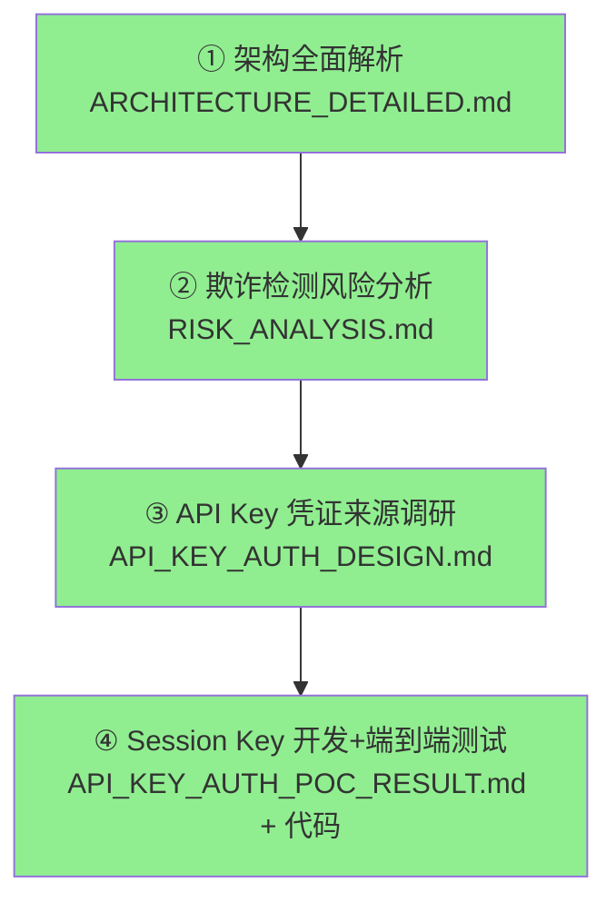
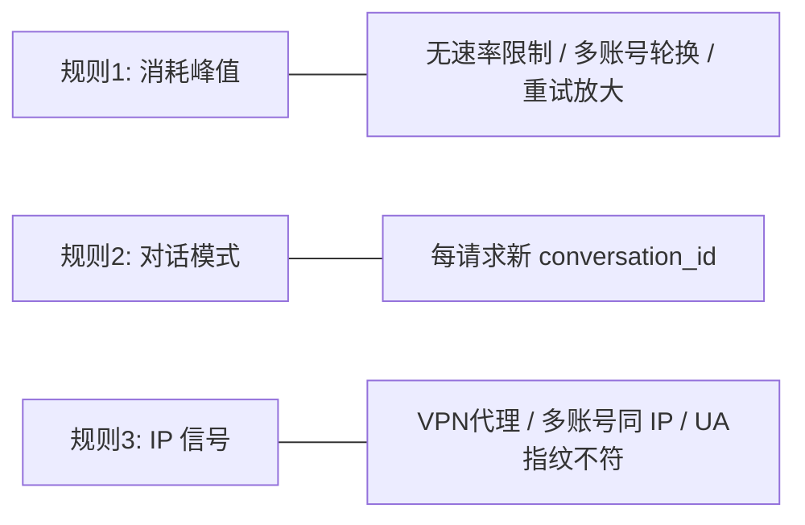
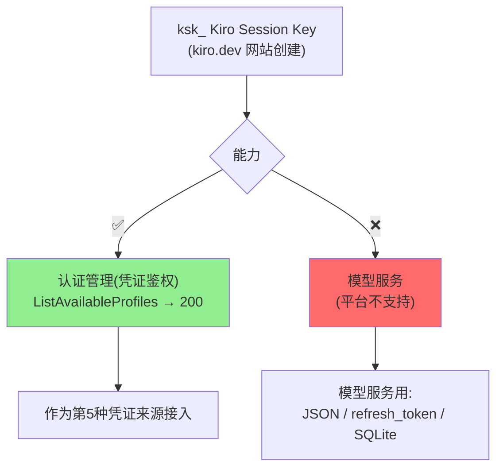
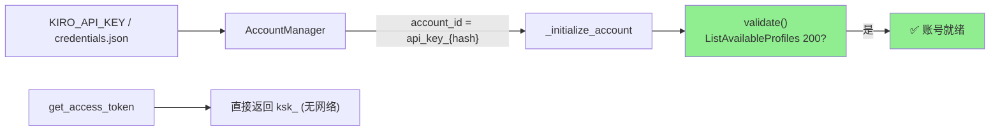

# 工作总结：Kiro Gateway 文档与 API Key 凭证来源

> 更新时间：2026-06-01 | 版本：v2.4.dev.13
> 分支：`feature/api-key-auth-poc` / `docs/architecture-walkthrough-zh`

本文档汇总最近完成的四块工作：架构解析、风险分析、API Key 调研、以及
Kiro Session Key 认证凭证来源的开发与端到端测试。

---

## 1. 工作全景



| # | 工作 | 交付物 | 状态 |
|---|------|--------|------|
| ① | 项目架构全面解析（需求→设计→实现） | `docs/zh/ARCHITECTURE_DETAILED.md` | ✅ |
| ② | 欺诈检测命中点纯风险分析 | `docs/zh/RISK_ANALYSIS.md` | ✅ |
| ③ | API Key 新增凭证来源调研方案 | `docs/zh/API_KEY_AUTH_DESIGN.md` | ✅ |
| ④ | Session Key 认证凭证实现 + 测试 | 代码 + `API_KEY_AUTH_POC_RESULT.md` + `manual_apikey_e2e.py` | ✅ |

---

## 2. ① 架构全面解析

- 覆盖：项目定位、分层架构、请求生命周期、20+ 模块详解、关键流程、配置部署、测试体系、版本演进。
- 含 12+ 个 mermaid 图（架构图 / 时序图 / 状态图 / 流程图 / 时间线）。
- 关键结论：**共享核心 + 薄适配器** 架构 —— OpenAI/Anthropic 双协议通过
  `converters_core` + `streaming_core` 复用同一套 Kiro 后端逻辑。

---

## 3. ② 欺诈检测风险分析（纯风险识别）

> 仅识别"哪些功能点会命中检测"，不含任何规避方案。



- 识别出 9 个命中点（3 高 / 3 中 / 3 低），附检测系统技术原理推测与防御加固建议。
- 最高风险组合：多账号 + VPN + 高频 → 三条规则全命中。

---

## 4. ③ + ④ Kiro Session Key 凭证来源（核心交付）

### 4.1 最终结论



**核心认知（经多轮验证纠正）**：`ksk_` 是**身份/会话密钥,仅能认证**。
Kiro 不支持用它调模型。因此实现为**纯认证凭证来源**。

### 4.2 协议（官方 CLI 二进制分析 + 真实端点探测）

| 维度 | 结论 |
|------|------|
| 传输 | `ksk_` 直接作为 `Authorization: Bearer` |
| 端点 | `q.{region}.amazonaws.com`（CodeWhisperer/Q 身份端点） |
| 校验 | `ListAvailableProfiles` → HTTP 200 = 有效凭证 |
| 模型 | `ListAvailableModels` → 403 → 跳过,用静态 fallback 模型 |

### 4.3 实现要点



- `AuthType.API_KEY`（最高优先级检测）+ host 覆盖为 `q.{region}.amazonaws.com`
- `get_access_token()` 直返 key（零网络）；`validate()` 做认证校验
- `is_token_expiring_soon=False`；`force_refresh` 返回 key
- `_should_use_static_models()`：API_KEY 跳过 ListAvailableModels（403）
- 安全：Key 脱敏入日志；account_id 为哈希；不记录 Authorization 头

### 4.4 测试结果

| 测试 | 结果 |
|------|------|
| 单元 + 集成（全量） | **1722 passed, 0 回归**（新增 31） |
| 真实 key 端到端认证（poc-01 / poc-02） | **两个 key 均 validate() → True ✅** |

```
OVERALL: PASS - all keys authenticate
```

---

## 5. 变更文件一览

| 文件 | 说明 |
|------|------|
| `kiro/config.py` | `KIRO_API_KEY` + 服务端点模板/helper |
| `kiro/auth.py` | `AuthType.API_KEY`、`validate()`、host 覆盖、脱敏 |
| `kiro/account_manager.py` | `type=api_key`、`_should_use_static_models()`、初始化校验 |
| `main.py` | `KIRO_API_KEY` 迁移 + 配置校验 |
| `.env.example` / `credentials.json.example` | Session Key 示例（标注仅认证） |
| `manual_apikey_e2e.py` | 真实 key 端到端认证测试脚本 |
| `docs/zh/*.md` | 架构 / 风险 / 调研 / POC 结果 / 本总结 |

---

## 6. 关联文档

- 架构解析：[`ARCHITECTURE_DETAILED.md`](ARCHITECTURE_DETAILED.md)
- 风险分析：[`RISK_ANALYSIS.md`](RISK_ANALYSIS.md)
- API Key 调研：[`API_KEY_AUTH_DESIGN.md`](API_KEY_AUTH_DESIGN.md)
- 开发与测试结果：[`API_KEY_AUTH_POC_RESULT.md`](API_KEY_AUTH_POC_RESULT.md)

> 能力边界：Session Key 仅用于**认证管理**；模型服务请使用携带模型权限的凭证。
